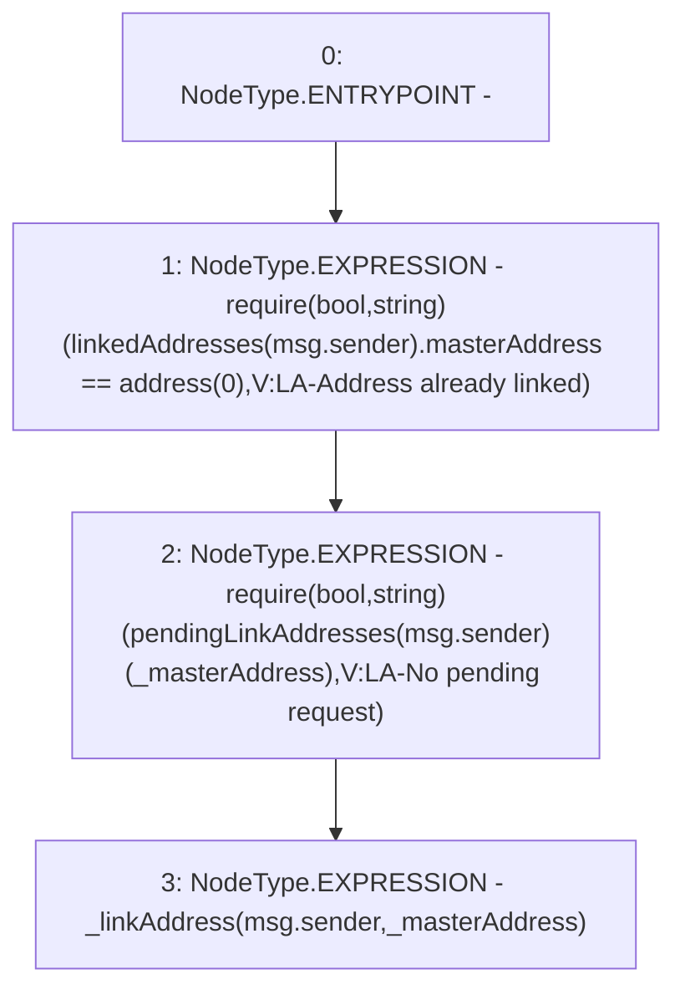

# Context: Verification.linkAddress

**Contract:** `Verification` (Inherits: OwnableUpgradeable, ContextUpgradeable, IVerification, Initializable)
**Signature:** `linkAddress(address)`
**Method Selector ID:** `0xc7097f62`
**Visibility:** `external`
**Environment-Free:** `No (reads EVM state context)`
**Modifiers:** None

### State Variables Interaction
- **Reads:** linkedAddresses, pendingLinkAddresses
- **Writes:** None

### Assertion Checks & Business Requirements
- require/assert: `require(bool,string)(linkedAddresses[msg.sender].masterAddress == address(0),V:LA-Address already linked)`
- require/assert: `require(bool,string)(pendingLinkAddresses[msg.sender][_masterAddress],V:LA-No pending request)`

### Environment & Verification Flags
- **Uses Foundry Cheatcodes:** No
- **Has Echidna Properties:** No

### Internal Calls Tree
- None

### External Calls / Value Transfers
- None

### Control Flow Graph (CFG)


### Source Mapping
Declared in: `contracts/Verification/Verification.sol` on lines **139** to **143**

```solidity
    function linkAddress(address _masterAddress) external {
        require(linkedAddresses[msg.sender].masterAddress == address(0), 'V:LA-Address already linked');
        require(pendingLinkAddresses[msg.sender][_masterAddress], 'V:LA-No pending request');
        _linkAddress(msg.sender, _masterAddress);
    }

```
