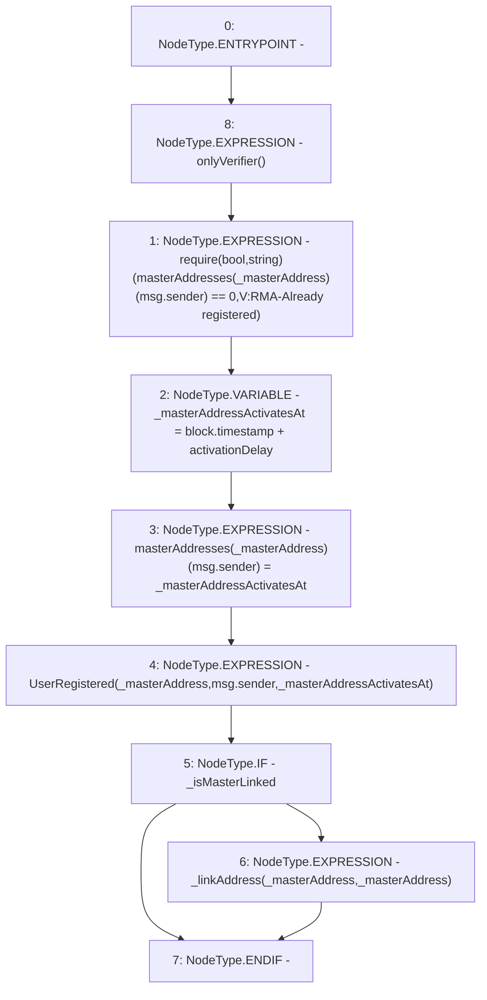

# Context: Verification.registerMasterAddress

**Contract:** `Verification` (Inherits: OwnableUpgradeable, ContextUpgradeable, IVerification, Initializable)
**Signature:** `registerMasterAddress(address,bool)`
**Method Selector ID:** `0xa94413a1`
**Visibility:** `external`
**Environment-Free:** `No (reads EVM state context)`
**Modifiers:**
- `onlyVerifier`
  ```solidity
  modifier onlyVerifier() {
          require(verifiers[msg.sender], 'Invalid verifier');
          _;
      }
  ```

### State Variables Interaction
- **Reads:** activationDelay, masterAddresses
- **Writes:** masterAddresses

### Assertion Checks & Business Requirements
- require/assert: `require(bool,string)(masterAddresses[_masterAddress][msg.sender] == 0,V:RMA-Already registered)`

### Environment & Verification Flags
- **Uses Foundry Cheatcodes:** No
- **Has Echidna Properties:** No

### Internal Calls Tree
- None

### External Calls / Value Transfers
- None

### Control Flow Graph (CFG)


### Source Mapping
Declared in: `contracts/Verification/Verification.sol` on lines **89** to **98**

```solidity
    function registerMasterAddress(address _masterAddress, bool _isMasterLinked) external override onlyVerifier {
        require(masterAddresses[_masterAddress][msg.sender] == 0, 'V:RMA-Already registered');
        uint256 _masterAddressActivatesAt = block.timestamp + activationDelay;
        masterAddresses[_masterAddress][msg.sender] = _masterAddressActivatesAt;
        emit UserRegistered(_masterAddress, msg.sender, _masterAddressActivatesAt);

        if (_isMasterLinked) {
            _linkAddress(_masterAddress, _masterAddress);
        }
    }

```
