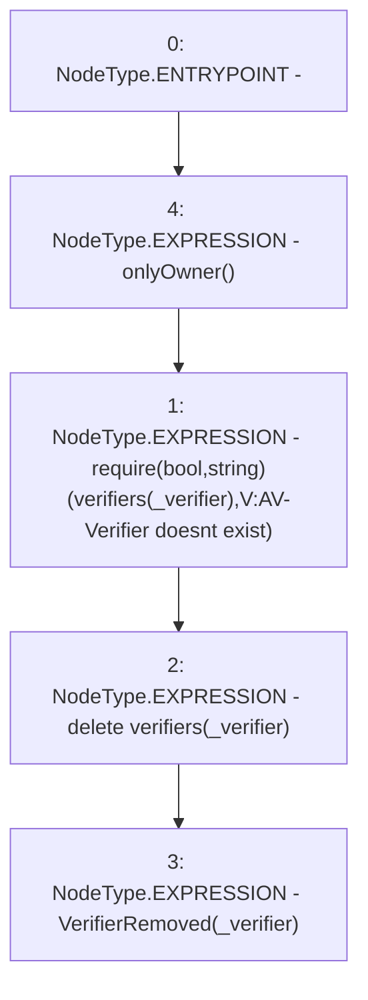

# Context: Verification.removeVerifier

**Contract:** `Verification` (Inherits: OwnableUpgradeable, ContextUpgradeable, IVerification, Initializable)
**Signature:** `removeVerifier(address)`
**Method Selector ID:** `0xca2dfd0a`
**Visibility:** `external`
**Environment-Free:** `No (reads EVM state context)`
**Modifiers:**
- `onlyOwner`
  ```solidity
  modifier onlyOwner() {
          require(owner() == _msgSender(), "Ownable: caller is not the owner");
          _;
      }
  ```

### State Variables Interaction
- **Reads:** verifiers
- **Writes:** verifiers

### Assertion Checks & Business Requirements
- require/assert: `require(bool,string)(verifiers[_verifier],V:AV-Verifier doesnt exist)`

### Environment & Verification Flags
- **Uses Foundry Cheatcodes:** No
- **Has Echidna Properties:** No

### Internal Calls Tree
- None

### External Calls / Value Transfers
- None

### Control Flow Graph (CFG)


### Source Mapping
Declared in: `contracts/Verification/Verification.sol` on lines **78** to **82**

```solidity
    function removeVerifier(address _verifier) external onlyOwner {
        require(verifiers[_verifier], 'V:AV-Verifier doesnt exist');
        delete verifiers[_verifier];
        emit VerifierRemoved(_verifier);
    }

```
