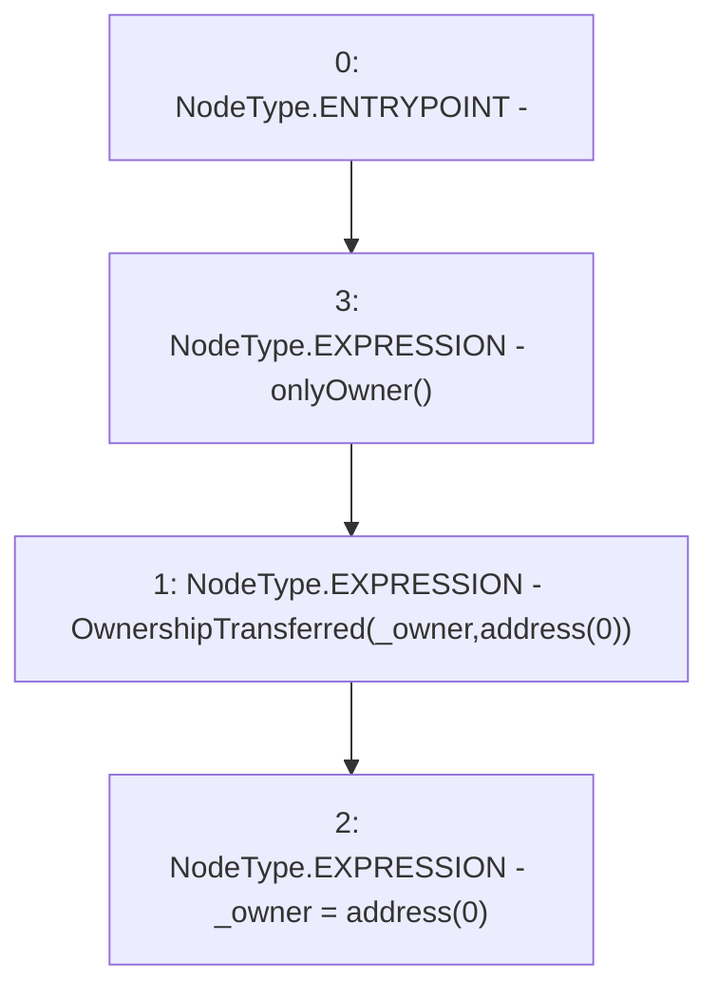

# Context: Verification.renounceOwnership

**Contract:** `Verification` (Inherits: OwnableUpgradeable, ContextUpgradeable, IVerification, Initializable)
**Signature:** `renounceOwnership()`
**Method Selector ID:** `0x715018a6`
**Visibility:** `public`
**Environment-Free:** `No (reads EVM state context)`
**Modifiers:**
- `onlyOwner`
  ```solidity
  modifier onlyOwner() {
          require(owner() == _msgSender(), "Ownable: caller is not the owner");
          _;
      }
  ```

### State Variables Interaction
- **Reads:** _owner
- **Writes:** _owner

### Environment & Verification Flags
- **Uses Foundry Cheatcodes:** No
- **Has Echidna Properties:** No

### Internal Calls Tree
- None

### External Calls / Value Transfers
- None

### Control Flow Graph (CFG)


### Source Mapping
Declared in: `node_modules/@openzeppelin/contracts-upgradeable/access/OwnableUpgradeable.sol` on lines **60** to **63**

```solidity
    function renounceOwnership() public virtual onlyOwner {
        emit OwnershipTransferred(_owner, address(0));
        _owner = address(0);
    }

```
