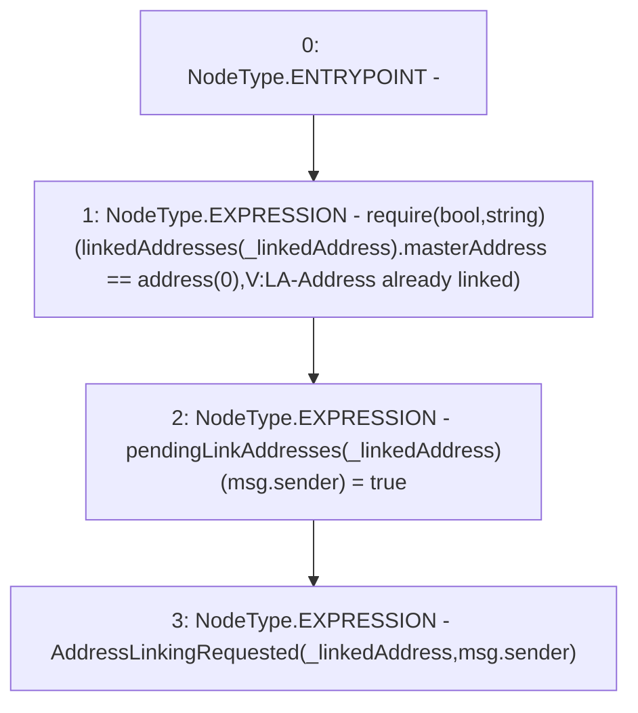

# Context: Verification.requestAddressLinking

**Contract:** `Verification` (Inherits: OwnableUpgradeable, ContextUpgradeable, IVerification, Initializable)
**Signature:** `requestAddressLinking(address)`
**Method Selector ID:** `0x40f65fe9`
**Visibility:** `external`
**Environment-Free:** `No (reads EVM state context)`
**Modifiers:** None

### State Variables Interaction
- **Reads:** linkedAddresses
- **Writes:** pendingLinkAddresses

### Assertion Checks & Business Requirements
- require/assert: `require(bool,string)(linkedAddresses[_linkedAddress].masterAddress == address(0),V:LA-Address already linked)`

### Environment & Verification Flags
- **Uses Foundry Cheatcodes:** No
- **Has Echidna Properties:** No

### Internal Calls Tree
- None

### External Calls / Value Transfers
- None

### Control Flow Graph (CFG)


### Source Mapping
Declared in: `contracts/Verification/Verification.sol` on lines **121** to **125**

```solidity
    function requestAddressLinking(address _linkedAddress) external {
        require(linkedAddresses[_linkedAddress].masterAddress == address(0), 'V:LA-Address already linked');
        pendingLinkAddresses[_linkedAddress][msg.sender] = true;
        emit AddressLinkingRequested(_linkedAddress, msg.sender);
    }

```
