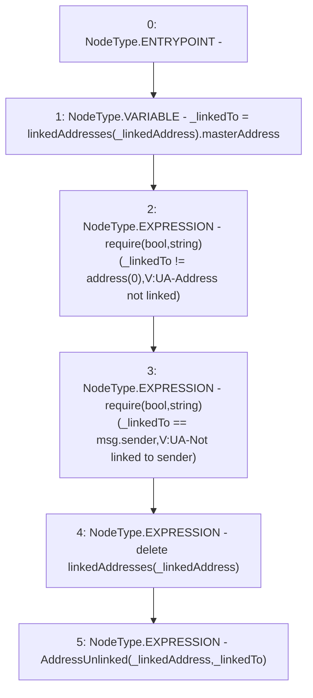

# Context: Verification.unlinkAddress

**Contract:** `Verification` (Inherits: OwnableUpgradeable, ContextUpgradeable, IVerification, Initializable)
**Signature:** `unlinkAddress(address)`
**Method Selector ID:** `0xb59284ac`
**Visibility:** `external`
**Environment-Free:** `No (reads EVM state context)`
**Modifiers:** None

### State Variables Interaction
- **Reads:** linkedAddresses
- **Writes:** linkedAddresses

### Assertion Checks & Business Requirements
- require/assert: `require(bool,string)(_linkedTo != address(0),V:UA-Address not linked)`
- require/assert: `require(bool,string)(_linkedTo == msg.sender,V:UA-Not linked to sender)`

### Environment & Verification Flags
- **Uses Foundry Cheatcodes:** No
- **Has Echidna Properties:** No

### Internal Calls Tree
- None

### External Calls / Value Transfers
- `TMP_2813(None) = SOLIDITY_CALL require(bool,string)(TMP_2812,V:UA-Not linked to sender)`

### Control Flow Graph (CFG)


### Source Mapping
Declared in: `contracts/Verification/Verification.sol` on lines **148** to **154**

```solidity
    function unlinkAddress(address _linkedAddress) external {
        address _linkedTo = linkedAddresses[_linkedAddress].masterAddress;
        require(_linkedTo != address(0), 'V:UA-Address not linked');
        require(_linkedTo == msg.sender, 'V:UA-Not linked to sender');
        delete linkedAddresses[_linkedAddress];
        emit AddressUnlinked(_linkedAddress, _linkedTo);
    }

```
