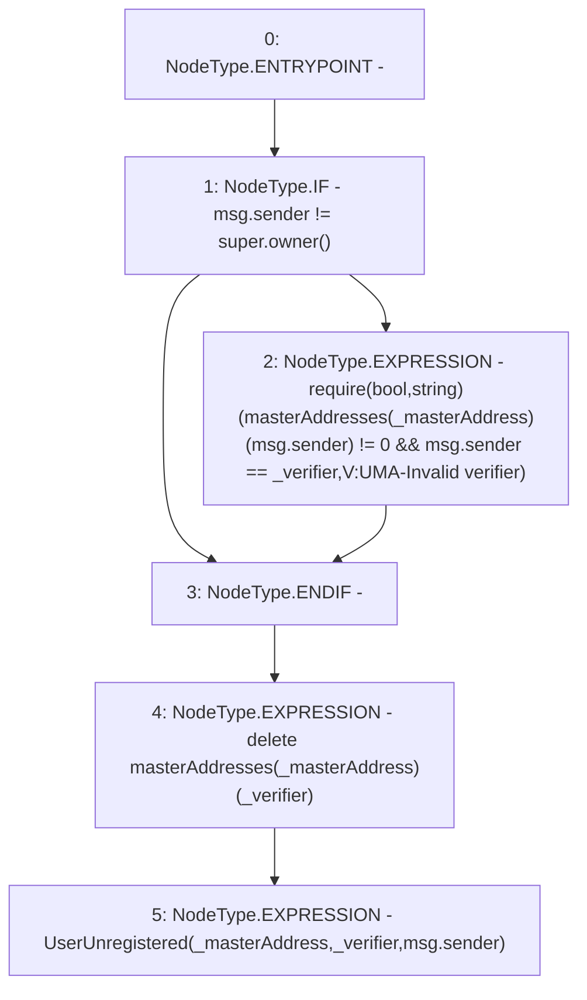

# Context: Verification.unregisterMasterAddress

**Contract:** `Verification` (Inherits: OwnableUpgradeable, ContextUpgradeable, IVerification, Initializable)
**Signature:** `unregisterMasterAddress(address,address)`
**Method Selector ID:** `0xb4d59d0e`
**Visibility:** `external`
**Environment-Free:** `No (reads EVM state context)`
**Modifiers:** None

### State Variables Interaction
- **Reads:** masterAddresses
- **Writes:** masterAddresses

### Assertion Checks & Business Requirements
- require/assert: `require(bool,string)(masterAddresses[_masterAddress][msg.sender] != 0 && msg.sender == _verifier,V:UMA-Invalid verifier)`

### Environment & Verification Flags
- **Uses Foundry Cheatcodes:** No
- **Has Echidna Properties:** No

### Internal Calls Tree
- None

### External Calls / Value Transfers
- None

### Control Flow Graph (CFG)


### Source Mapping
Declared in: `contracts/Verification/Verification.sol` on lines **104** to **110**

```solidity
    function unregisterMasterAddress(address _masterAddress, address _verifier) external override {
        if (msg.sender != super.owner()) {
            require(masterAddresses[_masterAddress][msg.sender] != 0 && msg.sender == _verifier, 'V:UMA-Invalid verifier');
        }
        delete masterAddresses[_masterAddress][_verifier];
        emit UserUnregistered(_masterAddress, _verifier, msg.sender);
    }

```
