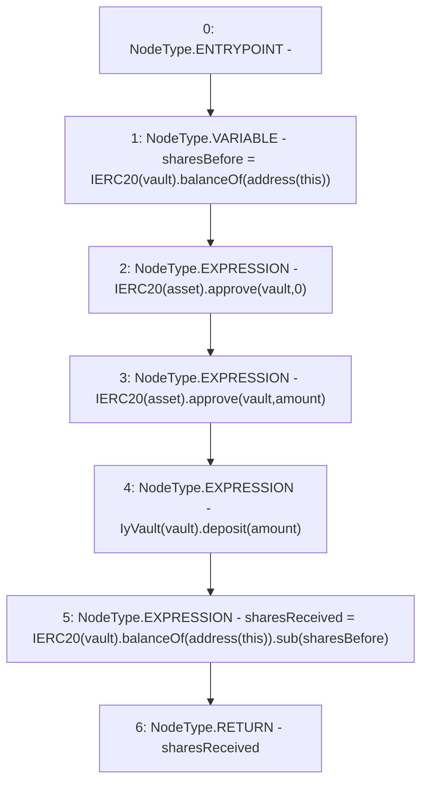

# Context: YearnYield._depositERC20

**Contract:** `YearnYield` (Inherits: ReentrancyGuard, OwnableUpgradeable, ContextUpgradeable, Initializable, IYield)
**Signature:** `_depositERC20(address,address,uint256) returns (uint256)`
**Method Selector ID:** `Internal (No Method ID)`
**Visibility:** `internal`
**Environment-Free:** `Yes`
**Modifiers:** None

### State Variables Interaction
- **Reads:** None
- **Writes:** None

### Environment & Verification Flags
- **Uses Foundry Cheatcodes:** No
- **Has Echidna Properties:** No

### Internal Calls Tree
- None

### External Calls / Value Transfers
- `IERC20.TMP_4015(bool) = HIGH_LEVEL_CALL, dest:TMP_4014(IERC20), function:approve, arguments:['vault', '0']  `
- `IERC20.TMP_4017(bool) = HIGH_LEVEL_CALL, dest:TMP_4016(IERC20), function:approve, arguments:['vault', 'amount']  `
- `SafeMath.TMP_4023(uint256) = LIBRARY_CALL, dest:SafeMath, function:SafeMath.sub(uint256,uint256), arguments:['TMP_4022', 'sharesBefore'] `
- `IERC20.TMP_4022(uint256) = HIGH_LEVEL_CALL, dest:TMP_4020(IERC20), function:balanceOf, arguments:['TMP_4021']  `
- `IERC20.TMP_4013(uint256) = HIGH_LEVEL_CALL, dest:TMP_4011(IERC20), function:balanceOf, arguments:['TMP_4012']  `
- `IyVault.HIGH_LEVEL_CALL, dest:TMP_4018(IyVault), function:deposit, arguments:['amount']  `

### Control Flow Graph (CFG)


### Source Mapping
Declared in: `contracts/yield/YearnYield.sol` on lines **202** to **215**

```solidity
    function _depositERC20(
        address asset,
        address vault,
        uint256 amount
    ) internal returns (uint256 sharesReceived) {
        uint256 sharesBefore = IERC20(vault).balanceOf(address(this));

        //lock collateral in vault
        IERC20(asset).approve(vault, 0);
        IERC20(asset).approve(vault, amount);
        IyVault(vault).deposit(amount);

        sharesReceived = IERC20(vault).balanceOf(address(this)).sub(sharesBefore);
    }

```
