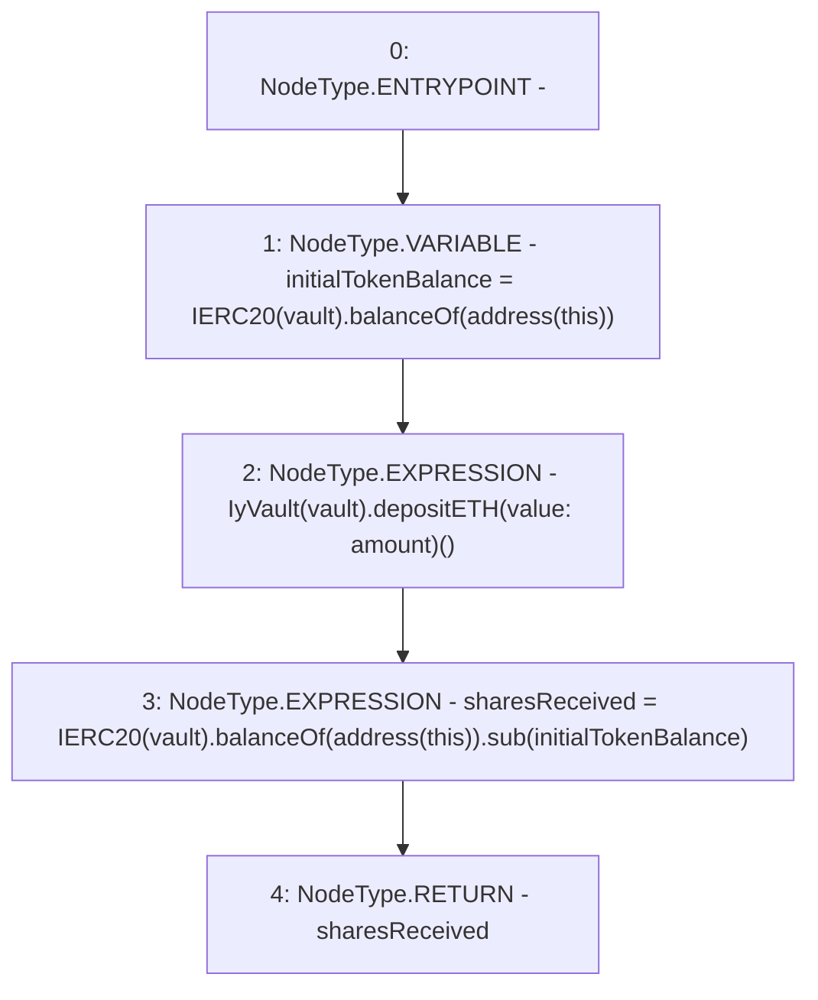

# Context: YearnYield._depositETH

**Contract:** `YearnYield` (Inherits: ReentrancyGuard, OwnableUpgradeable, ContextUpgradeable, Initializable, IYield)
**Signature:** `_depositETH(address,uint256) returns (uint256)`
**Method Selector ID:** `Internal (No Method ID)`
**Visibility:** `internal`
**Environment-Free:** `Yes`
**Modifiers:** None

### State Variables Interaction
- **Reads:** None
- **Writes:** None

### Environment & Verification Flags
- **Uses Foundry Cheatcodes:** No
- **Has Echidna Properties:** No

### Internal Calls Tree
- None

### External Calls / Value Transfers
- `SafeMath.TMP_4010(uint256) = LIBRARY_CALL, dest:SafeMath, function:SafeMath.sub(uint256,uint256), arguments:['TMP_4009', 'initialTokenBalance'] `
- `IERC20.TMP_4009(uint256) = HIGH_LEVEL_CALL, dest:TMP_4007(IERC20), function:balanceOf, arguments:['TMP_4008']  `
- `IERC20.TMP_4004(uint256) = HIGH_LEVEL_CALL, dest:TMP_4002(IERC20), function:balanceOf, arguments:['TMP_4003']  `
- `IyVault.HIGH_LEVEL_CALL, dest:TMP_4005(IyVault), function:depositETH, arguments:[] value:amount `

### Control Flow Graph (CFG)


### Source Mapping
Declared in: `contracts/yield/YearnYield.sol` on lines **193** to **200**

```solidity
    function _depositETH(address vault, uint256 amount) internal returns (uint256 sharesReceived) {
        uint256 initialTokenBalance = IERC20(vault).balanceOf(address(this));

        //mint vault
        IyVault(vault).depositETH{value: amount}();

        sharesReceived = IERC20(vault).balanceOf(address(this)).sub(initialTokenBalance);
    }

```
