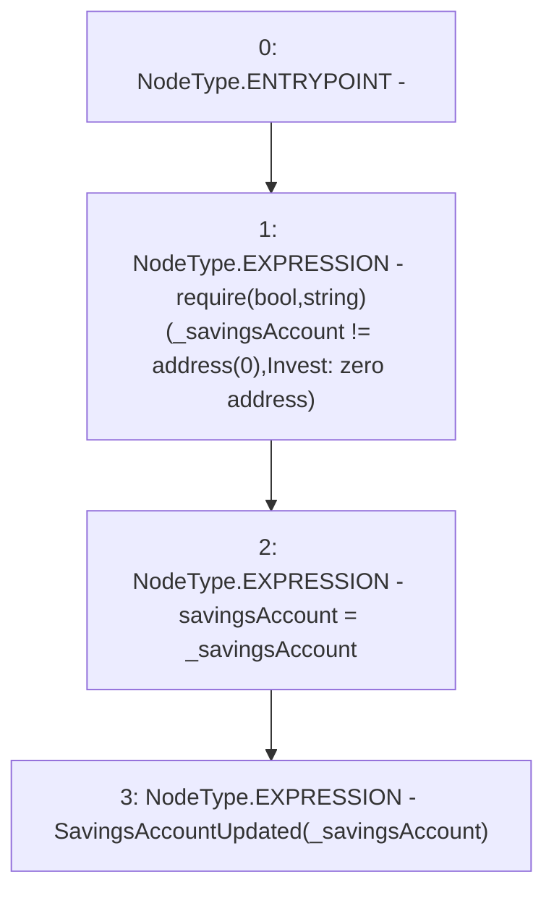

# Context: YearnYield._updateSavingsAccount

**Contract:** `YearnYield` (Inherits: ReentrancyGuard, OwnableUpgradeable, ContextUpgradeable, Initializable, IYield)
**Signature:** `_updateSavingsAccount(address)`
**Method Selector ID:** `Internal (No Method ID)`
**Visibility:** `internal`
**Environment-Free:** `Yes`
**Modifiers:** None

### State Variables Interaction
- **Reads:** None
- **Writes:** savingsAccount

### Assertion Checks & Business Requirements
- require/assert: `require(bool,string)(_savingsAccount != address(0),Invest: zero address)`

### Environment & Verification Flags
- **Uses Foundry Cheatcodes:** No
- **Has Echidna Properties:** No

### Internal Calls Tree
- None

### External Calls / Value Transfers
- None

### Control Flow Graph (CFG)


### Source Mapping
Declared in: `contracts/yield/YearnYield.sol` on lines **68** to **72**

```solidity
    function _updateSavingsAccount(address payable _savingsAccount) internal {
        require(_savingsAccount != address(0), 'Invest: zero address');
        savingsAccount = _savingsAccount;
        emit SavingsAccountUpdated(_savingsAccount);
    }

```
