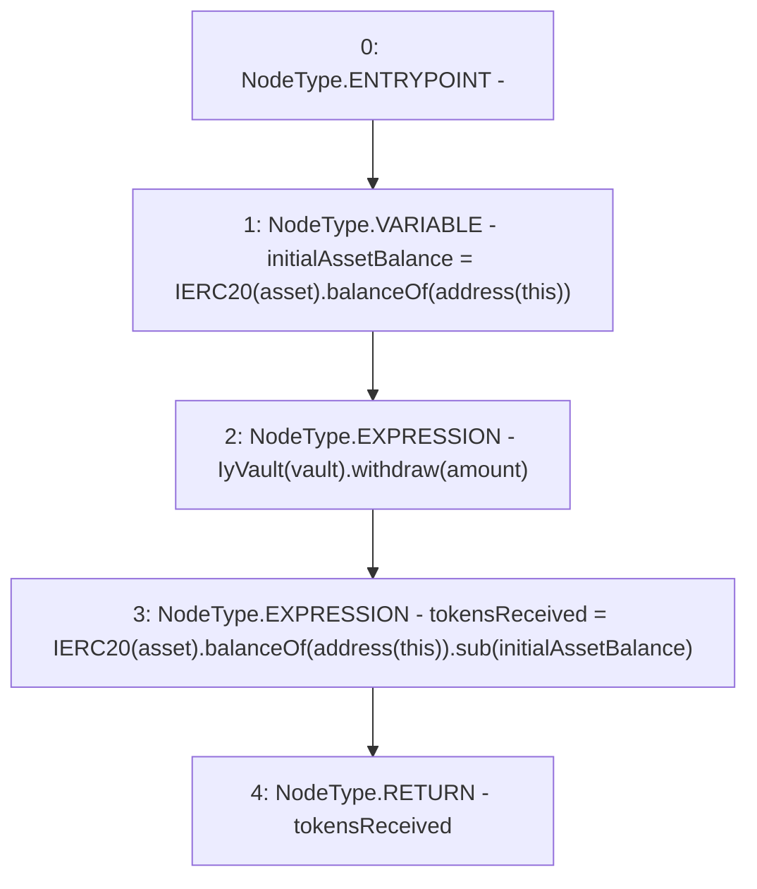

# Context: YearnYield._withdrawERC

**Contract:** `YearnYield` (Inherits: ReentrancyGuard, OwnableUpgradeable, ContextUpgradeable, Initializable, IYield)
**Signature:** `_withdrawERC(address,address,uint256) returns (uint256)`
**Method Selector ID:** `Internal (No Method ID)`
**Visibility:** `internal`
**Environment-Free:** `Yes`
**Modifiers:** None

### State Variables Interaction
- **Reads:** None
- **Writes:** None

### Environment & Verification Flags
- **Uses Foundry Cheatcodes:** No
- **Has Echidna Properties:** No

### Internal Calls Tree
- None

### External Calls / Value Transfers
- `IyVault.HIGH_LEVEL_CALL, dest:TMP_4034(IyVault), function:withdraw, arguments:['amount']  `
- `IERC20.TMP_4033(uint256) = HIGH_LEVEL_CALL, dest:TMP_4031(IERC20), function:balanceOf, arguments:['TMP_4032']  `
- `SafeMath.TMP_4039(uint256) = LIBRARY_CALL, dest:SafeMath, function:SafeMath.sub(uint256,uint256), arguments:['TMP_4038', 'initialAssetBalance'] `
- `IERC20.TMP_4038(uint256) = HIGH_LEVEL_CALL, dest:TMP_4036(IERC20), function:balanceOf, arguments:['TMP_4037']  `

### Control Flow Graph (CFG)


### Source Mapping
Declared in: `contracts/yield/YearnYield.sol` on lines **225** to **235**

```solidity
    function _withdrawERC(
        address asset,
        address vault,
        uint256 amount
    ) internal returns (uint256 tokensReceived) {
        uint256 initialAssetBalance = IERC20(asset).balanceOf(address(this));

        IyVault(vault).withdraw(amount);

        tokensReceived = IERC20(asset).balanceOf(address(this)).sub(initialAssetBalance);
    }

```
