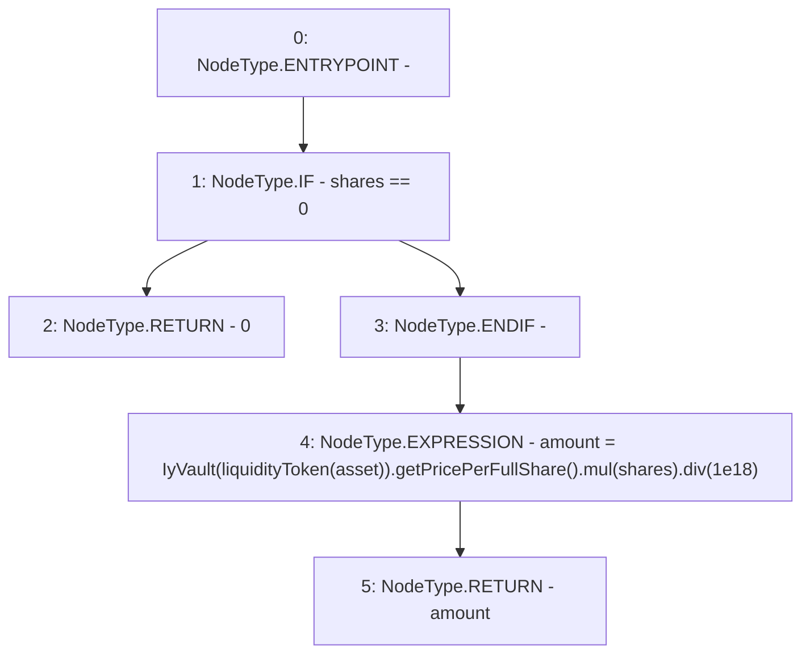

# Context: YearnYield.getTokensForShares

**Contract:** `YearnYield` (Inherits: ReentrancyGuard, OwnableUpgradeable, ContextUpgradeable, Initializable, IYield)
**Signature:** `getTokensForShares(uint256,address) returns (uint256)`
**Method Selector ID:** `0x59846d29`
**Visibility:** `public`
**Environment-Free:** `Yes`
**Modifiers:** None

### State Variables Interaction
- **Reads:** liquidityToken
- **Writes:** None

### Environment & Verification Flags
- **Uses Foundry Cheatcodes:** No
- **Has Echidna Properties:** No

### Internal Calls Tree
- None

### External Calls / Value Transfers
- `SafeMath.TMP_3998(uint256) = LIBRARY_CALL, dest:SafeMath, function:SafeMath.div(uint256,uint256), arguments:['TMP_3997', '1000000000000000000'] `
- `IyVault.TMP_3996(uint256) = HIGH_LEVEL_CALL, dest:TMP_3995(IyVault), function:getPricePerFullShare, arguments:[]  `
- `SafeMath.TMP_3997(uint256) = LIBRARY_CALL, dest:SafeMath, function:SafeMath.mul(uint256,uint256), arguments:['TMP_3996', 'shares'] `

### Control Flow Graph (CFG)


### Source Mapping
Declared in: `contracts/yield/YearnYield.sol` on lines **178** to **181**

```solidity
    function getTokensForShares(uint256 shares, address asset) public view override returns (uint256 amount) {
        if (shares == 0) return 0;
        amount = IyVault(liquidityToken[asset]).getPricePerFullShare().mul(shares).div(1e18);
    }

```
