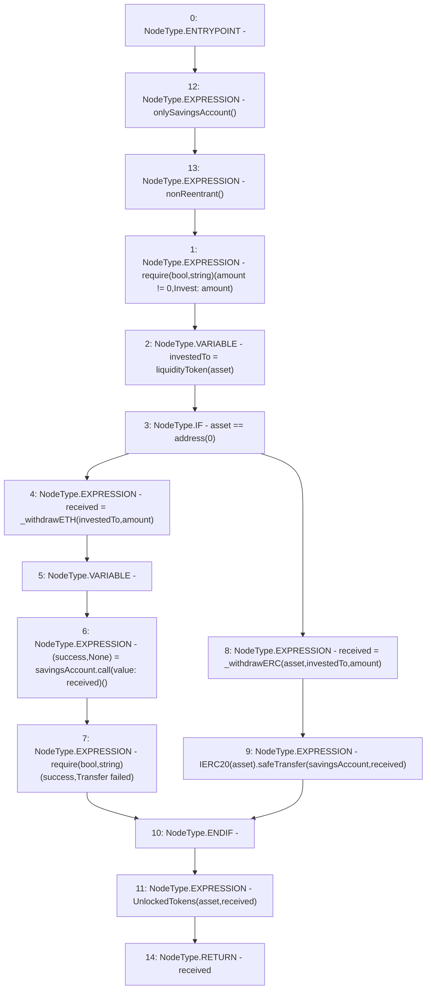

# Context: YearnYield.unlockTokens

**Contract:** `YearnYield` (Inherits: ReentrancyGuard, OwnableUpgradeable, ContextUpgradeable, Initializable, IYield)
**Signature:** `unlockTokens(address,uint256) returns (uint256)`
**Method Selector ID:** `0x9d564d9a`
**Visibility:** `external`
**Environment-Free:** `No (reads EVM state context)`
**Modifiers:**
- `onlySavingsAccount`
  ```solidity
  modifier onlySavingsAccount() {
          require(_msgSender() == savingsAccount, 'Invest: Only savings account can invoke');
          _;
      }
  ```
- `nonReentrant`
  ```solidity
  modifier nonReentrant() {
          // On the first call to nonReentrant, _notEntered will be true
          require(_status != _ENTERED, "ReentrancyGuard: reentrant call");
  
          // Any calls to nonReentrant after this point will fail
          _status = _ENTERED;
  
          _;
  
          // By storing the original value once again, a refund is triggered (see
          // https://eips.ethereum.org/EIPS/eip-2200)
          _status = _NOT_ENTERED;
      }
  ```

### State Variables Interaction
- **Reads:** liquidityToken, savingsAccount
- **Writes:** None

### Assertion Checks & Business Requirements
- require/assert: `require(bool,string)(amount != 0,Invest: amount)`
- require/assert: `require(bool,string)(success,Transfer failed)`

### Environment & Verification Flags
- **Uses Foundry Cheatcodes:** No
- **Has Echidna Properties:** No

### Internal Calls Tree
- None

### External Calls / Value Transfers
- `SafeERC20.LIBRARY_CALL, dest:SafeERC20, function:SafeERC20.safeTransfer(IERC20,address,uint256), arguments:['TMP_3980', 'savingsAccount', 'received'] `
- `low-level-call`

### Control Flow Graph (CFG)


### Source Mapping
Declared in: `contracts/yield/YearnYield.sol` on lines **139** to **153**

```solidity
    function unlockTokens(address asset, uint256 amount) external override onlySavingsAccount nonReentrant returns (uint256 received) {
        require(amount != 0, 'Invest: amount');
        address investedTo = liquidityToken[asset];

        if (asset == address(0)) {
            received = _withdrawETH(investedTo, amount);
            (bool success, ) = savingsAccount.call{value: received}('');
            require(success, 'Transfer failed');
        } else {
            received = _withdrawERC(asset, investedTo, amount);
            IERC20(asset).safeTransfer(savingsAccount, received);
        }

        emit UnlockedTokens(asset, received);
    }

```
