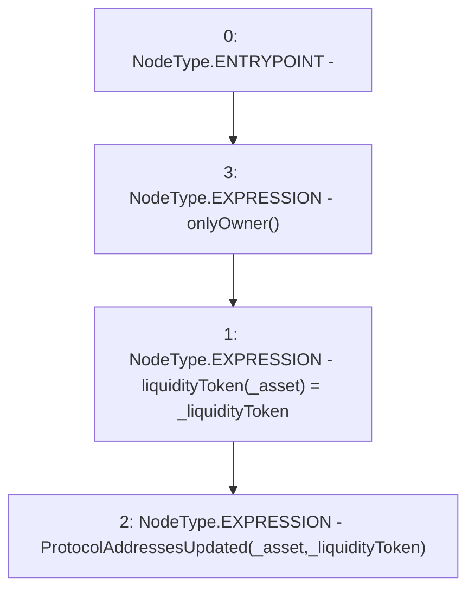

# Context: YearnYield.updateProtocolAddresses

**Contract:** `YearnYield` (Inherits: ReentrancyGuard, OwnableUpgradeable, ContextUpgradeable, Initializable, IYield)
**Signature:** `updateProtocolAddresses(address,address)`
**Method Selector ID:** `0x050470f1`
**Visibility:** `external`
**Environment-Free:** `No (reads EVM state context)`
**Modifiers:**
- `onlyOwner`
  ```solidity
  modifier onlyOwner() {
          require(owner() == _msgSender(), "Ownable: caller is not the owner");
          _;
      }
  ```

### State Variables Interaction
- **Reads:** None
- **Writes:** liquidityToken

### Environment & Verification Flags
- **Uses Foundry Cheatcodes:** No
- **Has Echidna Properties:** No

### Internal Calls Tree
- None

### External Calls / Value Transfers
- None

### Control Flow Graph (CFG)


### Source Mapping
Declared in: `contracts/yield/YearnYield.sol` on lines **80** to **83**

```solidity
    function updateProtocolAddresses(address _asset, address _liquidityToken) external onlyOwner {
        liquidityToken[_asset] = _liquidityToken;
        emit ProtocolAddressesUpdated(_asset, _liquidityToken);
    }

```
