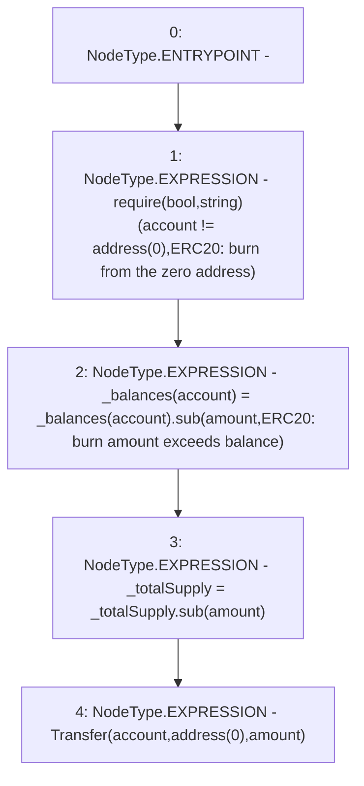

# Context: yVault._burn

**Contract:** `yVault` (Inherits: ERC20Detailed, ERC20, Context)
**Signature:** `_burn(address,uint256)`
**Method Selector ID:** `Internal (No Method ID)`
**Visibility:** `internal`
**Environment-Free:** `Yes`
**Modifiers:** None

### State Variables Interaction
- **Reads:** _balances, _totalSupply
- **Writes:** _balances, _totalSupply

### Assertion Checks & Business Requirements
- require/assert: `require(bool,string)(account != address(0),ERC20: burn from the zero address)`

### Environment & Verification Flags
- **Uses Foundry Cheatcodes:** No
- **Has Echidna Properties:** No

### Internal Calls Tree
- None

### External Calls / Value Transfers
- `SafeMath.TMP_3281(uint256) = LIBRARY_CALL, dest:SafeMath, function:SafeMath.sub(uint256,uint256,string), arguments:['REF_1540', 'amount', 'ERC20: burn amount exceeds balance'] `
- `SafeMath.TMP_3282(uint256) = LIBRARY_CALL, dest:SafeMath, function:SafeMath.sub(uint256,uint256), arguments:['_totalSupply', 'amount'] `

### Control Flow Graph (CFG)


### Source Mapping
Declared in: `contracts/mocks/yVault/yVault.sol` on lines **89** to **95**

```solidity
    function _burn(address account, uint256 amount) internal {
        require(account != address(0), 'ERC20: burn from the zero address');

        _balances[account] = _balances[account].sub(amount, 'ERC20: burn amount exceeds balance');
        _totalSupply = _totalSupply.sub(amount);
        emit Transfer(account, address(0), amount);
    }

```
