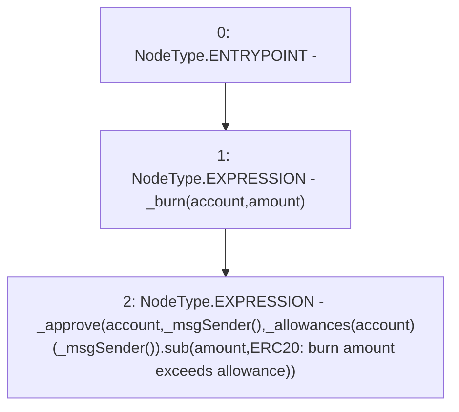

# Context: yVault._burnFrom

**Contract:** `yVault` (Inherits: ERC20Detailed, ERC20, Context)
**Signature:** `_burnFrom(address,uint256)`
**Method Selector ID:** `Internal (No Method ID)`
**Visibility:** `internal`
**Environment-Free:** `No (reads EVM state context)`
**Modifiers:** None

### State Variables Interaction
- **Reads:** _allowances
- **Writes:** None

### Environment & Verification Flags
- **Uses Foundry Cheatcodes:** No
- **Has Echidna Properties:** No

### Internal Calls Tree
- None

### External Calls / Value Transfers
- `SafeMath.TMP_3295(uint256) = LIBRARY_CALL, dest:SafeMath, function:SafeMath.sub(uint256,uint256,string), arguments:['REF_1546', 'amount', 'ERC20: burn amount exceeds allowance'] `

### Control Flow Graph (CFG)


### Source Mapping
Declared in: `contracts/mocks/yVault/yVault.sol` on lines **109** to **112**

```solidity
    function _burnFrom(address account, uint256 amount) internal {
        _burn(account, amount);
        _approve(account, _msgSender(), _allowances[account][_msgSender()].sub(amount, 'ERC20: burn amount exceeds allowance'));
    }

```
