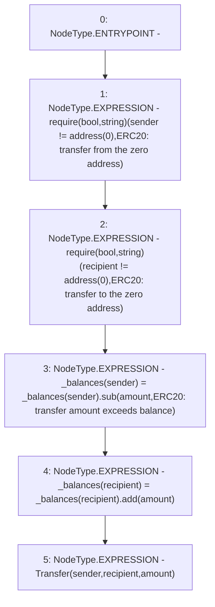

# Context: yVault._transfer

**Contract:** `yVault` (Inherits: ERC20Detailed, ERC20, Context)
**Signature:** `_transfer(address,address,uint256)`
**Method Selector ID:** `Internal (No Method ID)`
**Visibility:** `internal`
**Environment-Free:** `Yes`
**Modifiers:** None

### State Variables Interaction
- **Reads:** _balances
- **Writes:** _balances

### Assertion Checks & Business Requirements
- require/assert: `require(bool,string)(sender != address(0),ERC20: transfer from the zero address)`
- require/assert: `require(bool,string)(recipient != address(0),ERC20: transfer to the zero address)`

### Environment & Verification Flags
- **Uses Foundry Cheatcodes:** No
- **Has Echidna Properties:** No

### Internal Calls Tree
- None

### External Calls / Value Transfers
- `SafeMath.TMP_3269(uint256) = LIBRARY_CALL, dest:SafeMath, function:SafeMath.add(uint256,uint256), arguments:['REF_1533', 'amount'] `
- `TMP_3264(None) = SOLIDITY_CALL require(bool,string)(TMP_3263,ERC20: transfer from the zero address)`
- `SafeMath.TMP_3268(uint256) = LIBRARY_CALL, dest:SafeMath, function:SafeMath.sub(uint256,uint256,string), arguments:['REF_1530', 'amount', 'ERC20: transfer amount exceeds balance'] `
- `TMP_3267(None) = SOLIDITY_CALL require(bool,string)(TMP_3266,ERC20: transfer to the zero address)`

### Control Flow Graph (CFG)


### Source Mapping
Declared in: `contracts/mocks/yVault/yVault.sol` on lines **68** to **79**

```solidity
    function _transfer(
        address sender,
        address recipient,
        uint256 amount
    ) internal {
        require(sender != address(0), 'ERC20: transfer from the zero address');
        require(recipient != address(0), 'ERC20: transfer to the zero address');

        _balances[sender] = _balances[sender].sub(amount, 'ERC20: transfer amount exceeds balance');
        _balances[recipient] = _balances[recipient].add(amount);
        emit Transfer(sender, recipient, amount);
    }

```
