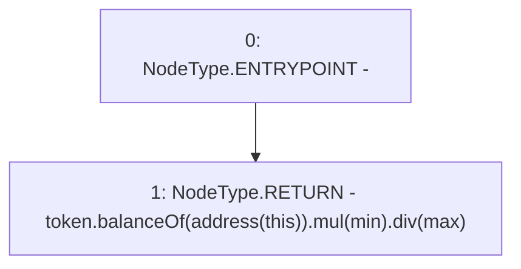

# Context: yVault.available

**Contract:** `yVault` (Inherits: ERC20Detailed, ERC20, Context)
**Signature:** `available() returns (uint256)`
**Method Selector ID:** `0x48a0d754`
**Visibility:** `public`
**Environment-Free:** `Yes`
**Modifiers:** None

### State Variables Interaction
- **Reads:** max, min, token
- **Writes:** None

### Environment & Verification Flags
- **Uses Foundry Cheatcodes:** No
- **Has Echidna Properties:** No

### Internal Calls Tree
- None

### External Calls / Value Transfers
- `ERC20.TMP_3322(uint256) = HIGH_LEVEL_CALL, dest:token(ERC20), function:balanceOf, arguments:['TMP_3321']  `
- `SafeMath.TMP_3323(uint256) = LIBRARY_CALL, dest:SafeMath, function:SafeMath.mul(uint256,uint256), arguments:['TMP_3322', 'min'] `
- `SafeMath.TMP_3324(uint256) = LIBRARY_CALL, dest:SafeMath, function:SafeMath.div(uint256,uint256), arguments:['TMP_3323', 'max'] `

### Control Flow Graph (CFG)


### Source Mapping
Declared in: `contracts/mocks/yVault/yVault.sol` on lines **261** to **263**

```solidity
    function available() public view returns (uint256) {
        return token.balanceOf(address(this)).mul(min).div(max);
    }

```
