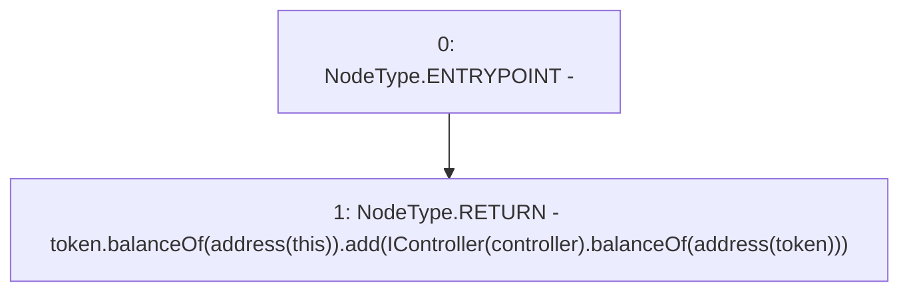

# Context: yVault.balance

**Contract:** `yVault` (Inherits: ERC20Detailed, ERC20, Context)
**Signature:** `balance() returns (uint256)`
**Method Selector ID:** `0xb69ef8a8`
**Visibility:** `public`
**Environment-Free:** `Yes`
**Modifiers:** None

### State Variables Interaction
- **Reads:** controller, token
- **Writes:** None

### Environment & Verification Flags
- **Uses Foundry Cheatcodes:** No
- **Has Echidna Properties:** No

### Internal Calls Tree
- None

### External Calls / Value Transfers
- `SafeMath.TMP_3314(uint256) = LIBRARY_CALL, dest:SafeMath, function:SafeMath.add(uint256,uint256), arguments:['TMP_3310', 'TMP_3313'] `
- `ERC20.TMP_3310(uint256) = HIGH_LEVEL_CALL, dest:token(ERC20), function:balanceOf, arguments:['TMP_3309']  `
- `IController.TMP_3313(uint256) = HIGH_LEVEL_CALL, dest:TMP_3311(IController), function:balanceOf, arguments:['TMP_3312']  `

### Control Flow Graph (CFG)


### Source Mapping
Declared in: `contracts/mocks/yVault/yVault.sol` on lines **240** to **242**

```solidity
    function balance() public view returns (uint256) {
        return token.balanceOf(address(this)).add(IController(controller).balanceOf(address(token)));
    }

```
