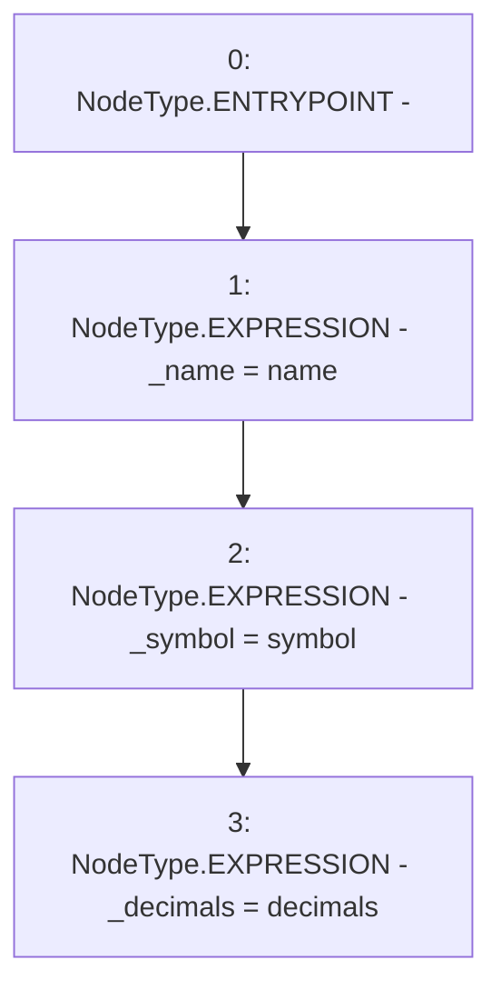

# Context: yVault.constructor

**Contract:** `yVault` (Inherits: ERC20Detailed, ERC20, Context)
**Signature:** `constructor(string,string,uint8)`
**Method Selector ID:** `0x5181b956`
**Visibility:** `public`
**Environment-Free:** `Yes`
**Modifiers:** None

### State Variables Interaction
- **Reads:** None
- **Writes:** _decimals, _name, _symbol

### Environment & Verification Flags
- **Uses Foundry Cheatcodes:** No
- **Has Echidna Properties:** No

### Internal Calls Tree
- None

### External Calls / Value Transfers
- None

### Control Flow Graph (CFG)


### Source Mapping
Declared in: `contracts/mocks/yVault/yVault.sol` on lines **120** to **128**

```solidity
    constructor(
        string memory name,
        string memory symbol,
        uint8 decimals
    ) {
        _name = name;
        _symbol = symbol;
        _decimals = decimals;
    }

```
