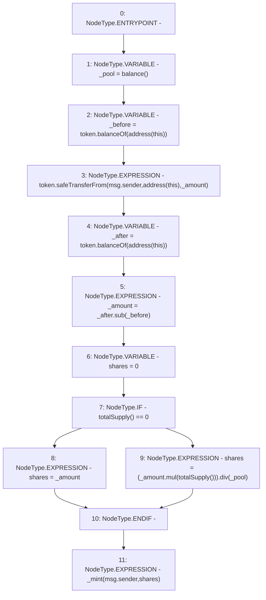

# Context: yVault.deposit

**Contract:** `yVault` (Inherits: ERC20Detailed, ERC20, Context)
**Signature:** `deposit(uint256)`
**Method Selector ID:** `0xb6b55f25`
**Visibility:** `public`
**Environment-Free:** `No (reads EVM state context)`
**Modifiers:** None

### State Variables Interaction
- **Reads:** token
- **Writes:** None

### Environment & Verification Flags
- **Uses Foundry Cheatcodes:** No
- **Has Echidna Properties:** No

### Internal Calls Tree
- None

### External Calls / Value Transfers
- `SafeMath.TMP_3339(uint256) = LIBRARY_CALL, dest:SafeMath, function:SafeMath.sub(uint256,uint256), arguments:['_after', '_before'] `
- `ERC20.TMP_3338(uint256) = HIGH_LEVEL_CALL, dest:token(ERC20), function:balanceOf, arguments:['TMP_3337']  `
- `SafeMath.TMP_3344(uint256) = LIBRARY_CALL, dest:SafeMath, function:SafeMath.div(uint256,uint256), arguments:['TMP_3343', '_pool'] `
- `SafeERC20.LIBRARY_CALL, dest:SafeERC20, function:SafeERC20.safeTransferFrom(ERC20,address,address,uint256), arguments:['token', 'msg.sender', 'TMP_3335', '_amount'] `
- `ERC20.TMP_3334(uint256) = HIGH_LEVEL_CALL, dest:token(ERC20), function:balanceOf, arguments:['TMP_3333']  `
- `SafeMath.TMP_3343(uint256) = LIBRARY_CALL, dest:SafeMath, function:SafeMath.mul(uint256,uint256), arguments:['_amount', 'TMP_3342'] `

### Control Flow Graph (CFG)


### Source Mapping
Declared in: `contracts/mocks/yVault/yVault.sol` on lines **275** to **288**

```solidity
    function deposit(uint256 _amount) public {
        uint256 _pool = balance();
        uint256 _before = token.balanceOf(address(this));
        token.safeTransferFrom(msg.sender, address(this), _amount);
        uint256 _after = token.balanceOf(address(this));
        _amount = _after.sub(_before); // Additional check for deflationary tokens
        uint256 shares = 0;
        if (totalSupply() == 0) {
            shares = _amount;
        } else {
            shares = (_amount.mul(totalSupply())).div(_pool);
        }
        _mint(msg.sender, shares);
    }

```
