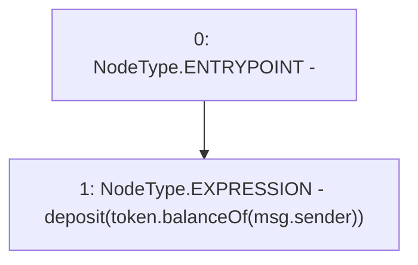

# Context: yVault.depositAll

**Contract:** `yVault` (Inherits: ERC20Detailed, ERC20, Context)
**Signature:** `depositAll()`
**Method Selector ID:** `0xde5f6268`
**Visibility:** `external`
**Environment-Free:** `No (reads EVM state context)`
**Modifiers:** None

### State Variables Interaction
- **Reads:** token
- **Writes:** None

### Environment & Verification Flags
- **Uses Foundry Cheatcodes:** No
- **Has Echidna Properties:** No

### Internal Calls Tree
- None

### External Calls / Value Transfers
- `ERC20.TMP_3330(uint256) = HIGH_LEVEL_CALL, dest:token(ERC20), function:balanceOf, arguments:['msg.sender']  `

### Control Flow Graph (CFG)


### Source Mapping
Declared in: `contracts/mocks/yVault/yVault.sol` on lines **271** to **273**

```solidity
    function depositAll() external {
        deposit(token.balanceOf(msg.sender));
    }

```
