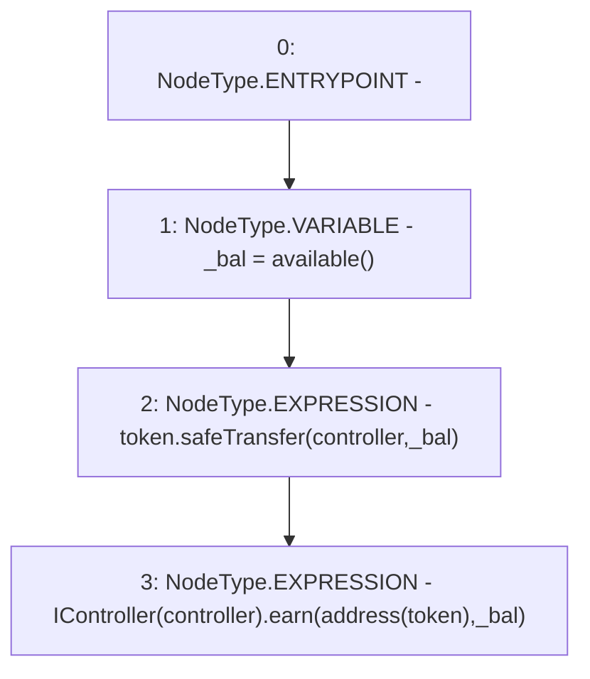

# Context: yVault.earn

**Contract:** `yVault` (Inherits: ERC20Detailed, ERC20, Context)
**Signature:** `earn()`
**Method Selector ID:** `0xd389800f`
**Visibility:** `public`
**Environment-Free:** `Yes`
**Modifiers:** None

### State Variables Interaction
- **Reads:** controller, token
- **Writes:** None

### Environment & Verification Flags
- **Uses Foundry Cheatcodes:** No
- **Has Echidna Properties:** No

### Internal Calls Tree
- None

### External Calls / Value Transfers
- `IController.HIGH_LEVEL_CALL, dest:TMP_3327(IController), function:earn, arguments:['TMP_3328', '_bal']  `
- `SafeERC20.LIBRARY_CALL, dest:SafeERC20, function:SafeERC20.safeTransfer(ERC20,address,uint256), arguments:['token', 'controller', '_bal'] `

### Control Flow Graph (CFG)


### Source Mapping
Declared in: `contracts/mocks/yVault/yVault.sol` on lines **265** to **269**

```solidity
    function earn() public {
        uint256 _bal = available();
        token.safeTransfer(controller, _bal);
        IController(controller).earn(address(token), _bal);
    }

```
