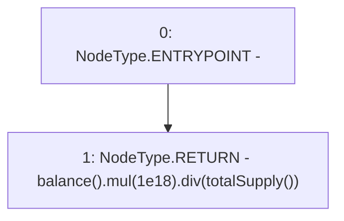

# Context: yVault.getPricePerFullShare

**Contract:** `yVault` (Inherits: ERC20Detailed, ERC20, Context)
**Signature:** `getPricePerFullShare() returns (uint256)`
**Method Selector ID:** `0x77c7b8fc`
**Visibility:** `public`
**Environment-Free:** `Yes`
**Modifiers:** None

### State Variables Interaction
- **Reads:** None
- **Writes:** None

### Environment & Verification Flags
- **Uses Foundry Cheatcodes:** No
- **Has Echidna Properties:** No

### Internal Calls Tree
- None

### External Calls / Value Transfers
- `SafeMath.TMP_3414(uint256) = LIBRARY_CALL, dest:SafeMath, function:SafeMath.div(uint256,uint256), arguments:['TMP_3412', 'TMP_3413'] `
- `SafeMath.TMP_3412(uint256) = LIBRARY_CALL, dest:SafeMath, function:SafeMath.mul(uint256,uint256), arguments:['TMP_3411', '1000000000000000000'] `

### Control Flow Graph (CFG)


### Source Mapping
Declared in: `contracts/mocks/yVault/yVault.sol` on lines **362** to **364**

```solidity
    function getPricePerFullShare() public view returns (uint256) {
        return balance().mul(1e18).div(totalSupply());
    }

```
