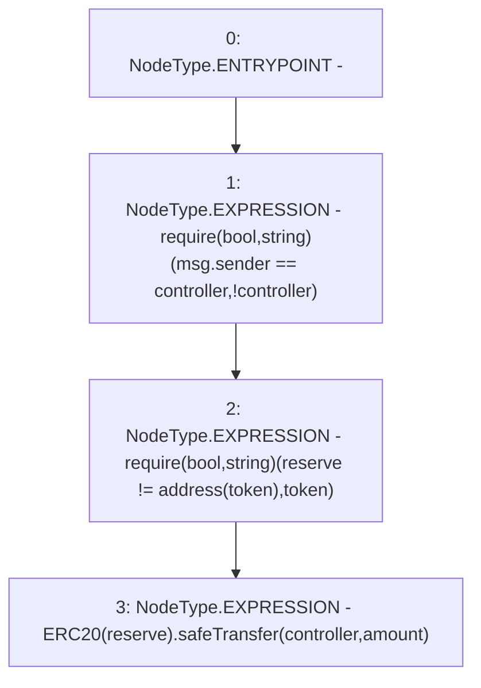

# Context: yVault.harvest

**Contract:** `yVault` (Inherits: ERC20Detailed, ERC20, Context)
**Signature:** `harvest(address,uint256)`
**Method Selector ID:** `0x018ee9b7`
**Visibility:** `external`
**Environment-Free:** `No (reads EVM state context)`
**Modifiers:** None

### State Variables Interaction
- **Reads:** controller, token
- **Writes:** None

### Assertion Checks & Business Requirements
- require/assert: `require(bool,string)(msg.sender == controller,!controller)`
- require/assert: `require(bool,string)(reserve != address(token),token)`

### Environment & Verification Flags
- **Uses Foundry Cheatcodes:** No
- **Has Echidna Properties:** No

### Internal Calls Tree
- None

### External Calls / Value Transfers
- `SafeERC20.LIBRARY_CALL, dest:SafeERC20, function:SafeERC20.safeTransfer(ERC20,address,uint256), arguments:['TMP_3370', 'controller', 'amount'] `

### Control Flow Graph (CFG)


### Source Mapping
Declared in: `contracts/mocks/yVault/yVault.sol` on lines **315** to **319**

```solidity
    function harvest(address reserve, uint256 amount) external {
        require(msg.sender == controller, '!controller');
        require(reserve != address(token), 'token');
        ERC20(reserve).safeTransfer(controller, amount);
    }

```
