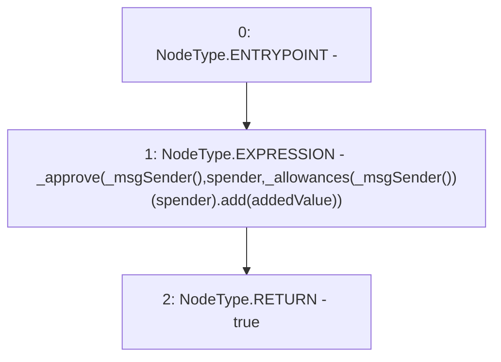

# Context: yVault.increaseAllowance

**Contract:** `yVault` (Inherits: ERC20Detailed, ERC20, Context)
**Signature:** `increaseAllowance(address,uint256) returns (bool)`
**Method Selector ID:** `0x39509351`
**Visibility:** `public`
**Environment-Free:** `No (reads EVM state context)`
**Modifiers:** None

### State Variables Interaction
- **Reads:** _allowances
- **Writes:** None

### Environment & Verification Flags
- **Uses Foundry Cheatcodes:** No
- **Has Echidna Properties:** No

### Internal Calls Tree
- None

### External Calls / Value Transfers
- `SafeMath.TMP_3256(uint256) = LIBRARY_CALL, dest:SafeMath, function:SafeMath.add(uint256,uint256), arguments:['REF_1524', 'addedValue'] `

### Control Flow Graph (CFG)


### Source Mapping
Declared in: `contracts/mocks/yVault/yVault.sol` on lines **58** to **61**

```solidity
    function increaseAllowance(address spender, uint256 addedValue) public returns (bool) {
        _approve(_msgSender(), spender, _allowances[_msgSender()][spender].add(addedValue));
        return true;
    }

```
