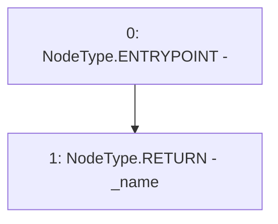

# Context: yVault.name

**Contract:** `yVault` (Inherits: ERC20Detailed, ERC20, Context)
**Signature:** `name() returns (string)`
**Method Selector ID:** `0x06fdde03`
**Visibility:** `public`
**Environment-Free:** `Yes`
**Modifiers:** None

### State Variables Interaction
- **Reads:** _name
- **Writes:** None

### Environment & Verification Flags
- **Uses Foundry Cheatcodes:** No
- **Has Echidna Properties:** No

### Internal Calls Tree
- None

### External Calls / Value Transfers
- None

### Control Flow Graph (CFG)


### Source Mapping
Declared in: `contracts/mocks/yVault/yVault.sol` on lines **130** to **132**

```solidity
    function name() public view returns (string memory) {
        return _name;
    }

```
