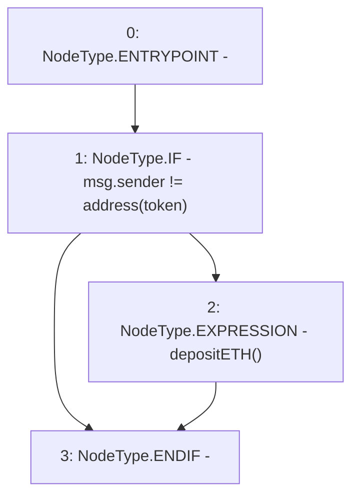

# Context: yVault.receive

**Contract:** `yVault` (Inherits: ERC20Detailed, ERC20, Context)
**Signature:** `receive()`
**Method Selector ID:** `0xa3e76c0f`
**Visibility:** `external`
**Environment-Free:** `No (reads EVM state context)`
**Modifiers:** None

### State Variables Interaction
- **Reads:** token
- **Writes:** None

### Environment & Verification Flags
- **Uses Foundry Cheatcodes:** No
- **Has Echidna Properties:** No

### Internal Calls Tree
- None

### External Calls / Value Transfers
- None

### Control Flow Graph (CFG)


### Source Mapping
Declared in: `contracts/mocks/yVault/yVault.sol` on lines **366** to **370**

```solidity
    receive() external payable {
        if (msg.sender != address(token)) {
            depositETH();
        }
    }

```
