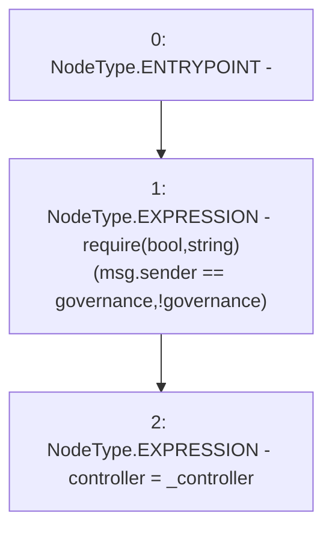

# Context: yVault.setController

**Contract:** `yVault` (Inherits: ERC20Detailed, ERC20, Context)
**Signature:** `setController(address)`
**Method Selector ID:** `0x92eefe9b`
**Visibility:** `public`
**Environment-Free:** `No (reads EVM state context)`
**Modifiers:** None

### State Variables Interaction
- **Reads:** governance
- **Writes:** controller

### Assertion Checks & Business Requirements
- require/assert: `require(bool,string)(msg.sender == governance,!governance)`

### Environment & Verification Flags
- **Uses Foundry Cheatcodes:** No
- **Has Echidna Properties:** No

### Internal Calls Tree
- None

### External Calls / Value Transfers
- None

### Control Flow Graph (CFG)


### Source Mapping
Declared in: `contracts/mocks/yVault/yVault.sol` on lines **254** to **257**

```solidity
    function setController(address _controller) public {
        require(msg.sender == governance, '!governance');
        controller = _controller;
    }

```
