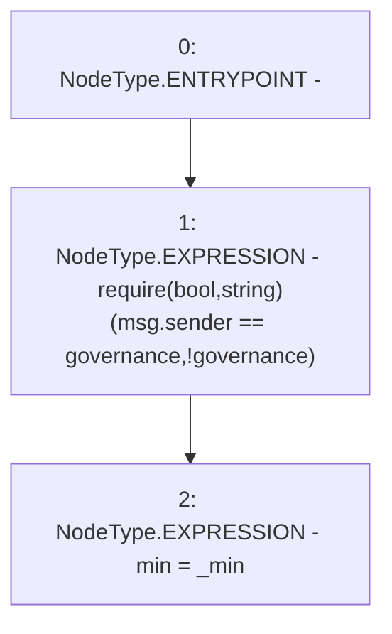

# Context: yVault.setMin

**Contract:** `yVault` (Inherits: ERC20Detailed, ERC20, Context)
**Signature:** `setMin(uint256)`
**Method Selector ID:** `0x45dc3dd8`
**Visibility:** `external`
**Environment-Free:** `No (reads EVM state context)`
**Modifiers:** None

### State Variables Interaction
- **Reads:** governance
- **Writes:** min

### Assertion Checks & Business Requirements
- require/assert: `require(bool,string)(msg.sender == governance,!governance)`

### Environment & Verification Flags
- **Uses Foundry Cheatcodes:** No
- **Has Echidna Properties:** No

### Internal Calls Tree
- None

### External Calls / Value Transfers
- None

### Control Flow Graph (CFG)


### Source Mapping
Declared in: `contracts/mocks/yVault/yVault.sol` on lines **244** to **247**

```solidity
    function setMin(uint256 _min) external {
        require(msg.sender == governance, '!governance');
        min = _min;
    }

```
