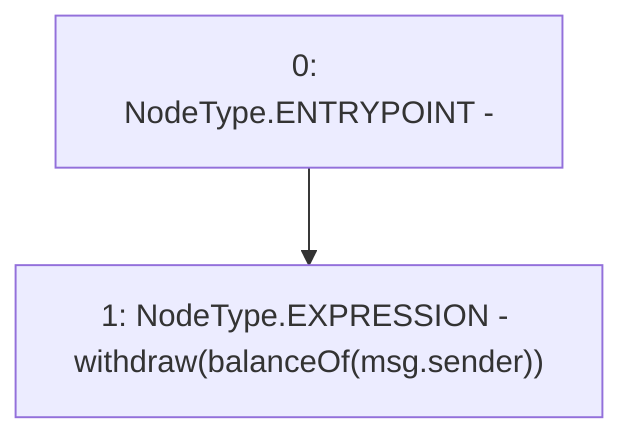

# Context: yVault.withdrawAll

**Contract:** `yVault` (Inherits: ERC20Detailed, ERC20, Context)
**Signature:** `withdrawAll()`
**Method Selector ID:** `0x853828b6`
**Visibility:** `external`
**Environment-Free:** `No (reads EVM state context)`
**Modifiers:** None

### State Variables Interaction
- **Reads:** None
- **Writes:** None

### Environment & Verification Flags
- **Uses Foundry Cheatcodes:** No
- **Has Echidna Properties:** No

### Internal Calls Tree
- None

### External Calls / Value Transfers
- None

### Control Flow Graph (CFG)


### Source Mapping
Declared in: `contracts/mocks/yVault/yVault.sol` on lines **306** to **308**

```solidity
    function withdrawAll() external {
        withdraw(balanceOf(msg.sender));
    }

```
