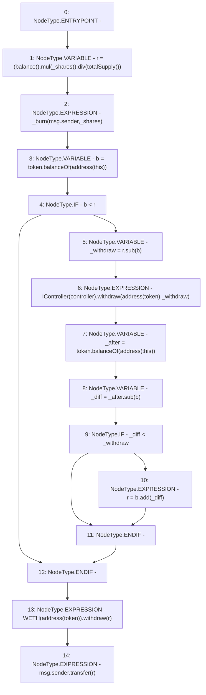

# Context: yVault.withdrawETH

**Contract:** `yVault` (Inherits: ERC20Detailed, ERC20, Context)
**Signature:** `withdrawETH(uint256)`
**Method Selector ID:** `0xf14210a6`
**Visibility:** `public`
**Environment-Free:** `No (reads EVM state context)`
**Modifiers:** None

### State Variables Interaction
- **Reads:** controller, token
- **Writes:** None

### Environment & Verification Flags
- **Uses Foundry Cheatcodes:** No
- **Has Echidna Properties:** No

### Internal Calls Tree
- None

### External Calls / Value Transfers
- `SafeMath.TMP_3404(uint256) = LIBRARY_CALL, dest:SafeMath, function:SafeMath.sub(uint256,uint256), arguments:['_after', 'b'] `
- `IController.HIGH_LEVEL_CALL, dest:TMP_3399(IController), function:withdraw, arguments:['TMP_3400', '_withdraw']  `
- `WETH.HIGH_LEVEL_CALL, dest:TMP_3408(WETH), function:withdraw, arguments:['r']  `
- `SafeMath.TMP_3391(uint256) = LIBRARY_CALL, dest:SafeMath, function:SafeMath.mul(uint256,uint256), arguments:['TMP_3390', '_shares'] `
- `ERC20.TMP_3396(uint256) = HIGH_LEVEL_CALL, dest:token(ERC20), function:balanceOf, arguments:['TMP_3395']  `
- `ERC20.TMP_3403(uint256) = HIGH_LEVEL_CALL, dest:token(ERC20), function:balanceOf, arguments:['TMP_3402']  `
- `SafeMath.TMP_3398(uint256) = LIBRARY_CALL, dest:SafeMath, function:SafeMath.sub(uint256,uint256), arguments:['r', 'b'] `
- `SafeMath.TMP_3393(uint256) = LIBRARY_CALL, dest:SafeMath, function:SafeMath.div(uint256,uint256), arguments:['TMP_3391', 'TMP_3392'] `
- `SafeMath.TMP_3406(uint256) = LIBRARY_CALL, dest:SafeMath, function:SafeMath.add(uint256,uint256), arguments:['b', '_diff'] `

### Control Flow Graph (CFG)


### Source Mapping
Declared in: `contracts/mocks/yVault/yVault.sol` on lines **342** to **360**

```solidity
    function withdrawETH(uint256 _shares) public {
        uint256 r = (balance().mul(_shares)).div(totalSupply());
        _burn(msg.sender, _shares);

        // Check balance
        uint256 b = token.balanceOf(address(this));
        if (b < r) {
            uint256 _withdraw = r.sub(b);
            IController(controller).withdraw(address(token), _withdraw);
            uint256 _after = token.balanceOf(address(this));
            uint256 _diff = _after.sub(b);
            if (_diff < _withdraw) {
                r = b.add(_diff);
            }
        }

        WETH(address(token)).withdraw(r);
        msg.sender.transfer(r);
    }

```
