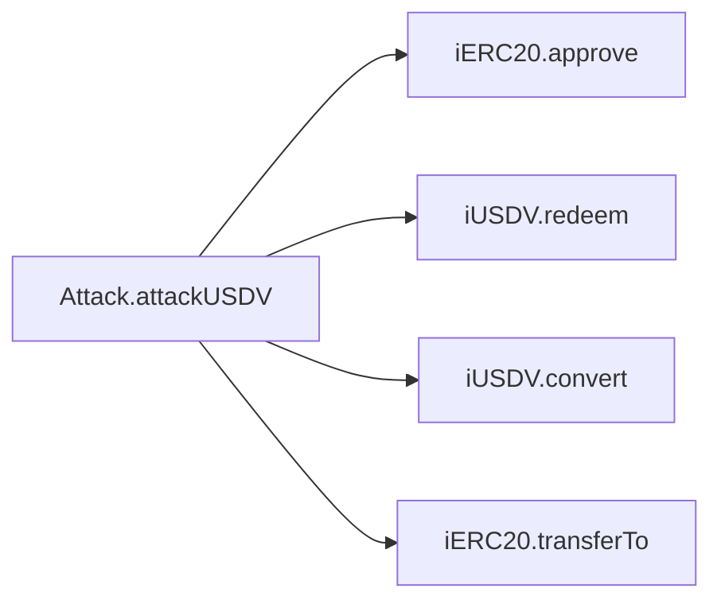
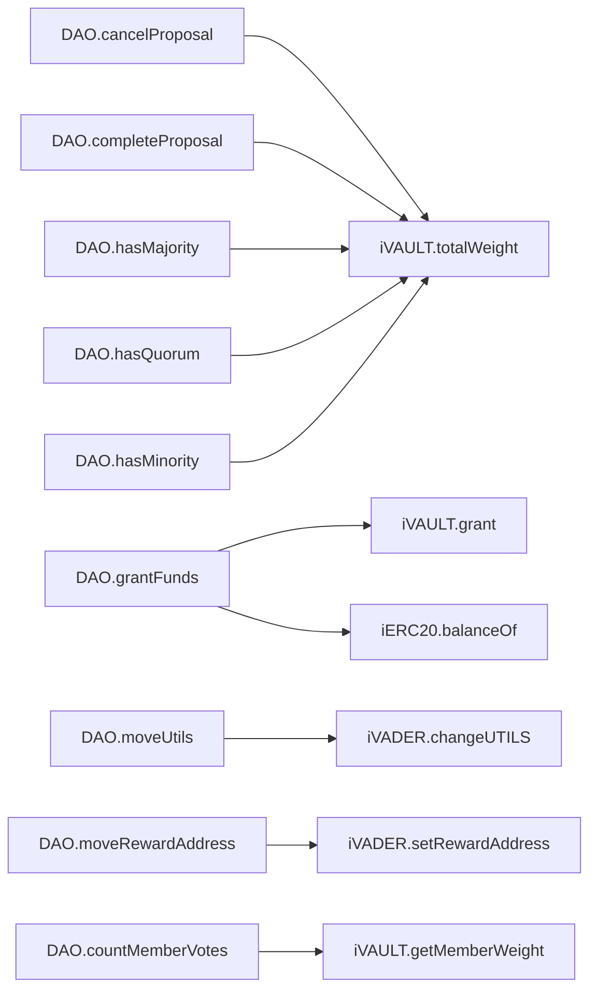
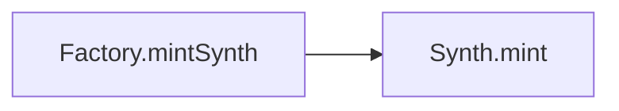
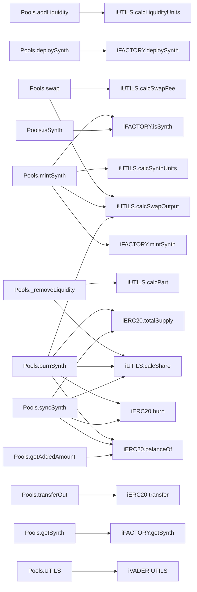
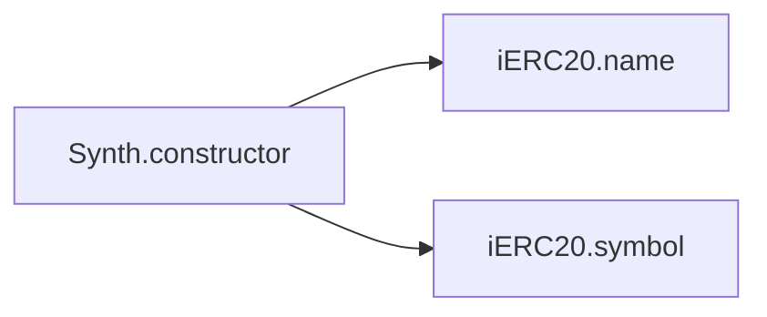
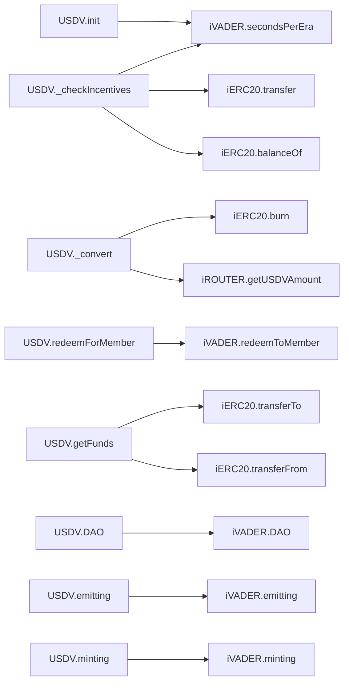
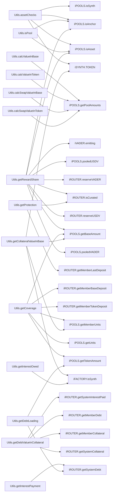
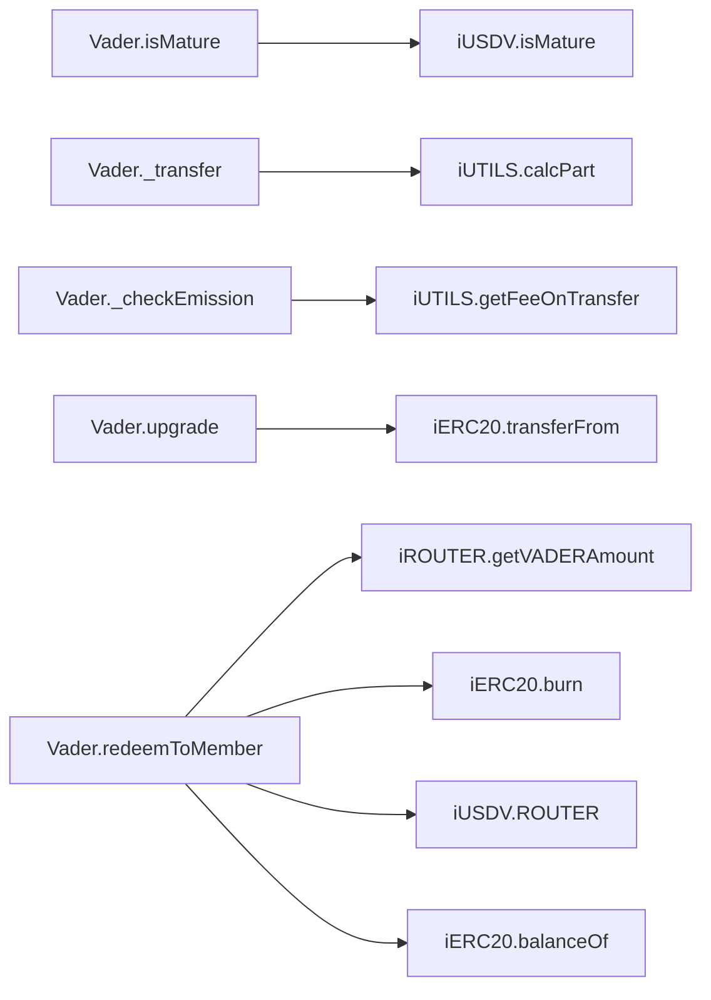
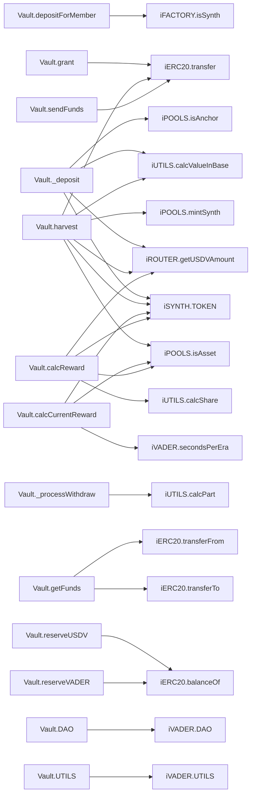

```mermaid
flowchart LR
    Router.addLiquidity --> iPOOLS.addLiquidity
    Router.removeLiquidity --> iPOOLS.removeLiquidity
    Router.removeLiquidity --> iERC20.transfer
    Router.swapWithSynthsWithLimit --> iPOOLS.swap
    Router.swapWithSynthsWithLimit --> iPOOLS.mintSynth
    Router.swapWithSynthsWithLimit --> iUTILS.calcSwapSlip
    Router.swapWithSynthsWithLimit --> iPOOLS.getBaseAmount
    Router.swapWithSynthsWithLimit --> iPOOLS.burnSynth
    Router.swapWithSynthsWithLimit --> iPOOLS.getTokenAmount
    Router.swapWithSynthsWithLimit --> iPOOLS.getSynth
    Router.swapWithSynthsWithLimit --> iPOOLS.isAnchor
    Router._handlePoolReward --> iPOOLS.sync
    Router._handlePoolReward --> iERC20.transfer
    Router._handlePoolReward --> iUTILS.getRewardShare
    Router.removeDepositData --> iUTILS.calcPart
    Router.getILProtection --> iUTILS.getProtection
    Router.curatePool --> iPOOLS.isAnchor
    Router.curatePool --> iPOOLS.isAsset
    Router.replacePool --> iPOOLS.getBaseAmount
    Router.replacePool --> iPOOLS.isAsset
    Router.listAnchor --> iUTILS.calcValueInBase
    Router.listAnchor --> iPOOLS.isAnchor
    Router.replaceAnchor --> iPOOLS.getBaseAmount
    Router.replaceAnchor --> iUTILS.requirePriceBounds
    Router.replaceAnchor --> iPOOLS.isAnchor
    Router.updateAnchorPrice --> iUTILS.calcValueInBase
    Router._handleAnchorPriceUpdate --> iPOOLS.isAnchor
    Router.getAnchorPrice --> iUTILS.sortArray
    Router.borrowForMember --> iPOOLS.isAnchor
    Router.borrowForMember --> iUTILS.assetChecks
    Router.borrowForMember --> iPOOLS.swap
    Router.borrowForMember --> iUTILS.getCollateralValueInBase
    Router.borrowForMember --> iERC20.transfer
    Router.borrowForMember --> iPOOLS.isAsset
    Router.repayForMember --> iPOOLS.swap
    Router.repayForMember --> iUTILS.calcPart
    Router.repayForMember --> iPOOLS.isAsset
    Router.repayForMember --> iUTILS.getDebtValueInCollateral
    Router.repayForMember --> iPOOLS.isAnchor
    Router.payInterest --> iERC20.transfer
    Router.payInterest --> iPOOLS.sync
    Router.payInterest --> iUTILS.getInterestOwed
    Router.payInterest --> iVADER.secondsPerEra
    Router.payInterest --> iPOOLS.isSynth
    Router.payInterest --> iPOOLS.syncSynth
    Router.payInterest --> iSYNTH.TOKEN
    Router._handleTransferIn --> iPOOLS.isSynth
    Router._handleTransferIn --> iPOOLS.lockUnits
    Router._handleTransferOut --> iPOOLS.isSynth
    Router._handleTransferOut --> iPOOLS.unlockUnits
    Router._getFunds --> iERC20.transferFrom
    Router._getFunds --> iERC20.balanceOf
    Router._getFunds --> iERC20.transferTo
    Router._sendFunds --> iERC20.transfer
    Router.reserveVADER --> iERC20.balanceOf
    Router.reserveUSDV --> iERC20.balanceOf
    Router.moveTokenToPools --> iERC20.transferFrom
    Router.moveTokenToPools --> iERC20.transferTo
    Router.moveTokenToPools --> iERC20.balanceOf
    Router.moveTokenToPools --> iPOOLS.isSynth
    Router.UTILS --> iVADER.UTILS
    Router.DAO --> iVADER.DAO
    Router.emitting --> iVADER.emitting
    Router.isPool --> iPOOLS.isAnchor
    Router.isPool --> iPOOLS.isAsset
```

# 🧬 Flow Graphs, Constructor Sequences & SSA Representations

## Contract: Attack
### Linearised Constructor Execution sequence
- No constructors configured in hierarchy.

### Inter-Contract & Function Call Graph (Mermaid)


### Functions Intermediate Code Operations (SlithIR & SSA)
#### Function: `init`
<details><summary>View SlithIR Operations</summary>

```
TMP_0(bool) = inited == False
TMP_1(None) = SOLIDITY_CALL require(bool)(TMP_0)
inited(bool) := True(bool)
VADER(address) := _vader(address)
USDV(address) := _USDV(address)
```
</details>
<details><summary>View SSA Operations</summary>

```
No SSA operations.
```
</details>

#### Function: `attackUSDV`
<details><summary>View SlithIR Operations</summary>

```
TMP_2 = CONVERT VADER to iERC20
TMP_3(bool) = HIGH_LEVEL_CALL, dest:TMP_2(iERC20), function:approve, arguments:['USDV', 'amount']  
TMP_4 = CONVERT USDV to iERC20
TMP_5(bool) = HIGH_LEVEL_CALL, dest:TMP_4(iERC20), function:approve, arguments:['USDV', 'amount']  
TMP_6 = CONVERT VADER to iERC20
TMP_7 = CONVERT this to address
TMP_8(bool) = HIGH_LEVEL_CALL, dest:TMP_6(iERC20), function:transferTo, arguments:['TMP_7', 'amount']  
TMP_9 = CONVERT USDV to iUSDV
TMP_10(uint256) = HIGH_LEVEL_CALL, dest:TMP_9(iUSDV), function:convert, arguments:['amount']  
TMP_11 = CONVERT USDV to iUSDV
TMP_12(uint256) = HIGH_LEVEL_CALL, dest:TMP_11(iUSDV), function:redeem, arguments:['amount']  
```
</details>
<details><summary>View SSA Operations</summary>

```
No SSA operations.
```
</details>


---

## Contract: DAO
### Linearised Constructor Execution sequence
- No constructors configured in hierarchy.

### Inter-Contract & Function Call Graph (Mermaid)


### Functions Intermediate Code Operations (SlithIR & SSA)
#### Function: `init`
<details><summary>View SlithIR Operations</summary>

```
TMP_13(bool) = inited == False
TMP_14(None) = SOLIDITY_CALL require(bool)(TMP_13)
inited(bool) := True(bool)
VADER(address) := _vader(address)
USDV(address) := _usdv(address)
VAULT(address) := _vault(address)
coolOffPeriod(uint256) := 1(uint256)
```
</details>
<details><summary>View SSA Operations</summary>

```
No SSA operations.
```
</details>

#### Function: `newGrantProposal`
<details><summary>View SlithIR Operations</summary>

```
typeStr(string) := GRANT(string)
proposalCount(uint256) = proposalCount (c)+ 1
REF_5(string) -> mapPID_type[proposalCount]
REF_5(string) (->mapPID_type) := typeStr(string)
REF_6(address) -> grant.recipient
REF_6(address) (->grant) := recipient(address)
REF_7(uint256) -> grant.amount
REF_7(uint256) (->grant) := amount(uint256)
REF_8(DAO.GrantDetails) -> mapPID_grant[proposalCount]
REF_8(DAO.GrantDetails) (->mapPID_grant) := grant(DAO.GrantDetails)
Emit NewProposal(msg.sender,proposalCount,typeStr)
```
</details>
<details><summary>View SSA Operations</summary>

```
No SSA operations.
```
</details>

#### Function: `newAddressProposal`
<details><summary>View SlithIR Operations</summary>

```
proposalCount(uint256) = proposalCount (c)+ 1
REF_9(address) -> mapPID_address[proposalCount]
REF_9(address) (->mapPID_address) := proposedAddress(address)
REF_10(string) -> mapPID_type[proposalCount]
REF_10(string) (->mapPID_type) := typeStr(string)
Emit NewProposal(msg.sender,proposalCount,typeStr)
```
</details>
<details><summary>View SSA Operations</summary>

```
No SSA operations.
```
</details>

#### Function: `voteProposal`
<details><summary>View SlithIR Operations</summary>

```
REF_11(string) -> mapPID_type[proposalID]
TMP_17 = CONVERT REF_11 to bytes
_type(bytes) := TMP_17(bytes)
TMP_18(uint256) = INTERNAL_CALL, DAO.countMemberVotes(uint256)(proposalID)
voteWeight(uint256) := TMP_18(uint256)
TMP_19(bool) = INTERNAL_CALL, DAO.hasQuorum(uint256)(proposalID)
REF_12(bool) -> mapPID_finalising[proposalID]
TMP_20(bool) = REF_12 == False
TMP_21(bool) = TMP_19 && TMP_20
CONDITION TMP_21
TMP_22(bool) = INTERNAL_CALL, DAO.isEqual(bytes,bytes)(_type,DAO)
TMP_23(bool) = INTERNAL_CALL, DAO.isEqual(bytes,bytes)(_type,UTILS)
TMP_24(bool) = TMP_22 || TMP_23
TMP_25(bool) = INTERNAL_CALL, DAO.isEqual(bytes,bytes)(_type,REWARD)
TMP_26(bool) = TMP_24 || TMP_25
CONDITION TMP_26
TMP_27(bool) = INTERNAL_CALL, DAO.hasMajority(uint256)(proposalID)
CONDITION TMP_27
INTERNAL_CALL, DAO._finalise(uint256)(proposalID)
INTERNAL_CALL, DAO._finalise(uint256)(proposalID)
REF_13(uint256) -> mapPID_votes[proposalID]
TMP_30 = CONVERT _type to string
Emit NewVote(msg.sender,proposalID,voteWeight,REF_13,TMP_30)
RETURN voteWeight
```
</details>
<details><summary>View SSA Operations</summary>

```
No SSA operations.
```
</details>

#### Function: `cancelProposal`
<details><summary>View SlithIR Operations</summary>

```
REF_17(bool) -> mapPID_finalising[oldProposalID]
TMP_36(None) = SOLIDITY_CALL require(bool,string)(REF_17,Must be finalising)
TMP_37(bool) = INTERNAL_CALL, DAO.hasMinority(uint256)(newProposalID)
TMP_38(None) = SOLIDITY_CALL require(bool,string)(TMP_37,Must have minority)
REF_18(string) -> mapPID_type[oldProposalID]
TMP_39 = CONVERT REF_18 to bytes
REF_19(string) -> mapPID_type[newProposalID]
TMP_40 = CONVERT REF_19 to bytes
TMP_41(bool) = INTERNAL_CALL, DAO.isEqual(bytes,bytes)(TMP_39,TMP_40)
TMP_42(None) = SOLIDITY_CALL require(bool,string)(TMP_41,Must be same)
REF_20(uint256) -> mapPID_votes[oldProposalID]
REF_20(uint256) (->mapPID_votes) := 0(uint256)
REF_21(uint256) -> mapPID_votes[oldProposalID]
REF_22(uint256) -> mapPID_votes[newProposalID]
TMP_43 = CONVERT VAULT to iVAULT
TMP_44(uint256) = HIGH_LEVEL_CALL, dest:TMP_43(iVAULT), function:totalWeight, arguments:[]  
Emit CancelProposal(msg.sender,oldProposalID,REF_21,REF_22,TMP_44)
```
</details>
<details><summary>View SSA Operations</summary>

```
No SSA operations.
```
</details>

#### Function: `finaliseProposal`
<details><summary>View SlithIR Operations</summary>

```
REF_24(uint256) -> mapPID_timeStart[proposalID]
TMP_46(uint256) = block.timestamp (c)- REF_24
TMP_47(bool) = TMP_46 > coolOffPeriod
TMP_48(None) = SOLIDITY_CALL require(bool,string)(TMP_47,Must be after cool off)
REF_25(bool) -> mapPID_finalising[proposalID]
TMP_49(bool) = REF_25 == True
TMP_50(None) = SOLIDITY_CALL require(bool,string)(TMP_49,Must be finalising)
TMP_51(bool) = INTERNAL_CALL, DAO.hasQuorum(uint256)(proposalID)
TMP_52 = UnaryType.BANG TMP_51 
CONDITION TMP_52
INTERNAL_CALL, DAO._finalise(uint256)(proposalID)
REF_26(string) -> mapPID_type[proposalID]
TMP_54 = CONVERT REF_26 to bytes
_type(bytes) := TMP_54(bytes)
TMP_55(bool) = INTERNAL_CALL, DAO.isEqual(bytes,bytes)(_type,GRANT)
CONDITION TMP_55
INTERNAL_CALL, DAO.grantFunds(uint256)(proposalID)
TMP_57(bool) = INTERNAL_CALL, DAO.isEqual(bytes,bytes)(_type,UTILS)
CONDITION TMP_57
INTERNAL_CALL, DAO.moveUtils(uint256)(proposalID)
TMP_59(bool) = INTERNAL_CALL, DAO.isEqual(bytes,bytes)(_type,REWARD)
CONDITION TMP_59
INTERNAL_CALL, DAO.moveRewardAddress(uint256)(proposalID)
```
</details>
<details><summary>View SSA Operations</summary>

```
No SSA operations.
```
</details>

#### Function: `hasMajority`
<details><summary>View SlithIR Operations</summary>

```
REF_50(uint256) -> mapPID_votes[_proposalID]
votes(uint256) := REF_50(uint256)
TMP_86 = CONVERT VAULT to iVAULT
TMP_87(uint256) = HIGH_LEVEL_CALL, dest:TMP_86(iVAULT), function:totalWeight, arguments:[]  
TMP_88(uint256) = TMP_87 (c)/ 2
consensus(uint256) := TMP_88(uint256)
TMP_89(bool) = votes > consensus
CONDITION TMP_89
RETURN True
RETURN False
```
</details>
<details><summary>View SSA Operations</summary>

```
No SSA operations.
```
</details>

#### Function: `hasQuorum`
<details><summary>View SlithIR Operations</summary>

```
REF_52(uint256) -> mapPID_votes[_proposalID]
votes(uint256) := REF_52(uint256)
TMP_90 = CONVERT VAULT to iVAULT
TMP_91(uint256) = HIGH_LEVEL_CALL, dest:TMP_90(iVAULT), function:totalWeight, arguments:[]  
TMP_92(uint256) = TMP_91 (c)/ 3
consensus(uint256) := TMP_92(uint256)
TMP_93(bool) = votes > consensus
CONDITION TMP_93
RETURN True
RETURN False
```
</details>
<details><summary>View SSA Operations</summary>

```
No SSA operations.
```
</details>

#### Function: `hasMinority`
<details><summary>View SlithIR Operations</summary>

```
REF_54(uint256) -> mapPID_votes[_proposalID]
votes(uint256) := REF_54(uint256)
TMP_94 = CONVERT VAULT to iVAULT
TMP_95(uint256) = HIGH_LEVEL_CALL, dest:TMP_94(iVAULT), function:totalWeight, arguments:[]  
TMP_96(uint256) = TMP_95 (c)/ 6
consensus(uint256) := TMP_96(uint256)
TMP_97(bool) = votes > consensus
CONDITION TMP_97
RETURN True
RETURN False
```
</details>
<details><summary>View SSA Operations</summary>

```
No SSA operations.
```
</details>

#### Function: `isEqual`
<details><summary>View SlithIR Operations</summary>

```
TMP_98(bytes32) = SOLIDITY_CALL sha256(bytes)(part1)
TMP_99(bytes32) = SOLIDITY_CALL sha256(bytes)(part2)
TMP_100(bool) = TMP_98 == TMP_99
CONDITION TMP_100
RETURN True
RETURN False
```
</details>
<details><summary>View SSA Operations</summary>

```
No SSA operations.
```
</details>


---

## Contract: Factory
### Linearised Constructor Execution sequence
- No constructors configured in hierarchy.

### Inter-Contract & Function Call Graph (Mermaid)


### Functions Intermediate Code Operations (SlithIR & SSA)
#### Function: `init`
<details><summary>View SlithIR Operations</summary>

```
TMP_101(bool) = inited == False
TMP_102(None) = SOLIDITY_CALL require(bool)(TMP_101)
inited(bool) := True(bool)
POOLS(address) := _pool(address)
```
</details>
<details><summary>View SSA Operations</summary>

```
No SSA operations.
```
</details>

#### Function: `deploySynth`
<details><summary>View SlithIR Operations</summary>

```
REF_56(address) -> getSynth[token]
TMP_103 = CONVERT 0 to address
TMP_104(bool) = REF_56 == TMP_103
TMP_105(None) = SOLIDITY_CALL require(bool,string)(TMP_104,CreateErr)
TMP_107(Synth) = new Synth(token) 
newSynth(Synth) := TMP_107(Synth)
TMP_108 = CONVERT newSynth to address
synth(address) := TMP_108(address)
INTERNAL_CALL, Factory._addSynth(address,address)(token,synth)
Emit CreateSynth(token,synth)
MODIFIER_CALL, Factory.onlyPOOLS()()
RETURN synth
```
</details>
<details><summary>View SSA Operations</summary>

```
No SSA operations.
```
</details>

#### Function: `mintSynth`
<details><summary>View SlithIR Operations</summary>

```
TMP_112 = CONVERT synth to Synth
HIGH_LEVEL_CALL, dest:TMP_112(Synth), function:mint, arguments:['member', 'amount']  
RETURN True
MODIFIER_CALL, Factory.onlyPOOLS()()
```
</details>
<details><summary>View SSA Operations</summary>

```
No SSA operations.
```
</details>


---

## Contract: Pools
### Linearised Constructor Execution sequence
- No constructors configured in hierarchy.

### Inter-Contract & Function Call Graph (Mermaid)


### Functions Intermediate Code Operations (SlithIR & SSA)
#### Function: `init`
<details><summary>View SlithIR Operations</summary>

```
TMP_120(bool) = inited == False
TMP_121(None) = SOLIDITY_CALL require(bool)(TMP_120)
inited(bool) := True(bool)
VADER(address) := _vader(address)
USDV(address) := _usdv(address)
ROUTER(address) := _router(address)
FACTORY(address) := _factory(address)
```
</details>
<details><summary>View SSA Operations</summary>

```
No SSA operations.
```
</details>

#### Function: `addLiquidity`
<details><summary>View SlithIR Operations</summary>

```
TMP_122(bool) = token != USDV
TMP_123(bool) = token != VADER
TMP_124(bool) = TMP_122 && TMP_123
TMP_125(None) = SOLIDITY_CALL require(bool)(TMP_124)
TMP_126(bool) = base == VADER
CONDITION TMP_126
TMP_127(bool) = INTERNAL_CALL, Pools.isAnchor(address)(token)
TMP_128 = UnaryType.BANG TMP_127 
CONDITION TMP_128
REF_63(bool) -> _isAnchor[token]
REF_63(bool) (->_isAnchor) := True(bool)
TMP_129(uint256) = INTERNAL_CALL, Pools.getAddedAmount(address,address)(VADER,token)
_actualInputBase(uint256) := TMP_129(uint256)
TMP_130(bool) = base == USDV
CONDITION TMP_130
TMP_131(bool) = INTERNAL_CALL, Pools.isAsset(address)(token)
TMP_132 = UnaryType.BANG TMP_131 
CONDITION TMP_132
REF_64(bool) -> _isAsset[token]
REF_64(bool) (->_isAsset) := True(bool)
TMP_133(uint256) = INTERNAL_CALL, Pools.getAddedAmount(address,address)(USDV,token)
_actualInputBase(uint256) := TMP_133(uint256)
TMP_134(uint256) = INTERNAL_CALL, Pools.getAddedAmount(address,address)(token,token)
_actualInputToken(uint256) := TMP_134(uint256)
TMP_135(address) = INTERNAL_CALL, Pools.UTILS()()
TMP_136 = CONVERT TMP_135 to iUTILS
REF_66(uint256) -> mapToken_baseAmount[token]
REF_67(uint256) -> mapToken_tokenAmount[token]
REF_68(uint256) -> mapToken_Units[token]
TMP_137(uint256) = HIGH_LEVEL_CALL, dest:TMP_136(iUTILS), function:calcLiquidityUnits, arguments:['_actualInputBase', 'REF_66', '_actualInputToken', 'REF_67', 'REF_68']  
liquidityUnits(uint256) := TMP_137(uint256)
REF_69(mapping(address => uint256)) -> mapTokenMember_Units[token]
REF_70(uint256) -> REF_69[member]
REF_70(-> mapTokenMember_Units) = REF_70 (c)+ liquidityUnits
REF_71(uint256) -> mapToken_Units[token]
REF_71(-> mapToken_Units) = REF_71 (c)+ liquidityUnits
REF_72(uint256) -> mapToken_baseAmount[token]
REF_72(-> mapToken_baseAmount) = REF_72 (c)+ _actualInputBase
REF_73(uint256) -> mapToken_tokenAmount[token]
REF_73(-> mapToken_tokenAmount) = REF_73 (c)+ _actualInputToken
Emit AddLiquidity(member,base,_actualInputBase,token,_actualInputToken,liquidityUnits)
RETURN liquidityUnits
```
</details>
<details><summary>View SSA Operations</summary>

```
No SSA operations.
```
</details>

#### Function: `removeLiquidity`
<details><summary>View SlithIR Operations</summary>

```
TUPLE_0(uint256,uint256) = INTERNAL_CALL, Pools._removeLiquidity(address,address,uint256,address)(base,token,basisPoints,tx.origin)
RETURN TUPLE_0
RETURN outputBase,outputToken
```
</details>
<details><summary>View SSA Operations</summary>

```
No SSA operations.
```
</details>

#### Function: `removeLiquidityDirectly`
<details><summary>View SlithIR Operations</summary>

```
TUPLE_1(uint256,uint256) = INTERNAL_CALL, Pools._removeLiquidity(address,address,uint256,address)(base,token,basisPoints,msg.sender)
RETURN TUPLE_1
RETURN outputBase,outputToken
```
</details>
<details><summary>View SSA Operations</summary>

```
No SSA operations.
```
</details>

#### Function: `swap`
<details><summary>View SlithIR Operations</summary>

```
CONDITION toBase
TMP_155(uint256) = INTERNAL_CALL, Pools.getAddedAmount(address,address)(token,token)
_actualInput(uint256) := TMP_155(uint256)
TMP_156(address) = INTERNAL_CALL, Pools.UTILS()()
TMP_157 = CONVERT TMP_156 to iUTILS
REF_90(uint256) -> mapToken_tokenAmount[token]
REF_91(uint256) -> mapToken_baseAmount[token]
TMP_158(uint256) = HIGH_LEVEL_CALL, dest:TMP_157(iUTILS), function:calcSwapOutput, arguments:['_actualInput', 'REF_90', 'REF_91']  
outputAmount(uint256) := TMP_158(uint256)
TMP_159(address) = INTERNAL_CALL, Pools.UTILS()()
TMP_160 = CONVERT TMP_159 to iUTILS
REF_93(uint256) -> mapToken_tokenAmount[token]
REF_94(uint256) -> mapToken_baseAmount[token]
TMP_161(uint256) = HIGH_LEVEL_CALL, dest:TMP_160(iUTILS), function:calcSwapFee, arguments:['_actualInput', 'REF_93', 'REF_94']  
_swapFee(uint256) := TMP_161(uint256)
REF_95(uint256) -> mapToken_tokenAmount[token]
REF_95(-> mapToken_tokenAmount) = REF_95 (c)+ _actualInput
REF_96(uint256) -> mapToken_baseAmount[token]
REF_96(-> mapToken_baseAmount) = REF_96 (c)- outputAmount
Emit Swap(member,token,_actualInput,base,outputAmount,_swapFee)
INTERNAL_CALL, Pools.transferOut(address,uint256,address)(base,outputAmount,member)
TMP_164(uint256) = INTERNAL_CALL, Pools.getAddedAmount(address,address)(base,token)
_actualInput_scope_0(uint256) := TMP_164(uint256)
TMP_165(address) = INTERNAL_CALL, Pools.UTILS()()
TMP_166 = CONVERT TMP_165 to iUTILS
REF_98(uint256) -> mapToken_baseAmount[token]
REF_99(uint256) -> mapToken_tokenAmount[token]
TMP_167(uint256) = HIGH_LEVEL_CALL, dest:TMP_166(iUTILS), function:calcSwapOutput, arguments:['_actualInput_scope_0', 'REF_98', 'REF_99']  
outputAmount(uint256) := TMP_167(uint256)
TMP_168(address) = INTERNAL_CALL, Pools.UTILS()()
TMP_169 = CONVERT TMP_168 to iUTILS
REF_101(uint256) -> mapToken_baseAmount[token]
REF_102(uint256) -> mapToken_tokenAmount[token]
TMP_170(uint256) = HIGH_LEVEL_CALL, dest:TMP_169(iUTILS), function:calcSwapFee, arguments:['_actualInput_scope_0', 'REF_101', 'REF_102']  
_swapFee_scope_1(uint256) := TMP_170(uint256)
REF_103(uint256) -> mapToken_baseAmount[token]
REF_103(-> mapToken_baseAmount) = REF_103 (c)+ _actualInput_scope_0
REF_104(uint256) -> mapToken_tokenAmount[token]
REF_104(-> mapToken_tokenAmount) = REF_104 (c)- outputAmount
Emit Swap(member,base,_actualInput_scope_0,token,outputAmount,_swapFee_scope_1)
INTERNAL_CALL, Pools.transferOut(address,uint256,address)(token,outputAmount,member)
RETURN outputAmount
```
</details>
<details><summary>View SSA Operations</summary>

```
No SSA operations.
```
</details>

#### Function: `sync`
<details><summary>View SlithIR Operations</summary>

```
TMP_173(uint256) = INTERNAL_CALL, Pools.getAddedAmount(address,address)(token,pool)
_actualInput(uint256) := TMP_173(uint256)
TMP_174(bool) = token == VADER
TMP_175(bool) = token == USDV
TMP_176(bool) = TMP_174 || TMP_175
CONDITION TMP_176
REF_105(uint256) -> mapToken_baseAmount[pool]
REF_105(-> mapToken_baseAmount) = REF_105 (c)+ _actualInput
REF_106(uint256) -> mapToken_tokenAmount[pool]
REF_106(-> mapToken_tokenAmount) = REF_106 (c)+ _actualInput
Emit Sync(token,pool,_actualInput)
```
</details>
<details><summary>View SSA Operations</summary>

```
No SSA operations.
```
</details>

#### Function: `deploySynth`
<details><summary>View SlithIR Operations</summary>

```
TMP_178(bool) = token != VADER
TMP_179(bool) = token != USDV
TMP_180(bool) = TMP_178 || TMP_179
TMP_181(None) = SOLIDITY_CALL require(bool)(TMP_180)
TMP_182 = CONVERT FACTORY to iFACTORY
TMP_183(address) = HIGH_LEVEL_CALL, dest:TMP_182(iFACTORY), function:deploySynth, arguments:['token']  
```
</details>
<details><summary>View SSA Operations</summary>

```
No SSA operations.
```
</details>

#### Function: `mintSynth`
<details><summary>View SlithIR Operations</summary>

```
TMP_184 = CONVERT FACTORY to iFACTORY
TMP_185(address) = INTERNAL_CALL, Pools.getSynth(address)(token)
TMP_186(bool) = HIGH_LEVEL_CALL, dest:TMP_184(iFACTORY), function:isSynth, arguments:['TMP_185']  
TMP_187(None) = SOLIDITY_CALL require(bool,string)(TMP_186,!synth)
TMP_188(uint256) = INTERNAL_CALL, Pools.getAddedAmount(address,address)(base,token)
_actualInputBase(uint256) := TMP_188(uint256)
TMP_189(address) = INTERNAL_CALL, Pools.UTILS()()
TMP_190 = CONVERT TMP_189 to iUTILS
REF_110(uint256) -> mapToken_baseAmount[token]
REF_111(uint256) -> mapToken_Units[token]
TMP_191(uint256) = HIGH_LEVEL_CALL, dest:TMP_190(iUTILS), function:calcSynthUnits, arguments:['_actualInputBase', 'REF_110', 'REF_111']  
_synthUnits(uint256) := TMP_191(uint256)
TMP_192(address) = INTERNAL_CALL, Pools.UTILS()()
TMP_193 = CONVERT TMP_192 to iUTILS
REF_113(uint256) -> mapToken_baseAmount[token]
REF_114(uint256) -> mapToken_tokenAmount[token]
TMP_194(uint256) = HIGH_LEVEL_CALL, dest:TMP_193(iUTILS), function:calcSwapOutput, arguments:['_actualInputBase', 'REF_113', 'REF_114']  
outputAmount(uint256) := TMP_194(uint256)
REF_115(mapping(address => uint256)) -> mapTokenMember_Units[token]
TMP_195 = CONVERT this to address
REF_116(uint256) -> REF_115[TMP_195]
REF_116(-> mapTokenMember_Units) = REF_116 (c)+ _synthUnits
REF_117(uint256) -> mapToken_Units[token]
REF_117(-> mapToken_Units) = REF_117 (c)+ _synthUnits
REF_118(uint256) -> mapToken_baseAmount[token]
REF_118(-> mapToken_baseAmount) = REF_118 (c)+ _actualInputBase
Emit AddLiquidity(member,base,_actualInputBase,token,0,_synthUnits)
TMP_197 = CONVERT FACTORY to iFACTORY
TMP_198(address) = INTERNAL_CALL, Pools.getSynth(address)(token)
TMP_199(bool) = HIGH_LEVEL_CALL, dest:TMP_197(iFACTORY), function:mintSynth, arguments:['TMP_198', 'member', 'outputAmount']  
RETURN outputAmount
```
</details>
<details><summary>View SSA Operations</summary>

```
No SSA operations.
```
</details>

#### Function: `burnSynth`
<details><summary>View SlithIR Operations</summary>

```
TMP_200(address) = INTERNAL_CALL, Pools.getSynth(address)(token)
TMP_201 = CONVERT TMP_200 to iERC20
TMP_202 = CONVERT this to address
TMP_203(uint256) = HIGH_LEVEL_CALL, dest:TMP_201(iERC20), function:balanceOf, arguments:['TMP_202']  
_actualInputSynth(uint256) := TMP_203(uint256)
TMP_204(address) = INTERNAL_CALL, Pools.UTILS()()
TMP_205 = CONVERT TMP_204 to iUTILS
TMP_206(address) = INTERNAL_CALL, Pools.getSynth(address)(token)
TMP_207 = CONVERT TMP_206 to iERC20
TMP_208(uint256) = HIGH_LEVEL_CALL, dest:TMP_207(iERC20), function:totalSupply, arguments:[]  
REF_123(mapping(address => uint256)) -> mapTokenMember_Units[token]
TMP_209 = CONVERT this to address
REF_124(uint256) -> REF_123[TMP_209]
TMP_210(uint256) = HIGH_LEVEL_CALL, dest:TMP_205(iUTILS), function:calcShare, arguments:['_actualInputSynth', 'TMP_208', 'REF_124']  
_unitsToDelete(uint256) := TMP_210(uint256)
TMP_211(address) = INTERNAL_CALL, Pools.getSynth(address)(token)
TMP_212 = CONVERT TMP_211 to iERC20
HIGH_LEVEL_CALL, dest:TMP_212(iERC20), function:burn, arguments:['_actualInputSynth']  
REF_126(mapping(address => uint256)) -> mapTokenMember_Units[token]
TMP_214 = CONVERT this to address
REF_127(uint256) -> REF_126[TMP_214]
REF_127(-> mapTokenMember_Units) = REF_127 (c)- _unitsToDelete
REF_128(uint256) -> mapToken_Units[token]
REF_128(-> mapToken_Units) = REF_128 (c)- _unitsToDelete
TMP_215(address) = INTERNAL_CALL, Pools.UTILS()()
TMP_216 = CONVERT TMP_215 to iUTILS
REF_130(uint256) -> mapToken_tokenAmount[token]
REF_131(uint256) -> mapToken_baseAmount[token]
TMP_217(uint256) = HIGH_LEVEL_CALL, dest:TMP_216(iUTILS), function:calcSwapOutput, arguments:['_actualInputSynth', 'REF_130', 'REF_131']  
outputBase(uint256) := TMP_217(uint256)
REF_132(uint256) -> mapToken_baseAmount[token]
REF_132(-> mapToken_baseAmount) = REF_132 (c)- outputBase
REF_133(uint256) -> mapToken_Units[token]
Emit RemoveLiquidity(member,base,outputBase,token,0,_unitsToDelete,REF_133)
INTERNAL_CALL, Pools.transferOut(address,uint256,address)(base,outputBase,member)
RETURN outputBase
```
</details>
<details><summary>View SSA Operations</summary>

```
No SSA operations.
```
</details>

#### Function: `syncSynth`
<details><summary>View SlithIR Operations</summary>

```
TMP_220(address) = INTERNAL_CALL, Pools.getSynth(address)(token)
TMP_221 = CONVERT TMP_220 to iERC20
TMP_222 = CONVERT this to address
TMP_223(uint256) = HIGH_LEVEL_CALL, dest:TMP_221(iERC20), function:balanceOf, arguments:['TMP_222']  
_actualInputSynth(uint256) := TMP_223(uint256)
TMP_224(address) = INTERNAL_CALL, Pools.UTILS()()
TMP_225 = CONVERT TMP_224 to iUTILS
TMP_226(address) = INTERNAL_CALL, Pools.getSynth(address)(token)
TMP_227 = CONVERT TMP_226 to iERC20
TMP_228(uint256) = HIGH_LEVEL_CALL, dest:TMP_227(iERC20), function:totalSupply, arguments:[]  
REF_137(mapping(address => uint256)) -> mapTokenMember_Units[token]
TMP_229 = CONVERT this to address
REF_138(uint256) -> REF_137[TMP_229]
TMP_230(uint256) = HIGH_LEVEL_CALL, dest:TMP_225(iUTILS), function:calcShare, arguments:['_actualInputSynth', 'TMP_228', 'REF_138']  
_unitsToDelete(uint256) := TMP_230(uint256)
TMP_231(address) = INTERNAL_CALL, Pools.getSynth(address)(token)
TMP_232 = CONVERT TMP_231 to iERC20
HIGH_LEVEL_CALL, dest:TMP_232(iERC20), function:burn, arguments:['_actualInputSynth']  
REF_140(mapping(address => uint256)) -> mapTokenMember_Units[token]
TMP_234 = CONVERT this to address
REF_141(uint256) -> REF_140[TMP_234]
REF_141(-> mapTokenMember_Units) = REF_141 (c)- _unitsToDelete
REF_142(uint256) -> mapToken_Units[token]
REF_142(-> mapToken_Units) = REF_142 (c)- _unitsToDelete
Emit SynthSync(token,_actualInputSynth,_unitsToDelete)
```
</details>
<details><summary>View SSA Operations</summary>

```
No SSA operations.
```
</details>

#### Function: `lockUnits`
<details><summary>View SlithIR Operations</summary>

```
REF_143(mapping(address => uint256)) -> mapTokenMember_Units[token]
REF_144(uint256) -> REF_143[member]
REF_144(-> mapTokenMember_Units) = REF_144 (c)- units
REF_145(mapping(address => uint256)) -> mapTokenMember_Units[token]
REF_146(uint256) -> REF_145[msg.sender]
REF_146(-> mapTokenMember_Units) = REF_146 (c)+ units
```
</details>
<details><summary>View SSA Operations</summary>

```
No SSA operations.
```
</details>

#### Function: `unlockUnits`
<details><summary>View SlithIR Operations</summary>

```
REF_147(mapping(address => uint256)) -> mapTokenMember_Units[token]
REF_148(uint256) -> REF_147[msg.sender]
REF_148(-> mapTokenMember_Units) = REF_148 (c)- units
REF_149(mapping(address => uint256)) -> mapTokenMember_Units[token]
REF_150(uint256) -> REF_149[member]
REF_150(-> mapTokenMember_Units) = REF_150 (c)+ units
```
</details>
<details><summary>View SSA Operations</summary>

```
No SSA operations.
```
</details>

#### Function: `isMember`
<details><summary>View SlithIR Operations</summary>

```
REF_154(bool) -> _isMember[member]
RETURN REF_154
```
</details>
<details><summary>View SSA Operations</summary>

```
No SSA operations.
```
</details>

#### Function: `isAsset`
<details><summary>View SlithIR Operations</summary>

```
REF_155(bool) -> _isAsset[token]
RETURN REF_155
```
</details>
<details><summary>View SSA Operations</summary>

```
No SSA operations.
```
</details>

#### Function: `isAnchor`
<details><summary>View SlithIR Operations</summary>

```
REF_156(bool) -> _isAnchor[token]
RETURN REF_156
```
</details>
<details><summary>View SSA Operations</summary>

```
No SSA operations.
```
</details>

#### Function: `getPoolAmounts`
<details><summary>View SlithIR Operations</summary>

```
TMP_256(uint256) = INTERNAL_CALL, Pools.getBaseAmount(address)(token)
TMP_257(uint256) = INTERNAL_CALL, Pools.getTokenAmount(address)(token)
RETURN TMP_256,TMP_257
```
</details>
<details><summary>View SSA Operations</summary>

```
No SSA operations.
```
</details>

#### Function: `getBaseAmount`
<details><summary>View SlithIR Operations</summary>

```
REF_157(uint256) -> mapToken_baseAmount[token]
RETURN REF_157
```
</details>
<details><summary>View SSA Operations</summary>

```
No SSA operations.
```
</details>

#### Function: `getTokenAmount`
<details><summary>View SlithIR Operations</summary>

```
REF_158(uint256) -> mapToken_tokenAmount[token]
RETURN REF_158
```
</details>
<details><summary>View SSA Operations</summary>

```
No SSA operations.
```
</details>

#### Function: `getUnits`
<details><summary>View SlithIR Operations</summary>

```
REF_159(uint256) -> mapToken_Units[token]
RETURN REF_159
```
</details>
<details><summary>View SSA Operations</summary>

```
No SSA operations.
```
</details>

#### Function: `getMemberUnits`
<details><summary>View SlithIR Operations</summary>

```
REF_160(mapping(address => uint256)) -> mapTokenMember_Units[token]
REF_161(uint256) -> REF_160[member]
RETURN REF_161
```
</details>
<details><summary>View SSA Operations</summary>

```
No SSA operations.
```
</details>

#### Function: `getSynth`
<details><summary>View SlithIR Operations</summary>

```
TMP_258 = CONVERT FACTORY to iFACTORY
TMP_259(address) = HIGH_LEVEL_CALL, dest:TMP_258(iFACTORY), function:getSynth, arguments:['token']  
RETURN TMP_259
```
</details>
<details><summary>View SSA Operations</summary>

```
No SSA operations.
```
</details>

#### Function: `isSynth`
<details><summary>View SlithIR Operations</summary>

```
TMP_260 = CONVERT FACTORY to iFACTORY
TMP_261(bool) = HIGH_LEVEL_CALL, dest:TMP_260(iFACTORY), function:isSynth, arguments:['token']  
RETURN TMP_261
```
</details>
<details><summary>View SSA Operations</summary>

```
No SSA operations.
```
</details>

#### Function: `UTILS`
<details><summary>View SlithIR Operations</summary>

```
TMP_262 = CONVERT VADER to iVADER
TMP_263(address) = HIGH_LEVEL_CALL, dest:TMP_262(iVADER), function:UTILS, arguments:[]  
RETURN TMP_263
```
</details>
<details><summary>View SSA Operations</summary>

```
No SSA operations.
```
</details>


---

## Contract: Router
### Linearised Constructor Execution sequence
- No constructors configured in hierarchy.

### Inter-Contract & Function Call Graph (Mermaid)


### Functions Intermediate Code Operations (SlithIR & SSA)
#### Function: `init`
<details><summary>View SlithIR Operations</summary>

```
TMP_264(bool) = inited == False
TMP_265(None) = SOLIDITY_CALL require(bool,string)(TMP_264,inited)
inited(bool) := True(bool)
VADER(address) := _vader(address)
USDV(address) := _usdv(address)
POOLS(address) := _pool(address)
rewardReductionFactor(uint256) := 1(uint256)
timeForFullProtection(uint256) := 1(uint256)
curatedPoolLimit(uint256) := 1(uint256)
anchorLimit(uint256) := 5(uint256)
insidePriceLimit(uint256) := 200(uint256)
outsidePriceLimit(uint256) := 500(uint256)
```
</details>
<details><summary>View SSA Operations</summary>

```
No SSA operations.
```
</details>

#### Function: `setParams`
<details><summary>View SlithIR Operations</summary>

```
rewardReductionFactor(uint256) := newFactor(uint256)
timeForFullProtection(uint256) := newTime(uint256)
curatedPoolLimit(uint256) := newLimit(uint256)
MODIFIER_CALL, Router.onlyDAO()()
```
</details>
<details><summary>View SSA Operations</summary>

```
No SSA operations.
```
</details>

#### Function: `setAnchorParams`
<details><summary>View SlithIR Operations</summary>

```
anchorLimit(uint256) := newLimit(uint256)
insidePriceLimit(uint256) := newInside(uint256)
outsidePriceLimit(uint256) := newOutside(uint256)
MODIFIER_CALL, Router.onlyDAO()()
```
</details>
<details><summary>View SSA Operations</summary>

```
No SSA operations.
```
</details>

#### Function: `addLiquidity`
<details><summary>View SlithIR Operations</summary>

```
TMP_268(uint256) = INTERNAL_CALL, Router.moveTokenToPools(address,uint256)(base,inputBase)
_actualInputBase(uint256) := TMP_268(uint256)
TMP_269(uint256) = INTERNAL_CALL, Router.moveTokenToPools(address,uint256)(token,inputToken)
_actualInputToken(uint256) := TMP_269(uint256)
INTERNAL_CALL, Router.addDepositData(address,address,uint256,uint256)(msg.sender,token,_actualInputBase,_actualInputToken)
TMP_271 = CONVERT POOLS to iPOOLS
TMP_272(uint256) = HIGH_LEVEL_CALL, dest:TMP_271(iPOOLS), function:addLiquidity, arguments:['base', 'token', 'msg.sender']  
RETURN TMP_272
```
</details>
<details><summary>View SSA Operations</summary>

```
No SSA operations.
```
</details>

#### Function: `removeLiquidity`
<details><summary>View SlithIR Operations</summary>

```
TMP_273 = CONVERT POOLS to iPOOLS
TUPLE_2(uint256,uint256) = HIGH_LEVEL_CALL, dest:TMP_273(iPOOLS), function:removeLiquidity, arguments:['base', 'token', 'basisPoints']  
amountBase(uint256)= UNPACK TUPLE_2 index: 0 
amountToken(uint256)= UNPACK TUPLE_2 index: 1 
TMP_274(uint256) = INTERNAL_CALL, Router.getILProtection(address,address,address,uint256)(msg.sender,base,token,basisPoints)
_protection(uint256) := TMP_274(uint256)
INTERNAL_CALL, Router.removeDepositData(address,address,uint256,uint256)(msg.sender,token,basisPoints,_protection)
TMP_276 = CONVERT base to iERC20
TMP_277(bool) = HIGH_LEVEL_CALL, dest:TMP_276(iERC20), function:transfer, arguments:['msg.sender', '_protection']  
RETURN amountBase,amountToken
```
</details>
<details><summary>View SSA Operations</summary>

```
No SSA operations.
```
</details>

#### Function: `swap`
<details><summary>View SlithIR Operations</summary>

```
TMP_278(uint256) = INTERNAL_CALL, Router.swapWithSynthsWithLimit(uint256,address,bool,address,bool,uint256)(inputAmount,inputToken,False,outputToken,False,10000)
RETURN TMP_278
RETURN outputAmount
```
</details>
<details><summary>View SSA Operations</summary>

```
No SSA operations.
```
</details>

#### Function: `swapWithLimit`
<details><summary>View SlithIR Operations</summary>

```
TMP_279(uint256) = INTERNAL_CALL, Router.swapWithSynthsWithLimit(uint256,address,bool,address,bool,uint256)(inputAmount,inputToken,False,outputToken,False,slipLimit)
RETURN TMP_279
RETURN outputAmount
```
</details>
<details><summary>View SSA Operations</summary>

```
No SSA operations.
```
</details>

#### Function: `swapWithSynths`
<details><summary>View SlithIR Operations</summary>

```
TMP_280(uint256) = INTERNAL_CALL, Router.swapWithSynthsWithLimit(uint256,address,bool,address,bool,uint256)(inputAmount,inputToken,inSynth,outputToken,outSynth,10000)
RETURN TMP_280
RETURN outputAmount
```
</details>
<details><summary>View SSA Operations</summary>

```
No SSA operations.
```
</details>

#### Function: `swapWithSynthsWithLimit`
<details><summary>View SlithIR Operations</summary>

```
_member(address) := msg.sender(address)
TMP_281 = UnaryType.BANG inSynth 
CONDITION TMP_281
TMP_282(uint256) = INTERNAL_CALL, Router.moveTokenToPools(address,uint256)(inputToken,inputAmount)
TMP_283 = CONVERT POOLS to iPOOLS
TMP_284(address) = HIGH_LEVEL_CALL, dest:TMP_283(iPOOLS), function:getSynth, arguments:['inputToken']  
TMP_285(uint256) = INTERNAL_CALL, Router.moveTokenToPools(address,uint256)(TMP_284,inputAmount)
TMP_286 = CONVERT POOLS to iPOOLS
TMP_287(bool) = HIGH_LEVEL_CALL, dest:TMP_286(iPOOLS), function:isAnchor, arguments:['inputToken']  
TMP_288 = CONVERT POOLS to iPOOLS
TMP_289(bool) = HIGH_LEVEL_CALL, dest:TMP_288(iPOOLS), function:isAnchor, arguments:['outputToken']  
TMP_290(bool) = TMP_287 || TMP_289
CONDITION TMP_290
_base(address) := VADER(address)
_base(address) := USDV(address)
TMP_291(bool) = INTERNAL_CALL, Router.isBase(address)(outputToken)
CONDITION TMP_291
TMP_292(address) = INTERNAL_CALL, Router.UTILS()()
TMP_293 = CONVERT TMP_292 to iUTILS
TMP_294 = CONVERT POOLS to iPOOLS
TMP_295(uint256) = HIGH_LEVEL_CALL, dest:TMP_294(iPOOLS), function:getTokenAmount, arguments:['inputToken']  
TMP_296(uint256) = HIGH_LEVEL_CALL, dest:TMP_293(iUTILS), function:calcSwapSlip, arguments:['inputAmount', 'TMP_295']  
TMP_297(bool) = TMP_296 <= slipLimit
TMP_298(None) = SOLIDITY_CALL require(bool)(TMP_297)
TMP_299 = UnaryType.BANG inSynth 
CONDITION TMP_299
TMP_300 = CONVERT POOLS to iPOOLS
TMP_301(uint256) = HIGH_LEVEL_CALL, dest:TMP_300(iPOOLS), function:swap, arguments:['_base', 'inputToken', '_member', 'True']  
outputAmount(uint256) := TMP_301(uint256)
TMP_302 = CONVERT POOLS to iPOOLS
TMP_303(uint256) = HIGH_LEVEL_CALL, dest:TMP_302(iPOOLS), function:burnSynth, arguments:['_base', 'inputToken', '_member']  
outputAmount(uint256) := TMP_303(uint256)
TMP_304(bool) = INTERNAL_CALL, Router.isBase(address)(inputToken)
CONDITION TMP_304
TMP_305(address) = INTERNAL_CALL, Router.UTILS()()
TMP_306 = CONVERT TMP_305 to iUTILS
TMP_307 = CONVERT POOLS to iPOOLS
TMP_308(uint256) = HIGH_LEVEL_CALL, dest:TMP_307(iPOOLS), function:getBaseAmount, arguments:['outputToken']  
TMP_309(uint256) = HIGH_LEVEL_CALL, dest:TMP_306(iUTILS), function:calcSwapSlip, arguments:['inputAmount', 'TMP_308']  
TMP_310(bool) = TMP_309 <= slipLimit
TMP_311(None) = SOLIDITY_CALL require(bool)(TMP_310)
TMP_312 = UnaryType.BANG outSynth 
CONDITION TMP_312
TMP_313 = CONVERT POOLS to iPOOLS
TMP_314(uint256) = HIGH_LEVEL_CALL, dest:TMP_313(iPOOLS), function:swap, arguments:['_base', 'outputToken', '_member', 'False']  
outputAmount(uint256) := TMP_314(uint256)
TMP_315 = CONVERT POOLS to iPOOLS
TMP_316(uint256) = HIGH_LEVEL_CALL, dest:TMP_315(iPOOLS), function:mintSynth, arguments:['_base', 'outputToken', '_member']  
outputAmount(uint256) := TMP_316(uint256)
TMP_317(bool) = INTERNAL_CALL, Router.isBase(address)(inputToken)
TMP_318 = UnaryType.BANG TMP_317 
TMP_319(bool) = INTERNAL_CALL, Router.isBase(address)(outputToken)
TMP_320 = UnaryType.BANG TMP_319 
TMP_321(bool) = TMP_318 && TMP_320
CONDITION TMP_321
TMP_322(address) = INTERNAL_CALL, Router.UTILS()()
TMP_323 = CONVERT TMP_322 to iUTILS
TMP_324 = CONVERT POOLS to iPOOLS
TMP_325(uint256) = HIGH_LEVEL_CALL, dest:TMP_324(iPOOLS), function:getTokenAmount, arguments:['inputToken']  
TMP_326(uint256) = HIGH_LEVEL_CALL, dest:TMP_323(iUTILS), function:calcSwapSlip, arguments:['inputAmount', 'TMP_325']  
TMP_327(bool) = TMP_326 <= slipLimit
TMP_328(None) = SOLIDITY_CALL require(bool)(TMP_327)
TMP_329 = UnaryType.BANG inSynth 
CONDITION TMP_329
TMP_330 = CONVERT POOLS to iPOOLS
TMP_331(uint256) = HIGH_LEVEL_CALL, dest:TMP_330(iPOOLS), function:swap, arguments:['_base', 'inputToken', 'POOLS', 'True']  
TMP_332 = CONVERT POOLS to iPOOLS
TMP_333(uint256) = HIGH_LEVEL_CALL, dest:TMP_332(iPOOLS), function:burnSynth, arguments:['_base', 'inputToken', 'POOLS']  
TMP_334(address) = INTERNAL_CALL, Router.UTILS()()
TMP_335 = CONVERT TMP_334 to iUTILS
TMP_336 = CONVERT POOLS to iPOOLS
TMP_337(uint256) = HIGH_LEVEL_CALL, dest:TMP_336(iPOOLS), function:getBaseAmount, arguments:['outputToken']  
TMP_338(uint256) = HIGH_LEVEL_CALL, dest:TMP_335(iUTILS), function:calcSwapSlip, arguments:['inputAmount', 'TMP_337']  
TMP_339(bool) = TMP_338 <= slipLimit
TMP_340(None) = SOLIDITY_CALL require(bool)(TMP_339)
TMP_341 = UnaryType.BANG outSynth 
CONDITION TMP_341
TMP_342 = CONVERT POOLS to iPOOLS
TMP_343(uint256) = HIGH_LEVEL_CALL, dest:TMP_342(iPOOLS), function:swap, arguments:['_base', 'outputToken', '_member', 'False']  
outputAmount(uint256) := TMP_343(uint256)
TMP_344 = CONVERT POOLS to iPOOLS
TMP_345(uint256) = HIGH_LEVEL_CALL, dest:TMP_344(iPOOLS), function:mintSynth, arguments:['_base', 'outputToken', '_member']  
outputAmount(uint256) := TMP_345(uint256)
INTERNAL_CALL, Router._handlePoolReward(address,address)(_base,inputToken)
INTERNAL_CALL, Router._handlePoolReward(address,address)(_base,outputToken)
INTERNAL_CALL, Router._handleAnchorPriceUpdate(address)(inputToken)
INTERNAL_CALL, Router._handleAnchorPriceUpdate(address)(outputToken)
RETURN outputAmount
```
</details>
<details><summary>View SSA Operations</summary>

```
No SSA operations.
```
</details>

#### Function: `getILProtection`
<details><summary>View SlithIR Operations</summary>

```
TMP_366(address) = INTERNAL_CALL, Router.UTILS()()
TMP_367 = CONVERT TMP_366 to iUTILS
TMP_368(uint256) = HIGH_LEVEL_CALL, dest:TMP_367(iUTILS), function:getProtection, arguments:['member', 'token', 'basisPoints', 'timeForFullProtection']  
protection(uint256) := TMP_368(uint256)
TMP_369(bool) = base == VADER
CONDITION TMP_369
TMP_370(uint256) = INTERNAL_CALL, Router.reserveVADER()()
TMP_371(bool) = protection >= TMP_370
CONDITION TMP_371
TMP_372(uint256) = INTERNAL_CALL, Router.reserveVADER()()
protection(uint256) := TMP_372(uint256)
TMP_373(uint256) = INTERNAL_CALL, Router.reserveUSDV()()
TMP_374(bool) = protection >= TMP_373
CONDITION TMP_374
TMP_375(uint256) = INTERNAL_CALL, Router.reserveUSDV()()
protection(uint256) := TMP_375(uint256)
RETURN protection
```
</details>
<details><summary>View SSA Operations</summary>

```
No SSA operations.
```
</details>

#### Function: `curatePool`
<details><summary>View SlithIR Operations</summary>

```
TMP_376 = CONVERT POOLS to iPOOLS
TMP_377(bool) = HIGH_LEVEL_CALL, dest:TMP_376(iPOOLS), function:isAsset, arguments:['token']  
TMP_378 = CONVERT POOLS to iPOOLS
TMP_379(bool) = HIGH_LEVEL_CALL, dest:TMP_378(iPOOLS), function:isAnchor, arguments:['token']  
TMP_380(bool) = TMP_377 || TMP_379
TMP_381(None) = SOLIDITY_CALL require(bool)(TMP_380)
TMP_382(bool) = INTERNAL_CALL, Router.isCurated(address)(token)
TMP_383 = UnaryType.BANG TMP_382 
CONDITION TMP_383
TMP_384(bool) = curatedPoolCount < curatedPoolLimit
CONDITION TMP_384
REF_211(bool) -> _isCurated[token]
REF_211(bool) (->_isCurated) := True(bool)
curatedPoolCount(uint256) = curatedPoolCount (c)+ 1
Emit Curated(msg.sender,token)
```
</details>
<details><summary>View SSA Operations</summary>

```
No SSA operations.
```
</details>

#### Function: `replacePool`
<details><summary>View SlithIR Operations</summary>

```
TMP_386 = CONVERT POOLS to iPOOLS
TMP_387(bool) = HIGH_LEVEL_CALL, dest:TMP_386(iPOOLS), function:isAsset, arguments:['newToken']  
TMP_388(None) = SOLIDITY_CALL require(bool)(TMP_387)
TMP_389 = CONVERT POOLS to iPOOLS
TMP_390(uint256) = HIGH_LEVEL_CALL, dest:TMP_389(iPOOLS), function:getBaseAmount, arguments:['newToken']  
TMP_391 = CONVERT POOLS to iPOOLS
TMP_392(uint256) = HIGH_LEVEL_CALL, dest:TMP_391(iPOOLS), function:getBaseAmount, arguments:['oldToken']  
TMP_393(bool) = TMP_390 > TMP_392
CONDITION TMP_393
REF_215(bool) -> _isCurated[oldToken]
REF_215(bool) (->_isCurated) := False(bool)
REF_216(bool) -> _isCurated[newToken]
REF_216(bool) (->_isCurated) := True(bool)
Emit Curated(msg.sender,newToken)
```
</details>
<details><summary>View SSA Operations</summary>

```
No SSA operations.
```
</details>

#### Function: `listAnchor`
<details><summary>View SlithIR Operations</summary>

```
REF_217 -> LENGTH arrayAnchors
TMP_395(bool) = REF_217 < anchorLimit
TMP_396(None) = SOLIDITY_CALL require(bool)(TMP_395)
TMP_397 = CONVERT POOLS to iPOOLS
TMP_398(bool) = HIGH_LEVEL_CALL, dest:TMP_397(iPOOLS), function:isAnchor, arguments:['token']  
TMP_399(None) = SOLIDITY_CALL require(bool)(TMP_398)
REF_220 -> LENGTH arrayAnchors
TMP_401(uint256) := REF_220(uint256)
TMP_402(uint256) = TMP_401 (c)+ 1
REF_220(uint256) (->arrayAnchors) := TMP_402(uint256)
REF_221(address) -> arrayAnchors[TMP_401]
REF_221(address) (->arrayAnchors) := token(address)
TMP_403(address) = INTERNAL_CALL, Router.UTILS()()
TMP_404 = CONVERT TMP_403 to iUTILS
TMP_405(uint256) = HIGH_LEVEL_CALL, dest:TMP_404(iUTILS), function:calcValueInBase, arguments:['token', 'one']  
REF_224 -> LENGTH arrayPrices
TMP_407(uint256) := REF_224(uint256)
TMP_408(uint256) = TMP_407 (c)+ 1
REF_224(uint256) (->arrayPrices) := TMP_408(uint256)
REF_225(uint256) -> arrayPrices[TMP_407]
REF_225(uint256) (->arrayPrices) := TMP_405(uint256)
REF_226(bool) -> _isCurated[token]
REF_226(bool) (->_isCurated) := True(bool)
INTERNAL_CALL, Router.updateAnchorPrice(address)(token)
```
</details>
<details><summary>View SSA Operations</summary>

```
No SSA operations.
```
</details>

#### Function: `replaceAnchor`
<details><summary>View SlithIR Operations</summary>

```
TMP_410 = CONVERT POOLS to iPOOLS
TMP_411(bool) = HIGH_LEVEL_CALL, dest:TMP_410(iPOOLS), function:isAnchor, arguments:['newToken']  
TMP_412(None) = SOLIDITY_CALL require(bool,string)(TMP_411,Not anchor)
TMP_413 = CONVERT POOLS to iPOOLS
TMP_414(uint256) = HIGH_LEVEL_CALL, dest:TMP_413(iPOOLS), function:getBaseAmount, arguments:['newToken']  
TMP_415 = CONVERT POOLS to iPOOLS
TMP_416(uint256) = HIGH_LEVEL_CALL, dest:TMP_415(iPOOLS), function:getBaseAmount, arguments:['oldToken']  
TMP_417(bool) = TMP_414 > TMP_416
TMP_418(None) = SOLIDITY_CALL require(bool,string)(TMP_417,Not deeper)
TMP_419(address) = INTERNAL_CALL, Router.UTILS()()
TMP_420 = CONVERT TMP_419 to iUTILS
TMP_421(uint256) = INTERNAL_CALL, Router.getAnchorPrice()()
HIGH_LEVEL_CALL, dest:TMP_420(iUTILS), function:requirePriceBounds, arguments:['oldToken', 'outsidePriceLimit', 'False', 'TMP_421']  
TMP_423(address) = INTERNAL_CALL, Router.UTILS()()
TMP_424 = CONVERT TMP_423 to iUTILS
TMP_425(uint256) = INTERNAL_CALL, Router.getAnchorPrice()()
HIGH_LEVEL_CALL, dest:TMP_424(iUTILS), function:requirePriceBounds, arguments:['newToken', 'insidePriceLimit', 'True', 'TMP_425']  
REF_232(bool) -> _isCurated[oldToken]
REF_232(bool) (->_isCurated) := False(bool)
REF_233(bool) -> _isCurated[newToken]
REF_233(bool) (->_isCurated) := True(bool)
i(uint256) := 0(uint256)
REF_234 -> LENGTH arrayAnchors
TMP_427(bool) = i < REF_234
CONDITION TMP_427
REF_235(address) -> arrayAnchors[i]
TMP_428(bool) = REF_235 == oldToken
CONDITION TMP_428
REF_236(address) -> arrayAnchors[i]
REF_236(address) (->arrayAnchors) := newToken(address)
TMP_429(uint256) := i(uint256)
i(uint256) = i (c)+ 1
INTERNAL_CALL, Router.updateAnchorPrice(address)(newToken)
```
</details>
<details><summary>View SSA Operations</summary>

```
No SSA operations.
```
</details>

#### Function: `updateAnchorPrice`
<details><summary>View SlithIR Operations</summary>

```
i(uint256) := 0(uint256)
REF_237 -> LENGTH arrayAnchors
TMP_431(bool) = i < REF_237
CONDITION TMP_431
REF_238(address) -> arrayAnchors[i]
TMP_432(bool) = REF_238 == token
CONDITION TMP_432
REF_239(uint256) -> arrayPrices[i]
TMP_433(address) = INTERNAL_CALL, Router.UTILS()()
TMP_434 = CONVERT TMP_433 to iUTILS
REF_241(address) -> arrayAnchors[i]
TMP_435(uint256) = HIGH_LEVEL_CALL, dest:TMP_434(iUTILS), function:calcValueInBase, arguments:['REF_241', 'one']  
REF_239(uint256) (->arrayPrices) := TMP_435(uint256)
TMP_436(uint256) := i(uint256)
i(uint256) = i (c)+ 1
```
</details>
<details><summary>View SSA Operations</summary>

```
No SSA operations.
```
</details>

#### Function: `getAnchorPrice`
<details><summary>View SlithIR Operations</summary>

```
REF_243 -> LENGTH arrayPrices
TMP_440(bool) = REF_243 > 0
CONDITION TMP_440
TMP_441(address) = INTERNAL_CALL, Router.UTILS()()
TMP_442 = CONVERT TMP_441 to iUTILS
TMP_443(uint256[]) = HIGH_LEVEL_CALL, dest:TMP_442(iUTILS), function:sortArray, arguments:['arrayPrices']  
_sortedAnchorFeed(uint256[]) = ['TMP_443(uint256[])']
REF_245(uint256) -> _sortedAnchorFeed[2]
anchorPrice(uint256) := REF_245(uint256)
anchorPrice(uint256) := one(uint256)
RETURN anchorPrice
```
</details>
<details><summary>View SSA Operations</summary>

```
No SSA operations.
```
</details>

#### Function: `getVADERAmount`
<details><summary>View SlithIR Operations</summary>

```
TMP_444(uint256) = INTERNAL_CALL, Router.getAnchorPrice()()
_price(uint256) := TMP_444(uint256)
TMP_445(uint256) = _price (c)* USDVAmount
TMP_446(uint256) = TMP_445 (c)/ one
RETURN TMP_446
RETURN vaderAmount
```
</details>
<details><summary>View SSA Operations</summary>

```
No SSA operations.
```
</details>

#### Function: `getUSDVAmount`
<details><summary>View SlithIR Operations</summary>

```
TMP_447(uint256) = INTERNAL_CALL, Router.getAnchorPrice()()
_price(uint256) := TMP_447(uint256)
TMP_448(uint256) = vaderAmount (c)* one
TMP_449(uint256) = TMP_448 (c)/ _price
RETURN TMP_449
RETURN USDVAmount
```
</details>
<details><summary>View SSA Operations</summary>

```
No SSA operations.
```
</details>

#### Function: `borrow`
<details><summary>View SlithIR Operations</summary>

```
TMP_450(uint256) = INTERNAL_CALL, Router.borrowForMember(address,uint256,address,address)(msg.sender,amount,collateralAsset,debtAsset)
RETURN TMP_450
```
</details>
<details><summary>View SSA Operations</summary>

```
No SSA operations.
```
</details>

#### Function: `borrowForMember`
<details><summary>View SlithIR Operations</summary>

```
TMP_451(address) = INTERNAL_CALL, Router.UTILS()()
TMP_452 = CONVERT TMP_451 to iUTILS
HIGH_LEVEL_CALL, dest:TMP_452(iUTILS), function:assetChecks, arguments:['collateralAsset', 'debtAsset']  
TMP_454(uint256) = INTERNAL_CALL, Router._handleTransferIn(address,address,uint256)(member,collateralAsset,amount)
_collateral(uint256) := TMP_454(uint256)
TMP_455(address) = INTERNAL_CALL, Router.UTILS()()
TMP_456 = CONVERT TMP_455 to iUTILS
TUPLE_3(uint256,uint256) = HIGH_LEVEL_CALL, dest:TMP_456(iUTILS), function:getCollateralValueInBase, arguments:['member', '_collateral', 'collateralAsset', 'debtAsset']  
_debtIssued(uint256)= UNPACK TUPLE_3 index: 0 
_baseBorrowed(uint256)= UNPACK TUPLE_3 index: 1 
REF_248(mapping(address => uint256)) -> mapCollateralDebt_Collateral[collateralAsset]
REF_249(uint256) -> REF_248[debtAsset]
REF_249(-> mapCollateralDebt_Collateral) = REF_249 (c)+ _collateral
REF_250(mapping(address => uint256)) -> mapCollateralDebt_Debt[collateralAsset]
REF_251(uint256) -> REF_250[debtAsset]
REF_251(-> mapCollateralDebt_Debt) = REF_251 (c)+ _debtIssued
INTERNAL_CALL, Router._addDebtToMember(address,uint256,address,uint256,address)(member,_collateral,collateralAsset,_debtIssued,debtAsset)
TMP_458(bool) = collateralAsset == VADER
TMP_459 = CONVERT POOLS to iPOOLS
TMP_460(bool) = HIGH_LEVEL_CALL, dest:TMP_459(iPOOLS), function:isAnchor, arguments:['debtAsset']  
TMP_461(bool) = TMP_458 || TMP_460
CONDITION TMP_461
TMP_462 = CONVERT VADER to iERC20
TMP_463(bool) = HIGH_LEVEL_CALL, dest:TMP_462(iERC20), function:transfer, arguments:['POOLS', '_baseBorrowed']  
TMP_464 = CONVERT POOLS to iPOOLS
TMP_465(uint256) = HIGH_LEVEL_CALL, dest:TMP_464(iPOOLS), function:swap, arguments:['VADER', 'debtAsset', 'member', 'False']  
TMP_466(bool) = collateralAsset == USDV
TMP_467 = CONVERT POOLS to iPOOLS
TMP_468(bool) = HIGH_LEVEL_CALL, dest:TMP_467(iPOOLS), function:isAsset, arguments:['debtAsset']  
TMP_469(bool) = TMP_466 || TMP_468
CONDITION TMP_469
TMP_470 = CONVERT USDV to iERC20
TMP_471(bool) = HIGH_LEVEL_CALL, dest:TMP_470(iERC20), function:transfer, arguments:['POOLS', '_baseBorrowed']  
TMP_472 = CONVERT POOLS to iPOOLS
TMP_473(uint256) = HIGH_LEVEL_CALL, dest:TMP_472(iPOOLS), function:swap, arguments:['USDV', 'debtAsset', 'member', 'False']  
Emit AddCollateral(member,collateralAsset,amount,debtAsset,_debtIssued)
INTERNAL_CALL, Router.payInterest(address,address)(collateralAsset,debtAsset)
RETURN _debtIssued
```
</details>
<details><summary>View SSA Operations</summary>

```
No SSA operations.
```
</details>

#### Function: `repay`
<details><summary>View SlithIR Operations</summary>

```
TMP_476(uint256) = INTERNAL_CALL, Router.repayForMember(address,uint256,address,address)(msg.sender,amount,collateralAsset,debtAsset)
RETURN TMP_476
```
</details>
<details><summary>View SSA Operations</summary>

```
No SSA operations.
```
</details>

#### Function: `repayForMember`
<details><summary>View SlithIR Operations</summary>

```
TMP_477(address) = INTERNAL_CALL, Router.UTILS()()
TMP_478 = CONVERT TMP_477 to iUTILS
TMP_479(uint256) = INTERNAL_CALL, Router.getMemberDebt(address,address,address)(member,collateralAsset,debtAsset)
TMP_480(uint256) = HIGH_LEVEL_CALL, dest:TMP_478(iUTILS), function:calcPart, arguments:['basisPoints', 'TMP_479']  
_amount(uint256) := TMP_480(uint256)
TMP_481(uint256) = INTERNAL_CALL, Router.moveTokenToPools(address,uint256)(debtAsset,_amount)
_debt(uint256) := TMP_481(uint256)
TMP_482(bool) = collateralAsset == VADER
TMP_483 = CONVERT POOLS to iPOOLS
TMP_484(bool) = HIGH_LEVEL_CALL, dest:TMP_483(iPOOLS), function:isAnchor, arguments:['debtAsset']  
TMP_485(bool) = TMP_482 || TMP_484
CONDITION TMP_485
TMP_486 = CONVERT POOLS to iPOOLS
TMP_487 = CONVERT this to address
TMP_488(uint256) = HIGH_LEVEL_CALL, dest:TMP_486(iPOOLS), function:swap, arguments:['VADER', 'debtAsset', 'TMP_487', 'True']  
TMP_489(bool) = collateralAsset == USDV
TMP_490 = CONVERT POOLS to iPOOLS
TMP_491(bool) = HIGH_LEVEL_CALL, dest:TMP_490(iPOOLS), function:isAsset, arguments:['debtAsset']  
TMP_492(bool) = TMP_489 || TMP_491
CONDITION TMP_492
TMP_493 = CONVERT POOLS to iPOOLS
TMP_494 = CONVERT this to address
TMP_495(uint256) = HIGH_LEVEL_CALL, dest:TMP_493(iPOOLS), function:swap, arguments:['USDV', 'debtAsset', 'TMP_494', 'True']  
TMP_496(address) = INTERNAL_CALL, Router.UTILS()()
TMP_497 = CONVERT TMP_496 to iUTILS
TUPLE_4(uint256,uint256) = HIGH_LEVEL_CALL, dest:TMP_497(iUTILS), function:getDebtValueInCollateral, arguments:['member', '_debt', 'collateralAsset', 'debtAsset']  
_collateralUnlocked(uint256)= UNPACK TUPLE_4 index: 0 
_memberInterestShare(uint256)= UNPACK TUPLE_4 index: 1 
REF_264(mapping(address => uint256)) -> mapCollateralDebt_Collateral[collateralAsset]
REF_265(uint256) -> REF_264[debtAsset]
REF_265(-> mapCollateralDebt_Collateral) = REF_265 (c)- _collateralUnlocked
REF_266(mapping(address => uint256)) -> mapCollateralDebt_Debt[collateralAsset]
REF_267(uint256) -> REF_266[debtAsset]
REF_267(-> mapCollateralDebt_Debt) = REF_267 (c)- _debt
REF_268(mapping(address => uint256)) -> mapCollateralDebt_interestPaid[collateralAsset]
REF_269(uint256) -> REF_268[debtAsset]
REF_269(-> mapCollateralDebt_interestPaid) = REF_269 (c)- _memberInterestShare
INTERNAL_CALL, Router._removeDebtFromMember(address,uint256,address,uint256,address)(member,_collateralUnlocked,collateralAsset,_debt,debtAsset)
Emit RemoveCollateral(member,collateralAsset,_collateralUnlocked,debtAsset,_debt)
INTERNAL_CALL, Router._handleTransferOut(address,address,uint256)(member,collateralAsset,_collateralUnlocked)
INTERNAL_CALL, Router.payInterest(address,address)(collateralAsset,debtAsset)
RETURN _collateralUnlocked
```
</details>
<details><summary>View SSA Operations</summary>

```
No SSA operations.
```
</details>

#### Function: `checkLiquidate`
<details><summary>View SlithIR Operations</summary>

```
No SlithIR operations.
```
</details>
<details><summary>View SSA Operations</summary>

```
No SSA operations.
```
</details>

#### Function: `isBase`
<details><summary>View SlithIR Operations</summary>

```
TMP_562(bool) = token == VADER
TMP_563(bool) = token == USDV
TMP_564(bool) = TMP_562 || TMP_563
CONDITION TMP_564
RETURN True
RETURN base
```
</details>
<details><summary>View SSA Operations</summary>

```
No SSA operations.
```
</details>

#### Function: `reserveVADER`
<details><summary>View SlithIR Operations</summary>

```
TMP_565 = CONVERT VADER to iERC20
TMP_566 = CONVERT this to address
TMP_567(uint256) = HIGH_LEVEL_CALL, dest:TMP_565(iERC20), function:balanceOf, arguments:['TMP_566']  
RETURN TMP_567
```
</details>
<details><summary>View SSA Operations</summary>

```
No SSA operations.
```
</details>

#### Function: `reserveUSDV`
<details><summary>View SlithIR Operations</summary>

```
TMP_568 = CONVERT USDV to iERC20
TMP_569 = CONVERT this to address
TMP_570(uint256) = HIGH_LEVEL_CALL, dest:TMP_568(iERC20), function:balanceOf, arguments:['TMP_569']  
RETURN TMP_570
```
</details>
<details><summary>View SSA Operations</summary>

```
No SSA operations.
```
</details>

#### Function: `UTILS`
<details><summary>View SlithIR Operations</summary>

```
TMP_589 = CONVERT VADER to iVADER
TMP_590(address) = HIGH_LEVEL_CALL, dest:TMP_589(iVADER), function:UTILS, arguments:[]  
RETURN TMP_590
```
</details>
<details><summary>View SSA Operations</summary>

```
No SSA operations.
```
</details>

#### Function: `DAO`
<details><summary>View SlithIR Operations</summary>

```
TMP_591 = CONVERT VADER to iVADER
TMP_592(address) = HIGH_LEVEL_CALL, dest:TMP_591(iVADER), function:DAO, arguments:[]  
RETURN TMP_592
```
</details>
<details><summary>View SSA Operations</summary>

```
No SSA operations.
```
</details>

#### Function: `emitting`
<details><summary>View SlithIR Operations</summary>

```
TMP_593 = CONVERT VADER to iVADER
TMP_594(bool) = HIGH_LEVEL_CALL, dest:TMP_593(iVADER), function:emitting, arguments:[]  
RETURN TMP_594
```
</details>
<details><summary>View SSA Operations</summary>

```
No SSA operations.
```
</details>

#### Function: `isCurated`
<details><summary>View SlithIR Operations</summary>

```
REF_326(bool) -> _isCurated[token]
CONDITION REF_326
curated(bool) := True(bool)
RETURN curated
```
</details>
<details><summary>View SSA Operations</summary>

```
No SSA operations.
```
</details>

#### Function: `isPool`
<details><summary>View SlithIR Operations</summary>

```
TMP_595 = CONVERT POOLS to iPOOLS
TMP_596(bool) = HIGH_LEVEL_CALL, dest:TMP_595(iPOOLS), function:isAnchor, arguments:['token']  
TMP_597 = CONVERT POOLS to iPOOLS
TMP_598(bool) = HIGH_LEVEL_CALL, dest:TMP_597(iPOOLS), function:isAsset, arguments:['token']  
TMP_599(bool) = TMP_596 || TMP_598
CONDITION TMP_599
pool(bool) := True(bool)
RETURN pool
```
</details>
<details><summary>View SSA Operations</summary>

```
No SSA operations.
```
</details>

#### Function: `getMemberBaseDeposit`
<details><summary>View SlithIR Operations</summary>

```
REF_329(mapping(address => uint256)) -> mapMemberToken_depositBase[member]
REF_330(uint256) -> REF_329[token]
RETURN REF_330
```
</details>
<details><summary>View SSA Operations</summary>

```
No SSA operations.
```
</details>

#### Function: `getMemberTokenDeposit`
<details><summary>View SlithIR Operations</summary>

```
REF_331(mapping(address => uint256)) -> mapMemberToken_depositToken[member]
REF_332(uint256) -> REF_331[token]
RETURN REF_332
```
</details>
<details><summary>View SSA Operations</summary>

```
No SSA operations.
```
</details>

#### Function: `getMemberLastDeposit`
<details><summary>View SlithIR Operations</summary>

```
REF_333(mapping(address => uint256)) -> mapMemberToken_lastDeposited[member]
REF_334(uint256) -> REF_333[token]
RETURN REF_334
```
</details>
<details><summary>View SSA Operations</summary>

```
No SSA operations.
```
</details>

#### Function: `getMemberCollateral`
<details><summary>View SlithIR Operations</summary>

```
REF_335(Router.CollateralDetails) -> mapMember_Collateral[member]
REF_336(mapping(address => Router.DebtDetails)) -> REF_335.mapCollateral_Debt
REF_337(Router.DebtDetails) -> REF_336[collateralAsset]
REF_338(mapping(address => uint256)) -> REF_337.collateral
REF_339(uint256) -> REF_338[debtAsset]
RETURN REF_339
```
</details>
<details><summary>View SSA Operations</summary>

```
No SSA operations.
```
</details>

#### Function: `getMemberDebt`
<details><summary>View SlithIR Operations</summary>

```
REF_340(Router.CollateralDetails) -> mapMember_Collateral[member]
REF_341(mapping(address => Router.DebtDetails)) -> REF_340.mapCollateral_Debt
REF_342(Router.DebtDetails) -> REF_341[collateralAsset]
REF_343(mapping(address => uint256)) -> REF_342.debt
REF_344(uint256) -> REF_343[debtAsset]
RETURN REF_344
```
</details>
<details><summary>View SSA Operations</summary>

```
No SSA operations.
```
</details>

#### Function: `getSystemCollateral`
<details><summary>View SlithIR Operations</summary>

```
REF_345(mapping(address => uint256)) -> mapCollateralDebt_Collateral[collateralAsset]
REF_346(uint256) -> REF_345[debtAsset]
RETURN REF_346
```
</details>
<details><summary>View SSA Operations</summary>

```
No SSA operations.
```
</details>

#### Function: `getSystemDebt`
<details><summary>View SlithIR Operations</summary>

```
REF_347(mapping(address => uint256)) -> mapCollateralDebt_Debt[collateralAsset]
REF_348(uint256) -> REF_347[debtAsset]
RETURN REF_348
```
</details>
<details><summary>View SSA Operations</summary>

```
No SSA operations.
```
</details>

#### Function: `getSystemInterestPaid`
<details><summary>View SlithIR Operations</summary>

```
REF_349(mapping(address => uint256)) -> mapCollateralDebt_interestPaid[collateralAsset]
REF_350(uint256) -> REF_349[debtAsset]
RETURN REF_350
```
</details>
<details><summary>View SSA Operations</summary>

```
No SSA operations.
```
</details>

#### Function: `getNextEraTime`
<details><summary>View SlithIR Operations</summary>

```
REF_351(mapping(address => uint256)) -> mapCollateralAsset_NextEra[collateralAsset]
REF_352(uint256) -> REF_351[debtAsset]
RETURN REF_352
```
</details>
<details><summary>View SSA Operations</summary>

```
No SSA operations.
```
</details>


---

## Contract: Synth
### Linearised Constructor Execution sequence
- No constructors configured in hierarchy.

### Inter-Contract & Function Call Graph (Mermaid)


### Functions Intermediate Code Operations (SlithIR & SSA)
#### Function: `name`
<details><summary>View SlithIR Operations</summary>

```
No SlithIR operations.
```
</details>
<details><summary>View SSA Operations</summary>

```
No SSA operations.
```
</details>

#### Function: `symbol`
<details><summary>View SlithIR Operations</summary>

```
No SlithIR operations.
```
</details>
<details><summary>View SSA Operations</summary>

```
No SSA operations.
```
</details>

#### Function: `decimals`
<details><summary>View SlithIR Operations</summary>

```
No SlithIR operations.
```
</details>
<details><summary>View SSA Operations</summary>

```
No SSA operations.
```
</details>

#### Function: `totalSupply`
<details><summary>View SlithIR Operations</summary>

```
No SlithIR operations.
```
</details>
<details><summary>View SSA Operations</summary>

```
No SSA operations.
```
</details>

#### Function: `balanceOf`
<details><summary>View SlithIR Operations</summary>

```
No SlithIR operations.
```
</details>
<details><summary>View SSA Operations</summary>

```
No SSA operations.
```
</details>

#### Function: `transfer`
<details><summary>View SlithIR Operations</summary>

```
No SlithIR operations.
```
</details>
<details><summary>View SSA Operations</summary>

```
No SSA operations.
```
</details>

#### Function: `allowance`
<details><summary>View SlithIR Operations</summary>

```
No SlithIR operations.
```
</details>
<details><summary>View SSA Operations</summary>

```
No SSA operations.
```
</details>

#### Function: `approve`
<details><summary>View SlithIR Operations</summary>

```
No SlithIR operations.
```
</details>
<details><summary>View SSA Operations</summary>

```
No SSA operations.
```
</details>

#### Function: `transferFrom`
<details><summary>View SlithIR Operations</summary>

```
No SlithIR operations.
```
</details>
<details><summary>View SSA Operations</summary>

```
No SSA operations.
```
</details>

#### Function: `transferTo`
<details><summary>View SlithIR Operations</summary>

```
No SlithIR operations.
```
</details>
<details><summary>View SSA Operations</summary>

```
No SSA operations.
```
</details>

#### Function: `burn`
<details><summary>View SlithIR Operations</summary>

```
No SlithIR operations.
```
</details>
<details><summary>View SSA Operations</summary>

```
No SSA operations.
```
</details>

#### Function: `burnFrom`
<details><summary>View SlithIR Operations</summary>

```
No SlithIR operations.
```
</details>
<details><summary>View SSA Operations</summary>

```
No SSA operations.
```
</details>

#### Function: `balanceOf`
<details><summary>View SlithIR Operations</summary>

```
REF_357(uint256) -> _balances[account]
RETURN REF_357
```
</details>
<details><summary>View SSA Operations</summary>

```
No SSA operations.
```
</details>

#### Function: `allowance`
<details><summary>View SlithIR Operations</summary>

```
REF_358(mapping(address => uint256)) -> _allowances[owner]
REF_359(uint256) -> REF_358[spender]
RETURN REF_359
```
</details>
<details><summary>View SSA Operations</summary>

```
No SSA operations.
```
</details>

#### Function: `transfer`
<details><summary>View SlithIR Operations</summary>

```
INTERNAL_CALL, Synth._transfer(address,address,uint256)(msg.sender,recipient,amount)
RETURN True
```
</details>
<details><summary>View SSA Operations</summary>

```
No SSA operations.
```
</details>

#### Function: `approve`
<details><summary>View SlithIR Operations</summary>

```
INTERNAL_CALL, Synth._approve(address,address,uint256)(msg.sender,spender,amount)
RETURN True
```
</details>
<details><summary>View SSA Operations</summary>

```
No SSA operations.
```
</details>

#### Function: `transferFrom`
<details><summary>View SlithIR Operations</summary>

```
INTERNAL_CALL, Synth._transfer(address,address,uint256)(sender,recipient,amount)
REF_362(mapping(address => uint256)) -> _allowances[sender]
REF_363(uint256) -> REF_362[msg.sender]
TMP_622(uint256) = REF_363 (c)- amount
INTERNAL_CALL, Synth._approve(address,address,uint256)(sender,msg.sender,TMP_622)
RETURN True
```
</details>
<details><summary>View SSA Operations</summary>

```
No SSA operations.
```
</details>

#### Function: `transferTo`
<details><summary>View SlithIR Operations</summary>

```
INTERNAL_CALL, Synth._transfer(address,address,uint256)(tx.origin,recipient,amount)
RETURN True
```
</details>
<details><summary>View SSA Operations</summary>

```
No SSA operations.
```
</details>

#### Function: `mint`
<details><summary>View SlithIR Operations</summary>

```
TMP_632 = CONVERT 0 to address
TMP_633(bool) = account != TMP_632
TMP_634(None) = SOLIDITY_CALL require(bool,string)(TMP_633,recipient)
totalSupply(uint256) = totalSupply (c)+ amount
REF_366(uint256) -> _balances[account]
REF_366(-> _balances) = REF_366 (c)+ amount
TMP_635 = CONVERT 0 to address
Emit Transfer(TMP_635,account,amount)
MODIFIER_CALL, Synth.onlyFACTORY()()
```
</details>
<details><summary>View SSA Operations</summary>

```
No SSA operations.
```
</details>

#### Function: `burn`
<details><summary>View SlithIR Operations</summary>

```
INTERNAL_CALL, Synth._burn(address,uint256)(msg.sender,amount)
```
</details>
<details><summary>View SSA Operations</summary>

```
No SSA operations.
```
</details>

#### Function: `burnFrom`
<details><summary>View SlithIR Operations</summary>

```
TMP_639(uint256) = INTERNAL_CALL, Synth.allowance(address,address)(account,msg.sender)
TMP_640(uint256) = TMP_639 (c)- amount
decreasedAllowance(uint256) := TMP_640(uint256)
INTERNAL_CALL, Synth._approve(address,address,uint256)(account,msg.sender,decreasedAllowance)
INTERNAL_CALL, Synth._burn(address,uint256)(account,amount)
```
</details>
<details><summary>View SSA Operations</summary>

```
No SSA operations.
```
</details>


---

## Contract: Token1
### Linearised Constructor Execution sequence
- No constructors configured in hierarchy.

### Inter-Contract & Function Call Graph (Mermaid)
```mermaid
flowchart LR
```

### Functions Intermediate Code Operations (SlithIR & SSA)
#### Function: `name`
<details><summary>View SlithIR Operations</summary>

```
No SlithIR operations.
```
</details>
<details><summary>View SSA Operations</summary>

```
No SSA operations.
```
</details>

#### Function: `symbol`
<details><summary>View SlithIR Operations</summary>

```
No SlithIR operations.
```
</details>
<details><summary>View SSA Operations</summary>

```
No SSA operations.
```
</details>

#### Function: `decimals`
<details><summary>View SlithIR Operations</summary>

```
No SlithIR operations.
```
</details>
<details><summary>View SSA Operations</summary>

```
No SSA operations.
```
</details>

#### Function: `totalSupply`
<details><summary>View SlithIR Operations</summary>

```
No SlithIR operations.
```
</details>
<details><summary>View SSA Operations</summary>

```
No SSA operations.
```
</details>

#### Function: `balanceOf`
<details><summary>View SlithIR Operations</summary>

```
No SlithIR operations.
```
</details>
<details><summary>View SSA Operations</summary>

```
No SSA operations.
```
</details>

#### Function: `transfer`
<details><summary>View SlithIR Operations</summary>

```
No SlithIR operations.
```
</details>
<details><summary>View SSA Operations</summary>

```
No SSA operations.
```
</details>

#### Function: `allowance`
<details><summary>View SlithIR Operations</summary>

```
No SlithIR operations.
```
</details>
<details><summary>View SSA Operations</summary>

```
No SSA operations.
```
</details>

#### Function: `approve`
<details><summary>View SlithIR Operations</summary>

```
No SlithIR operations.
```
</details>
<details><summary>View SSA Operations</summary>

```
No SSA operations.
```
</details>

#### Function: `transferFrom`
<details><summary>View SlithIR Operations</summary>

```
No SlithIR operations.
```
</details>
<details><summary>View SSA Operations</summary>

```
No SSA operations.
```
</details>

#### Function: `transferTo`
<details><summary>View SlithIR Operations</summary>

```
No SlithIR operations.
```
</details>
<details><summary>View SSA Operations</summary>

```
No SSA operations.
```
</details>

#### Function: `burn`
<details><summary>View SlithIR Operations</summary>

```
No SlithIR operations.
```
</details>
<details><summary>View SSA Operations</summary>

```
No SSA operations.
```
</details>

#### Function: `burnFrom`
<details><summary>View SlithIR Operations</summary>

```
No SlithIR operations.
```
</details>
<details><summary>View SSA Operations</summary>

```
No SSA operations.
```
</details>

#### Function: `balanceOf`
<details><summary>View SlithIR Operations</summary>

```
REF_369(uint256) -> _balances[account]
RETURN REF_369
```
</details>
<details><summary>View SSA Operations</summary>

```
No SSA operations.
```
</details>

#### Function: `allowance`
<details><summary>View SlithIR Operations</summary>

```
REF_370(mapping(address => uint256)) -> _allowances[owner]
REF_371(uint256) -> REF_370[spender]
RETURN REF_371
```
</details>
<details><summary>View SSA Operations</summary>

```
No SSA operations.
```
</details>

#### Function: `transfer`
<details><summary>View SlithIR Operations</summary>

```
INTERNAL_CALL, Token1._transfer(address,address,uint256)(msg.sender,recipient,amount)
RETURN True
```
</details>
<details><summary>View SSA Operations</summary>

```
No SSA operations.
```
</details>

#### Function: `approve`
<details><summary>View SlithIR Operations</summary>

```
INTERNAL_CALL, Token1._approve(address,address,uint256)(msg.sender,spender,amount)
RETURN True
```
</details>
<details><summary>View SSA Operations</summary>

```
No SSA operations.
```
</details>

#### Function: `transferFrom`
<details><summary>View SlithIR Operations</summary>

```
INTERNAL_CALL, Token1._transfer(address,address,uint256)(sender,recipient,amount)
REF_374(mapping(address => uint256)) -> _allowances[sender]
REF_375(uint256) -> REF_374[msg.sender]
TMP_662(uint256) = REF_375 (c)- amount
INTERNAL_CALL, Token1._approve(address,address,uint256)(sender,msg.sender,TMP_662)
RETURN True
```
</details>
<details><summary>View SSA Operations</summary>

```
No SSA operations.
```
</details>

#### Function: `transferTo`
<details><summary>View SlithIR Operations</summary>

```
INTERNAL_CALL, Token1._transfer(address,address,uint256)(tx.origin,recipient,amount)
RETURN True
```
</details>
<details><summary>View SSA Operations</summary>

```
No SSA operations.
```
</details>

#### Function: `burn`
<details><summary>View SlithIR Operations</summary>

```
INTERNAL_CALL, Token1._burn(address,uint256)(msg.sender,amount)
```
</details>
<details><summary>View SSA Operations</summary>

```
No SSA operations.
```
</details>

#### Function: `burnFrom`
<details><summary>View SlithIR Operations</summary>

```
TMP_675(uint256) = INTERNAL_CALL, Token1.allowance(address,address)(account,msg.sender)
TMP_676(uint256) = TMP_675 (c)- amount
decreasedAllowance(uint256) := TMP_676(uint256)
INTERNAL_CALL, Token1._approve(address,address,uint256)(account,msg.sender,decreasedAllowance)
INTERNAL_CALL, Token1._burn(address,uint256)(account,amount)
```
</details>
<details><summary>View SSA Operations</summary>

```
No SSA operations.
```
</details>


---

## Contract: Token2
### Linearised Constructor Execution sequence
- No constructors configured in hierarchy.

### Inter-Contract & Function Call Graph (Mermaid)
```mermaid
flowchart LR
```

### Functions Intermediate Code Operations (SlithIR & SSA)
#### Function: `name`
<details><summary>View SlithIR Operations</summary>

```
No SlithIR operations.
```
</details>
<details><summary>View SSA Operations</summary>

```
No SSA operations.
```
</details>

#### Function: `symbol`
<details><summary>View SlithIR Operations</summary>

```
No SlithIR operations.
```
</details>
<details><summary>View SSA Operations</summary>

```
No SSA operations.
```
</details>

#### Function: `decimals`
<details><summary>View SlithIR Operations</summary>

```
No SlithIR operations.
```
</details>
<details><summary>View SSA Operations</summary>

```
No SSA operations.
```
</details>

#### Function: `totalSupply`
<details><summary>View SlithIR Operations</summary>

```
No SlithIR operations.
```
</details>
<details><summary>View SSA Operations</summary>

```
No SSA operations.
```
</details>

#### Function: `balanceOf`
<details><summary>View SlithIR Operations</summary>

```
No SlithIR operations.
```
</details>
<details><summary>View SSA Operations</summary>

```
No SSA operations.
```
</details>

#### Function: `transfer`
<details><summary>View SlithIR Operations</summary>

```
No SlithIR operations.
```
</details>
<details><summary>View SSA Operations</summary>

```
No SSA operations.
```
</details>

#### Function: `allowance`
<details><summary>View SlithIR Operations</summary>

```
No SlithIR operations.
```
</details>
<details><summary>View SSA Operations</summary>

```
No SSA operations.
```
</details>

#### Function: `approve`
<details><summary>View SlithIR Operations</summary>

```
No SlithIR operations.
```
</details>
<details><summary>View SSA Operations</summary>

```
No SSA operations.
```
</details>

#### Function: `transferFrom`
<details><summary>View SlithIR Operations</summary>

```
No SlithIR operations.
```
</details>
<details><summary>View SSA Operations</summary>

```
No SSA operations.
```
</details>

#### Function: `transferTo`
<details><summary>View SlithIR Operations</summary>

```
No SlithIR operations.
```
</details>
<details><summary>View SSA Operations</summary>

```
No SSA operations.
```
</details>

#### Function: `burn`
<details><summary>View SlithIR Operations</summary>

```
No SlithIR operations.
```
</details>
<details><summary>View SSA Operations</summary>

```
No SSA operations.
```
</details>

#### Function: `burnFrom`
<details><summary>View SlithIR Operations</summary>

```
No SlithIR operations.
```
</details>
<details><summary>View SSA Operations</summary>

```
No SSA operations.
```
</details>

#### Function: `balanceOf`
<details><summary>View SlithIR Operations</summary>

```
REF_381(uint256) -> _balances[account]
RETURN REF_381
```
</details>
<details><summary>View SSA Operations</summary>

```
No SSA operations.
```
</details>

#### Function: `allowance`
<details><summary>View SlithIR Operations</summary>

```
REF_382(mapping(address => uint256)) -> _allowances[owner]
REF_383(uint256) -> REF_382[spender]
RETURN REF_383
```
</details>
<details><summary>View SSA Operations</summary>

```
No SSA operations.
```
</details>

#### Function: `transfer`
<details><summary>View SlithIR Operations</summary>

```
INTERNAL_CALL, Token2._transfer(address,address,uint256)(msg.sender,recipient,amount)
RETURN True
```
</details>
<details><summary>View SSA Operations</summary>

```
No SSA operations.
```
</details>

#### Function: `approve`
<details><summary>View SlithIR Operations</summary>

```
INTERNAL_CALL, Token2._approve(address,address,uint256)(msg.sender,spender,amount)
RETURN True
```
</details>
<details><summary>View SSA Operations</summary>

```
No SSA operations.
```
</details>

#### Function: `transferFrom`
<details><summary>View SlithIR Operations</summary>

```
INTERNAL_CALL, Token2._transfer(address,address,uint256)(sender,recipient,amount)
REF_386(mapping(address => uint256)) -> _allowances[sender]
REF_387(uint256) -> REF_386[msg.sender]
TMP_700(uint256) = REF_387 (c)- amount
INTERNAL_CALL, Token2._approve(address,address,uint256)(sender,msg.sender,TMP_700)
RETURN True
```
</details>
<details><summary>View SSA Operations</summary>

```
No SSA operations.
```
</details>

#### Function: `transferTo`
<details><summary>View SlithIR Operations</summary>

```
INTERNAL_CALL, Token2._transfer(address,address,uint256)(tx.origin,recipient,amount)
RETURN True
```
</details>
<details><summary>View SSA Operations</summary>

```
No SSA operations.
```
</details>

#### Function: `burn`
<details><summary>View SlithIR Operations</summary>

```
INTERNAL_CALL, Token2._burn(address,uint256)(msg.sender,amount)
```
</details>
<details><summary>View SSA Operations</summary>

```
No SSA operations.
```
</details>

#### Function: `burnFrom`
<details><summary>View SlithIR Operations</summary>

```
TMP_713(uint256) = INTERNAL_CALL, Token2.allowance(address,address)(account,msg.sender)
TMP_714(uint256) = TMP_713 (c)- amount
decreasedAllowance(uint256) := TMP_714(uint256)
INTERNAL_CALL, Token2._approve(address,address,uint256)(account,msg.sender,decreasedAllowance)
INTERNAL_CALL, Token2._burn(address,uint256)(account,amount)
```
</details>
<details><summary>View SSA Operations</summary>

```
No SSA operations.
```
</details>


---

## Contract: USDV
### Linearised Constructor Execution sequence
- No constructors configured in hierarchy.

### Inter-Contract & Function Call Graph (Mermaid)


### Functions Intermediate Code Operations (SlithIR & SSA)
#### Function: `name`
<details><summary>View SlithIR Operations</summary>

```
No SlithIR operations.
```
</details>
<details><summary>View SSA Operations</summary>

```
No SSA operations.
```
</details>

#### Function: `symbol`
<details><summary>View SlithIR Operations</summary>

```
No SlithIR operations.
```
</details>
<details><summary>View SSA Operations</summary>

```
No SSA operations.
```
</details>

#### Function: `decimals`
<details><summary>View SlithIR Operations</summary>

```
No SlithIR operations.
```
</details>
<details><summary>View SSA Operations</summary>

```
No SSA operations.
```
</details>

#### Function: `totalSupply`
<details><summary>View SlithIR Operations</summary>

```
No SlithIR operations.
```
</details>
<details><summary>View SSA Operations</summary>

```
No SSA operations.
```
</details>

#### Function: `balanceOf`
<details><summary>View SlithIR Operations</summary>

```
No SlithIR operations.
```
</details>
<details><summary>View SSA Operations</summary>

```
No SSA operations.
```
</details>

#### Function: `transfer`
<details><summary>View SlithIR Operations</summary>

```
No SlithIR operations.
```
</details>
<details><summary>View SSA Operations</summary>

```
No SSA operations.
```
</details>

#### Function: `allowance`
<details><summary>View SlithIR Operations</summary>

```
No SlithIR operations.
```
</details>
<details><summary>View SSA Operations</summary>

```
No SSA operations.
```
</details>

#### Function: `approve`
<details><summary>View SlithIR Operations</summary>

```
No SlithIR operations.
```
</details>
<details><summary>View SSA Operations</summary>

```
No SSA operations.
```
</details>

#### Function: `transferFrom`
<details><summary>View SlithIR Operations</summary>

```
No SlithIR operations.
```
</details>
<details><summary>View SSA Operations</summary>

```
No SSA operations.
```
</details>

#### Function: `transferTo`
<details><summary>View SlithIR Operations</summary>

```
No SlithIR operations.
```
</details>
<details><summary>View SSA Operations</summary>

```
No SSA operations.
```
</details>

#### Function: `burn`
<details><summary>View SlithIR Operations</summary>

```
No SlithIR operations.
```
</details>
<details><summary>View SSA Operations</summary>

```
No SSA operations.
```
</details>

#### Function: `burnFrom`
<details><summary>View SlithIR Operations</summary>

```
No SlithIR operations.
```
</details>
<details><summary>View SSA Operations</summary>

```
No SSA operations.
```
</details>

#### Function: `isMature`
<details><summary>View SlithIR Operations</summary>

```
REF_392(uint256) -> lastBlock[tx.origin]
TMP_726(uint256) = REF_392 (c)+ blockDelay
TMP_727(bool) = TMP_726 <= block.number
CONDITION TMP_727
RETURN True
RETURN isMatured
```
</details>
<details><summary>View SSA Operations</summary>

```
No SSA operations.
```
</details>

#### Function: `init`
<details><summary>View SlithIR Operations</summary>

```
TMP_728(bool) = inited == False
TMP_729(None) = SOLIDITY_CALL require(bool)(TMP_728)
inited(bool) := True(bool)
VADER(address) := _vader(address)
VAULT(address) := _vault(address)
ROUTER(address) := _router(address)
TMP_730 = CONVERT VADER to iVADER
TMP_731(uint256) = HIGH_LEVEL_CALL, dest:TMP_730(iVADER), function:secondsPerEra, arguments:[]  
TMP_732(uint256) = block.timestamp (c)+ TMP_731
nextEraTime(uint256) := TMP_732(uint256)
```
</details>
<details><summary>View SSA Operations</summary>

```
No SSA operations.
```
</details>

#### Function: `balanceOf`
<details><summary>View SlithIR Operations</summary>

```
REF_394(uint256) -> _balances[account]
RETURN REF_394
```
</details>
<details><summary>View SSA Operations</summary>

```
No SSA operations.
```
</details>

#### Function: `allowance`
<details><summary>View SlithIR Operations</summary>

```
REF_395(mapping(address => uint256)) -> _allowances[owner]
REF_396(uint256) -> REF_395[spender]
RETURN REF_396
```
</details>
<details><summary>View SSA Operations</summary>

```
No SSA operations.
```
</details>

#### Function: `transfer`
<details><summary>View SlithIR Operations</summary>

```
INTERNAL_CALL, USDV._transfer(address,address,uint256)(msg.sender,recipient,amount)
RETURN True
```
</details>
<details><summary>View SSA Operations</summary>

```
No SSA operations.
```
</details>

#### Function: `approve`
<details><summary>View SlithIR Operations</summary>

```
INTERNAL_CALL, USDV._approve(address,address,uint256)(msg.sender,spender,amount)
RETURN True
```
</details>
<details><summary>View SSA Operations</summary>

```
No SSA operations.
```
</details>

#### Function: `transferFrom`
<details><summary>View SlithIR Operations</summary>

```
INTERNAL_CALL, USDV._transfer(address,address,uint256)(sender,recipient,amount)
REF_399(mapping(address => uint256)) -> _allowances[sender]
REF_400(uint256) -> REF_399[msg.sender]
TMP_743(uint256) = REF_400 (c)- amount
INTERNAL_CALL, USDV._approve(address,address,uint256)(sender,msg.sender,TMP_743)
RETURN True
```
</details>
<details><summary>View SSA Operations</summary>

```
No SSA operations.
```
</details>

#### Function: `transferTo`
<details><summary>View SlithIR Operations</summary>

```
INTERNAL_CALL, USDV._transfer(address,address,uint256)(tx.origin,recipient,amount)
RETURN True
```
</details>
<details><summary>View SSA Operations</summary>

```
No SSA operations.
```
</details>

#### Function: `burn`
<details><summary>View SlithIR Operations</summary>

```
INTERNAL_CALL, USDV._burn(address,uint256)(msg.sender,amount)
```
</details>
<details><summary>View SSA Operations</summary>

```
No SSA operations.
```
</details>

#### Function: `burnFrom`
<details><summary>View SlithIR Operations</summary>

```
TMP_759(uint256) = INTERNAL_CALL, USDV.allowance(address,address)(account,msg.sender)
TMP_760(uint256) = TMP_759 (c)- amount
decreasedAllowance(uint256) := TMP_760(uint256)
INTERNAL_CALL, USDV._approve(address,address,uint256)(account,msg.sender,decreasedAllowance)
INTERNAL_CALL, USDV._burn(address,uint256)(account,amount)
```
</details>
<details><summary>View SSA Operations</summary>

```
No SSA operations.
```
</details>

#### Function: `setParams`
<details><summary>View SlithIR Operations</summary>

```
blockDelay(uint256) := newDelay(uint256)
MODIFIER_CALL, USDV.onlyDAO()()
```
</details>
<details><summary>View SSA Operations</summary>

```
No SSA operations.
```
</details>

#### Function: `convert`
<details><summary>View SlithIR Operations</summary>

```
TMP_806(uint256) = INTERNAL_CALL, USDV.convertForMember(address,uint256)(msg.sender,amount)
RETURN TMP_806
```
</details>
<details><summary>View SSA Operations</summary>

```
No SSA operations.
```
</details>

#### Function: `convertForMember`
<details><summary>View SlithIR Operations</summary>

```
INTERNAL_CALL, USDV.getFunds(address,uint256)(VADER,amount)
TMP_808(uint256) = INTERNAL_CALL, USDV._convert(address,uint256)(member,amount)
RETURN TMP_808
```
</details>
<details><summary>View SSA Operations</summary>

```
No SSA operations.
```
</details>

#### Function: `redeem`
<details><summary>View SlithIR Operations</summary>

```
TMP_816(uint256) = INTERNAL_CALL, USDV.redeemForMember(address,uint256)(msg.sender,amount)
RETURN TMP_816
```
</details>
<details><summary>View SSA Operations</summary>

```
No SSA operations.
```
</details>

#### Function: `redeemForMember`
<details><summary>View SlithIR Operations</summary>

```
INTERNAL_CALL, USDV._transfer(address,address,uint256)(msg.sender,VADER,amount)
TMP_818 = CONVERT VADER to iVADER
TMP_819(uint256) = HIGH_LEVEL_CALL, dest:TMP_818(iVADER), function:redeemToMember, arguments:['member']  
redeemAmount(uint256) := TMP_819(uint256)
REF_415(uint256) -> lastBlock[tx.origin]
REF_415(uint256) (->lastBlock) := block.number(uint256)
RETURN redeemAmount
```
</details>
<details><summary>View SSA Operations</summary>

```
No SSA operations.
```
</details>

#### Function: `DAO`
<details><summary>View SlithIR Operations</summary>

```
TMP_833 = CONVERT VADER to iVADER
TMP_834(address) = HIGH_LEVEL_CALL, dest:TMP_833(iVADER), function:DAO, arguments:[]  
RETURN TMP_834
```
</details>
<details><summary>View SSA Operations</summary>

```
No SSA operations.
```
</details>

#### Function: `emitting`
<details><summary>View SlithIR Operations</summary>

```
TMP_835 = CONVERT VADER to iVADER
TMP_836(bool) = HIGH_LEVEL_CALL, dest:TMP_835(iVADER), function:emitting, arguments:[]  
RETURN TMP_836
```
</details>
<details><summary>View SSA Operations</summary>

```
No SSA operations.
```
</details>

#### Function: `minting`
<details><summary>View SlithIR Operations</summary>

```
TMP_837 = CONVERT VADER to iVADER
TMP_838(bool) = HIGH_LEVEL_CALL, dest:TMP_837(iVADER), function:minting, arguments:[]  
RETURN TMP_838
```
</details>
<details><summary>View SSA Operations</summary>

```
No SSA operations.
```
</details>


---

## Contract: Utils
### Linearised Constructor Execution sequence
- No constructors configured in hierarchy.

### Inter-Contract & Function Call Graph (Mermaid)


### Functions Intermediate Code Operations (SlithIR & SSA)
#### Function: `init`
<details><summary>View SlithIR Operations</summary>

```
TMP_844(bool) = inited == False
TMP_845(None) = SOLIDITY_CALL require(bool,string)(TMP_844,inited)
inited(bool) := True(bool)
VADER(address) := _vader(address)
USDV(address) := _usdv(address)
ROUTER(address) := _router(address)
POOLS(address) := _pools(address)
FACTORY(address) := _factory(address)
```
</details>
<details><summary>View SSA Operations</summary>

```
No SSA operations.
```
</details>

#### Function: `getFeeOnTransfer`
<details><summary>View SlithIR Operations</summary>

```
TMP_846(uint256) = INTERNAL_CALL, Utils.calcShare(uint256,uint256,uint256)(totalSupply,maxSupply,100)
RETURN TMP_846
```
</details>
<details><summary>View SSA Operations</summary>

```
No SSA operations.
```
</details>

#### Function: `assetChecks`
<details><summary>View SlithIR Operations</summary>

```
TMP_847(bool) = collateralAsset == VADER
CONDITION TMP_847
TMP_848 = CONVERT POOLS to iPOOLS
TMP_849(bool) = HIGH_LEVEL_CALL, dest:TMP_848(iPOOLS), function:isAnchor, arguments:['debtAsset']  
TMP_850(None) = SOLIDITY_CALL require(bool,string)(TMP_849,Bad Combo)
TMP_851(bool) = collateralAsset == USDV
CONDITION TMP_851
TMP_852 = CONVERT POOLS to iPOOLS
TMP_853(bool) = HIGH_LEVEL_CALL, dest:TMP_852(iPOOLS), function:isAsset, arguments:['debtAsset']  
TMP_854(None) = SOLIDITY_CALL require(bool,string)(TMP_853,Bad Combo)
TMP_855 = CONVERT POOLS to iPOOLS
TMP_856(bool) = HIGH_LEVEL_CALL, dest:TMP_855(iPOOLS), function:isSynth, arguments:['collateralAsset']  
TMP_857 = CONVERT POOLS to iPOOLS
TMP_858 = CONVERT collateralAsset to iSYNTH
TMP_859(address) = HIGH_LEVEL_CALL, dest:TMP_858(iSYNTH), function:TOKEN, arguments:[]  
TMP_860(bool) = HIGH_LEVEL_CALL, dest:TMP_857(iPOOLS), function:isAnchor, arguments:['TMP_859']  
TMP_861(bool) = TMP_856 && TMP_860
CONDITION TMP_861
TMP_862 = CONVERT POOLS to iPOOLS
TMP_863(bool) = HIGH_LEVEL_CALL, dest:TMP_862(iPOOLS), function:isAnchor, arguments:['debtAsset']  
TMP_864(None) = SOLIDITY_CALL require(bool,string)(TMP_863,Bad Combo)
TMP_865 = CONVERT POOLS to iPOOLS
TMP_866(bool) = HIGH_LEVEL_CALL, dest:TMP_865(iPOOLS), function:isSynth, arguments:['collateralAsset']  
TMP_867 = CONVERT POOLS to iPOOLS
TMP_868 = CONVERT collateralAsset to iSYNTH
TMP_869(address) = HIGH_LEVEL_CALL, dest:TMP_868(iSYNTH), function:TOKEN, arguments:[]  
TMP_870(bool) = HIGH_LEVEL_CALL, dest:TMP_867(iPOOLS), function:isAsset, arguments:['TMP_869']  
TMP_871(bool) = TMP_866 && TMP_870
CONDITION TMP_871
TMP_872 = CONVERT POOLS to iPOOLS
TMP_873(bool) = HIGH_LEVEL_CALL, dest:TMP_872(iPOOLS), function:isAsset, arguments:['debtAsset']  
TMP_874(None) = SOLIDITY_CALL require(bool,string)(TMP_873,Bad Combo)
```
</details>
<details><summary>View SSA Operations</summary>

```
No SSA operations.
```
</details>

#### Function: `isBase`
<details><summary>View SlithIR Operations</summary>

```
TMP_875(bool) = token == VADER
TMP_876(bool) = token == USDV
TMP_877(bool) = TMP_875 || TMP_876
CONDITION TMP_877
RETURN True
RETURN base
```
</details>
<details><summary>View SSA Operations</summary>

```
No SSA operations.
```
</details>

#### Function: `isPool`
<details><summary>View SlithIR Operations</summary>

```
TMP_878 = CONVERT POOLS to iPOOLS
TMP_879(bool) = HIGH_LEVEL_CALL, dest:TMP_878(iPOOLS), function:isAnchor, arguments:['token']  
TMP_880 = CONVERT POOLS to iPOOLS
TMP_881(bool) = HIGH_LEVEL_CALL, dest:TMP_880(iPOOLS), function:isAsset, arguments:['token']  
TMP_882(bool) = TMP_879 || TMP_881
CONDITION TMP_882
pool(bool) := True(bool)
RETURN pool
```
</details>
<details><summary>View SSA Operations</summary>

```
No SSA operations.
```
</details>

#### Function: `calcValueInBase`
<details><summary>View SlithIR Operations</summary>

```
TMP_883 = CONVERT POOLS to iPOOLS
TUPLE_5(uint256,uint256) = HIGH_LEVEL_CALL, dest:TMP_883(iPOOLS), function:getPoolAmounts, arguments:['token']  
_baseAmt(uint256)= UNPACK TUPLE_5 index: 0 
_tokenAmt(uint256)= UNPACK TUPLE_5 index: 1 
TMP_884(bool) = _baseAmt > 0
TMP_885(bool) = _tokenAmt > 0
TMP_886(bool) = TMP_884 && TMP_885
CONDITION TMP_886
TMP_887(uint256) = amount (c)* _baseAmt
TMP_888(uint256) = TMP_887 (c)/ _tokenAmt
RETURN TMP_888
RETURN value
```
</details>
<details><summary>View SSA Operations</summary>

```
No SSA operations.
```
</details>

#### Function: `calcValueInToken`
<details><summary>View SlithIR Operations</summary>

```
TMP_889 = CONVERT POOLS to iPOOLS
TUPLE_6(uint256,uint256) = HIGH_LEVEL_CALL, dest:TMP_889(iPOOLS), function:getPoolAmounts, arguments:['token']  
_baseAmt(uint256)= UNPACK TUPLE_6 index: 0 
_tokenAmt(uint256)= UNPACK TUPLE_6 index: 1 
TMP_890(bool) = _baseAmt > 0
TMP_891(bool) = _tokenAmt > 0
TMP_892(bool) = TMP_890 && TMP_891
CONDITION TMP_892
TMP_893(uint256) = amount (c)* _tokenAmt
TMP_894(uint256) = TMP_893 (c)/ _baseAmt
RETURN TMP_894
RETURN value
```
</details>
<details><summary>View SSA Operations</summary>

```
No SSA operations.
```
</details>

#### Function: `calcValueOfTokenInToken`
<details><summary>View SlithIR Operations</summary>

```
TMP_895(uint256) = INTERNAL_CALL, Utils.calcValueInBase(address,uint256)(token1,amount)
TMP_896(uint256) = INTERNAL_CALL, Utils.calcValueInToken(address,uint256)(token2,TMP_895)
RETURN TMP_896
RETURN value
```
</details>
<details><summary>View SSA Operations</summary>

```
No SSA operations.
```
</details>

#### Function: `calcSwapValueInBase`
<details><summary>View SlithIR Operations</summary>

```
TMP_897 = CONVERT POOLS to iPOOLS
TUPLE_7(uint256,uint256) = HIGH_LEVEL_CALL, dest:TMP_897(iPOOLS), function:getPoolAmounts, arguments:['token']  
_baseAmt(uint256)= UNPACK TUPLE_7 index: 0 
_tokenAmt(uint256)= UNPACK TUPLE_7 index: 1 
TMP_898(uint256) = INTERNAL_CALL, Utils.calcSwapOutput(uint256,uint256,uint256)(amount,_tokenAmt,_baseAmt)
RETURN TMP_898
```
</details>
<details><summary>View SSA Operations</summary>

```
No SSA operations.
```
</details>

#### Function: `calcSwapValueInToken`
<details><summary>View SlithIR Operations</summary>

```
TMP_899 = CONVERT POOLS to iPOOLS
TUPLE_8(uint256,uint256) = HIGH_LEVEL_CALL, dest:TMP_899(iPOOLS), function:getPoolAmounts, arguments:['token']  
_baseAmt(uint256)= UNPACK TUPLE_8 index: 0 
_tokenAmt(uint256)= UNPACK TUPLE_8 index: 1 
TMP_900(uint256) = INTERNAL_CALL, Utils.calcSwapOutput(uint256,uint256,uint256)(amount,_baseAmt,_tokenAmt)
RETURN TMP_900
```
</details>
<details><summary>View SSA Operations</summary>

```
No SSA operations.
```
</details>

#### Function: `requirePriceBounds`
<details><summary>View SlithIR Operations</summary>

```
TMP_901(uint256) = INTERNAL_CALL, Utils.calcValueInBase(address,uint256)(token,one)
_testingPrice(uint256) := TMP_901(uint256)
TMP_902(uint256) = _10k (c)- bound
TMP_903(uint256) = INTERNAL_CALL, Utils.calcPart(uint256,uint256)(TMP_902,targetPrice)
_lower(uint256) := TMP_903(uint256)
TMP_904(uint256) = _10k (c)+ bound
TMP_905(uint256) = targetPrice (c)* TMP_904
TMP_906(uint256) = TMP_905 (c)/ _10k
_upper(uint256) := TMP_906(uint256)
CONDITION inside
TMP_907(bool) = _testingPrice >= _lower
TMP_908(bool) = _testingPrice <= _upper
TMP_909(bool) = TMP_907 && TMP_908
TMP_910(None) = SOLIDITY_CALL require(bool,string)(TMP_909,Not inside)
TMP_911(bool) = _testingPrice <= _lower
TMP_912(bool) = _testingPrice >= _upper
TMP_913(bool) = TMP_911 || TMP_912
TMP_914(None) = SOLIDITY_CALL require(bool,string)(TMP_913,Not outside)
```
</details>
<details><summary>View SSA Operations</summary>

```
No SSA operations.
```
</details>

#### Function: `getRewardShare`
<details><summary>View SlithIR Operations</summary>

```
TMP_915 = CONVERT VADER to iVADER
TMP_916(bool) = HIGH_LEVEL_CALL, dest:TMP_915(iVADER), function:emitting, arguments:[]  
TMP_917 = CONVERT ROUTER to iROUTER
TMP_918(bool) = HIGH_LEVEL_CALL, dest:TMP_917(iROUTER), function:isCurated, arguments:['token']  
TMP_919(bool) = TMP_916 && TMP_918
CONDITION TMP_919
TMP_920 = CONVERT POOLS to iPOOLS
TMP_921(uint256) = HIGH_LEVEL_CALL, dest:TMP_920(iPOOLS), function:getBaseAmount, arguments:['token']  
_baseAmount(uint256) := TMP_921(uint256)
TMP_922 = CONVERT POOLS to iPOOLS
TMP_923(bool) = HIGH_LEVEL_CALL, dest:TMP_922(iPOOLS), function:isAsset, arguments:['token']  
CONDITION TMP_923
TMP_924 = CONVERT POOLS to iPOOLS
TMP_925(uint256) = HIGH_LEVEL_CALL, dest:TMP_924(iPOOLS), function:pooledUSDV, arguments:[]  
TMP_926 = CONVERT ROUTER to iROUTER
TMP_927(uint256) = HIGH_LEVEL_CALL, dest:TMP_926(iROUTER), function:reserveUSDV, arguments:[]  
TMP_928(uint256) = INTERNAL_CALL, Utils.calcShare(uint256,uint256,uint256)(_baseAmount,TMP_925,TMP_927)
_share(uint256) := TMP_928(uint256)
TMP_929(uint256) = INTERNAL_CALL, Utils.getReducedShare(uint256,uint256)(_share,rewardReductionFactor)
rewardShare(uint256) := TMP_929(uint256)
TMP_930 = CONVERT POOLS to iPOOLS
TMP_931(bool) = HIGH_LEVEL_CALL, dest:TMP_930(iPOOLS), function:isAnchor, arguments:['token']  
CONDITION TMP_931
TMP_932 = CONVERT POOLS to iPOOLS
TMP_933(uint256) = HIGH_LEVEL_CALL, dest:TMP_932(iPOOLS), function:pooledVADER, arguments:[]  
TMP_934 = CONVERT ROUTER to iROUTER
TMP_935(uint256) = HIGH_LEVEL_CALL, dest:TMP_934(iROUTER), function:reserveVADER, arguments:[]  
TMP_936(uint256) = INTERNAL_CALL, Utils.calcShare(uint256,uint256,uint256)(_baseAmount,TMP_933,TMP_935)
_share_scope_0(uint256) := TMP_936(uint256)
TMP_937(uint256) = INTERNAL_CALL, Utils.getReducedShare(uint256,uint256)(_share_scope_0,rewardReductionFactor)
rewardShare(uint256) := TMP_937(uint256)
RETURN rewardShare
```
</details>
<details><summary>View SSA Operations</summary>

```
No SSA operations.
```
</details>

#### Function: `getReducedShare`
<details><summary>View SlithIR Operations</summary>

```
TMP_938(uint256) = INTERNAL_CALL, Utils.calcShare(uint256,uint256,uint256)(1,rewardReductionFactor,amount)
RETURN TMP_938
```
</details>
<details><summary>View SSA Operations</summary>

```
No SSA operations.
```
</details>

#### Function: `getProtection`
<details><summary>View SlithIR Operations</summary>

```
TMP_939(uint256) = INTERNAL_CALL, Utils.getCoverage(address,address)(member,token)
_coverage(uint256) := TMP_939(uint256)
TMP_940 = CONVERT ROUTER to iROUTER
TMP_941(bool) = HIGH_LEVEL_CALL, dest:TMP_940(iROUTER), function:isCurated, arguments:['token']  
CONDITION TMP_941
TMP_942 = CONVERT ROUTER to iROUTER
TMP_943(uint256) = HIGH_LEVEL_CALL, dest:TMP_942(iROUTER), function:getMemberLastDeposit, arguments:['member', 'token']  
TMP_944(uint256) = block.timestamp (c)- TMP_943
_duration(uint256) := TMP_944(uint256)
TMP_945(bool) = _duration <= timeForFullProtection
CONDITION TMP_945
TMP_946(uint256) = INTERNAL_CALL, Utils.calcShare(uint256,uint256,uint256)(_duration,timeForFullProtection,_coverage)
protection(uint256) := TMP_946(uint256)
protection(uint256) := _coverage(uint256)
TMP_947(uint256) = INTERNAL_CALL, Utils.calcPart(uint256,uint256)(basisPoints,protection)
RETURN TMP_947
RETURN protection
```
</details>
<details><summary>View SSA Operations</summary>

```
No SSA operations.
```
</details>

#### Function: `getCoverage`
<details><summary>View SlithIR Operations</summary>

```
TMP_948 = CONVERT ROUTER to iROUTER
TMP_949(uint256) = HIGH_LEVEL_CALL, dest:TMP_948(iROUTER), function:getMemberBaseDeposit, arguments:['member', 'token']  
_B0(uint256) := TMP_949(uint256)
TMP_950 = CONVERT ROUTER to iROUTER
TMP_951(uint256) = HIGH_LEVEL_CALL, dest:TMP_950(iROUTER), function:getMemberTokenDeposit, arguments:['member', 'token']  
_T0(uint256) := TMP_951(uint256)
TMP_952 = CONVERT POOLS to iPOOLS
TMP_953(uint256) = HIGH_LEVEL_CALL, dest:TMP_952(iPOOLS), function:getMemberUnits, arguments:['token', 'member']  
_units(uint256) := TMP_953(uint256)
TMP_954 = CONVERT POOLS to iPOOLS
TMP_955(uint256) = HIGH_LEVEL_CALL, dest:TMP_954(iPOOLS), function:getUnits, arguments:['token']  
TMP_956 = CONVERT POOLS to iPOOLS
TMP_957(uint256) = HIGH_LEVEL_CALL, dest:TMP_956(iPOOLS), function:getBaseAmount, arguments:['token']  
TMP_958(uint256) = INTERNAL_CALL, Utils.calcShare(uint256,uint256,uint256)(_units,TMP_955,TMP_957)
_B1(uint256) := TMP_958(uint256)
TMP_959 = CONVERT POOLS to iPOOLS
TMP_960(uint256) = HIGH_LEVEL_CALL, dest:TMP_959(iPOOLS), function:getUnits, arguments:['token']  
TMP_961 = CONVERT POOLS to iPOOLS
TMP_962(uint256) = HIGH_LEVEL_CALL, dest:TMP_961(iPOOLS), function:getTokenAmount, arguments:['token']  
TMP_963(uint256) = INTERNAL_CALL, Utils.calcShare(uint256,uint256,uint256)(_units,TMP_960,TMP_962)
_T1(uint256) := TMP_963(uint256)
TMP_964(uint256) = INTERNAL_CALL, Utils.calcCoverage(uint256,uint256,uint256,uint256)(_B0,_T0,_B1,_T1)
RETURN TMP_964
```
</details>
<details><summary>View SSA Operations</summary>

```
No SSA operations.
```
</details>

#### Function: `getCollateralValueInBase`
<details><summary>View SlithIR Operations</summary>

```
TMP_965(uint256) = collateral (c)* 6666
TMP_966(uint256) = TMP_965 (c)/ 10000
_collateralAdjusted(uint256) := TMP_966(uint256)
TMP_967(bool) = INTERNAL_CALL, Utils.isBase(address)(collateralAsset)
CONDITION TMP_967
baseValue(uint256) := _collateralAdjusted(uint256)
TMP_968(bool) = INTERNAL_CALL, Utils.isPool(address)(collateralAsset)
CONDITION TMP_968
TMP_969 = CONVERT POOLS to iPOOLS
TMP_970(uint256) = HIGH_LEVEL_CALL, dest:TMP_969(iPOOLS), function:getMemberUnits, arguments:['collateralAsset', 'member']  
TMP_971 = CONVERT POOLS to iPOOLS
TMP_972(uint256) = HIGH_LEVEL_CALL, dest:TMP_971(iPOOLS), function:getBaseAmount, arguments:['collateralAsset']  
TMP_973(uint256) = INTERNAL_CALL, Utils.calcAsymmetricShare(uint256,uint256,uint256)(_collateralAdjusted,TMP_970,TMP_972)
baseValue(uint256) := TMP_973(uint256)
TMP_974 = CONVERT FACTORY to iFACTORY
TMP_975(bool) = HIGH_LEVEL_CALL, dest:TMP_974(iFACTORY), function:isSynth, arguments:['collateralAsset']  
CONDITION TMP_975
TMP_976 = CONVERT collateralAsset to iSYNTH
TMP_977(address) = HIGH_LEVEL_CALL, dest:TMP_976(iSYNTH), function:TOKEN, arguments:[]  
TMP_978(uint256) = INTERNAL_CALL, Utils.calcSwapValueInBase(address,uint256)(TMP_977,_collateralAdjusted)
baseValue(uint256) := TMP_978(uint256)
TMP_979(uint256) = INTERNAL_CALL, Utils.calcSwapValueInToken(address,uint256)(debtAsset,baseValue)
debt(uint256) := TMP_979(uint256)
RETURN debt,baseValue
RETURN debt,baseValue
```
</details>
<details><summary>View SSA Operations</summary>

```
No SSA operations.
```
</details>

#### Function: `getDebtValueInCollateral`
<details><summary>View SlithIR Operations</summary>

```
TMP_980 = CONVERT ROUTER to iROUTER
TMP_981(uint256) = HIGH_LEVEL_CALL, dest:TMP_980(iROUTER), function:getMemberDebt, arguments:['member', 'collateralAsset', 'debtAsset']  
_memberDebt(uint256) := TMP_981(uint256)
TMP_982 = CONVERT ROUTER to iROUTER
TMP_983(uint256) = HIGH_LEVEL_CALL, dest:TMP_982(iROUTER), function:getMemberCollateral, arguments:['member', 'collateralAsset', 'debtAsset']  
_memberCollateral(uint256) := TMP_983(uint256)
TMP_984 = CONVERT ROUTER to iROUTER
TMP_985(uint256) = HIGH_LEVEL_CALL, dest:TMP_984(iROUTER), function:getSystemCollateral, arguments:['collateralAsset', 'debtAsset']  
_collateral(uint256) := TMP_985(uint256)
TMP_986 = CONVERT ROUTER to iROUTER
TMP_987(uint256) = HIGH_LEVEL_CALL, dest:TMP_986(iROUTER), function:getSystemInterestPaid, arguments:['collateralAsset', 'debtAsset']  
_interestPaid(uint256) := TMP_987(uint256)
TMP_988(uint256) = INTERNAL_CALL, Utils.calcShare(uint256,uint256,uint256)(_memberCollateral,_collateral,_interestPaid)
_memberInterestShare(uint256) := TMP_988(uint256)
TMP_989(uint256) = INTERNAL_CALL, Utils.calcShare(uint256,uint256,uint256)(debt,_memberDebt,_memberCollateral)
_collateralUnlocked(uint256) := TMP_989(uint256)
RETURN _collateralUnlocked,_memberInterestShare
```
</details>
<details><summary>View SSA Operations</summary>

```
No SSA operations.
```
</details>

#### Function: `getInterestOwed`
<details><summary>View SlithIR Operations</summary>

```
TMP_990(uint256) = INTERNAL_CALL, Utils.getInterestPayment(address,address)(collateralAsset,debtAsset)
TMP_991(uint256) = INTERNAL_CALL, Utils.calcShare(uint256,uint256,uint256)(timeElapsed,_year,TMP_990)
_interestPayment(uint256) := TMP_991(uint256)
TMP_992(bool) = INTERNAL_CALL, Utils.isBase(address)(collateralAsset)
CONDITION TMP_992
TMP_993(uint256) = INTERNAL_CALL, Utils.calcValueInBase(address,uint256)(debtAsset,_interestPayment)
interestOwed(uint256) := TMP_993(uint256)
TMP_994 = CONVERT FACTORY to iFACTORY
TMP_995(bool) = HIGH_LEVEL_CALL, dest:TMP_994(iFACTORY), function:isSynth, arguments:['collateralAsset']  
CONDITION TMP_995
TMP_996(uint256) = INTERNAL_CALL, Utils.calcValueOfTokenInToken(address,uint256,address)(debtAsset,_interestPayment,collateralAsset)
interestOwed(uint256) := TMP_996(uint256)
RETURN interestOwed
```
</details>
<details><summary>View SSA Operations</summary>

```
No SSA operations.
```
</details>

#### Function: `getInterestPayment`
<details><summary>View SlithIR Operations</summary>

```
TMP_997(uint256) = INTERNAL_CALL, Utils.getDebtLoading(address,address)(collateralAsset,debtAsset)
_debtLoading(uint256) := TMP_997(uint256)
TMP_998 = CONVERT ROUTER to iROUTER
TMP_999(uint256) = HIGH_LEVEL_CALL, dest:TMP_998(iROUTER), function:getSystemDebt, arguments:['collateralAsset', 'debtAsset']  
TMP_1000(uint256) = _debtLoading (c)* TMP_999
TMP_1001(uint256) = TMP_1000 (c)/ 10000
RETURN TMP_1001
```
</details>
<details><summary>View SSA Operations</summary>

```
No SSA operations.
```
</details>

#### Function: `getDebtLoading`
<details><summary>View SlithIR Operations</summary>

```
TMP_1002 = CONVERT ROUTER to iROUTER
TMP_1003(uint256) = HIGH_LEVEL_CALL, dest:TMP_1002(iROUTER), function:getSystemDebt, arguments:['collateralAsset', 'debtAsset']  
_debtIssued(uint256) := TMP_1003(uint256)
TMP_1004 = CONVERT POOLS to iPOOLS
TMP_1005(uint256) = HIGH_LEVEL_CALL, dest:TMP_1004(iPOOLS), function:getTokenAmount, arguments:['debtAsset']  
_debtDepth(uint256) := TMP_1005(uint256)
TMP_1006(uint256) = _debtIssued (c)* 10000
TMP_1007(uint256) = TMP_1006 (c)/ _debtDepth
RETURN TMP_1007
```
</details>
<details><summary>View SSA Operations</summary>

```
No SSA operations.
```
</details>

#### Function: `calcPart`
<details><summary>View SlithIR Operations</summary>

```
TMP_1008(bool) = bp <= 10000
TMP_1009(bool) = bp >= 0
TMP_1010(bool) = TMP_1008 && TMP_1009
TMP_1011(None) = SOLIDITY_CALL require(bool,string)(TMP_1010,Must be correct BP)
TMP_1012(uint256) = INTERNAL_CALL, Utils.calcShare(uint256,uint256,uint256)(bp,10000,total)
RETURN TMP_1012
```
</details>
<details><summary>View SSA Operations</summary>

```
No SSA operations.
```
</details>

#### Function: `calcShare`
<details><summary>View SlithIR Operations</summary>

```
TMP_1013(bool) = part > total
CONDITION TMP_1013
part(uint256) := total(uint256)
TMP_1014(bool) = total > 0
CONDITION TMP_1014
TMP_1015(uint256) = amount (c)* part
TMP_1016(uint256) = TMP_1015 (c)/ total
share(uint256) := TMP_1016(uint256)
RETURN share
```
</details>
<details><summary>View SSA Operations</summary>

```
No SSA operations.
```
</details>

#### Function: `calcSwapOutput`
<details><summary>View SlithIR Operations</summary>

```
TMP_1017(uint256) = x (c)* X
TMP_1018(uint256) = TMP_1017 (c)* Y
numerator(uint256) := TMP_1018(uint256)
TMP_1019(uint256) = x (c)+ X
TMP_1020(uint256) = x (c)+ X
TMP_1021(uint256) = TMP_1019 (c)* TMP_1020
denominator(uint256) := TMP_1021(uint256)
TMP_1022(uint256) = numerator (c)/ denominator
RETURN TMP_1022
```
</details>
<details><summary>View SSA Operations</summary>

```
No SSA operations.
```
</details>

#### Function: `calcSwapFee`
<details><summary>View SlithIR Operations</summary>

```
TMP_1023(uint256) = x (c)* x
TMP_1024(uint256) = TMP_1023 (c)* Y
numerator(uint256) := TMP_1024(uint256)
TMP_1025(uint256) = x (c)+ X
TMP_1026(uint256) = x (c)+ X
TMP_1027(uint256) = TMP_1025 (c)* TMP_1026
denominator(uint256) := TMP_1027(uint256)
TMP_1028(uint256) = numerator (c)/ denominator
RETURN TMP_1028
```
</details>
<details><summary>View SSA Operations</summary>

```
No SSA operations.
```
</details>

#### Function: `calcSwapSlip`
<details><summary>View SlithIR Operations</summary>

```
TMP_1029(uint256) = x (c)* 10000
TMP_1030(uint256) = x (c)+ X
TMP_1031(uint256) = TMP_1029 (c)/ TMP_1030
RETURN TMP_1031
```
</details>
<details><summary>View SSA Operations</summary>

```
No SSA operations.
```
</details>

#### Function: `calcLiquidityUnits`
<details><summary>View SlithIR Operations</summary>

```
TMP_1032(bool) = P == 0
CONDITION TMP_1032
RETURN b
TMP_1033(uint256) = INTERNAL_CALL, Utils.getSlipAdustment(uint256,uint256,uint256,uint256)(b,B,t,T)
slipAdjustment(uint256) := TMP_1033(uint256)
TMP_1034(uint256) = t (c)* B
part1(uint256) := TMP_1034(uint256)
TMP_1035(uint256) = T (c)* b
part2(uint256) := TMP_1035(uint256)
TMP_1036(uint256) = T (c)* B
TMP_1037(uint256) = TMP_1036 (c)* 2
part3(uint256) := TMP_1037(uint256)
TMP_1038(uint256) = P (c)* part1
TMP_1039(uint256) = TMP_1038 (c)+ part2
TMP_1040(uint256) = TMP_1039 (c)/ part3
_units(uint256) := TMP_1040(uint256)
TMP_1041(uint256) = _units (c)* slipAdjustment
TMP_1042(uint256) = TMP_1041 (c)/ one
RETURN TMP_1042
```
</details>
<details><summary>View SSA Operations</summary>

```
No SSA operations.
```
</details>

#### Function: `getSlipAdustment`
<details><summary>View SlithIR Operations</summary>

```
TMP_1043(uint256) = B (c)* t
part1(uint256) := TMP_1043(uint256)
TMP_1044(uint256) = b (c)* T
part2(uint256) := TMP_1044(uint256)
TMP_1045(uint256) = b (c)* 2
TMP_1046(uint256) = TMP_1045 (c)+ B
part3(uint256) := TMP_1046(uint256)
TMP_1047(uint256) = t (c)+ T
part4(uint256) := TMP_1047(uint256)
TMP_1048(bool) = part1 > part2
CONDITION TMP_1048
TMP_1049(uint256) = part1 (c)- part2
numerator(uint256) := TMP_1049(uint256)
TMP_1050(uint256) = part2 (c)- part1
numerator(uint256) := TMP_1050(uint256)
TMP_1051(uint256) = part3 (c)* part4
denominator(uint256) := TMP_1051(uint256)
TMP_1052(uint256) = numerator (c)* one
TMP_1053(uint256) = TMP_1052 (c)/ denominator
TMP_1054(uint256) = one (c)- TMP_1053
RETURN TMP_1054
```
</details>
<details><summary>View SSA Operations</summary>

```
No SSA operations.
```
</details>

#### Function: `calcSynthUnits`
<details><summary>View SlithIR Operations</summary>

```
TMP_1055(uint256) = P (c)* b
TMP_1056(uint256) = b (c)+ B
TMP_1057(uint256) = 2 (c)* TMP_1056
TMP_1058(uint256) = TMP_1055 (c)/ TMP_1057
RETURN TMP_1058
```
</details>
<details><summary>View SSA Operations</summary>

```
No SSA operations.
```
</details>

#### Function: `calcAsymmetricShare`
<details><summary>View SlithIR Operations</summary>

```
TMP_1059(uint256) = u (c)* A
part1(uint256) := TMP_1059(uint256)
TMP_1060(uint256) = U (c)* U
TMP_1061(uint256) = TMP_1060 (c)* 2
part2(uint256) := TMP_1061(uint256)
TMP_1062(uint256) = U (c)* u
TMP_1063(uint256) = TMP_1062 (c)* 2
part3(uint256) := TMP_1063(uint256)
TMP_1064(uint256) = u (c)* u
part4(uint256) := TMP_1064(uint256)
TMP_1065(uint256) = part1 (c)* part2
TMP_1066(uint256) = TMP_1065 (c)- part3
TMP_1067(uint256) = TMP_1066 (c)+ part4
numerator(uint256) := TMP_1067(uint256)
TMP_1068(uint256) = U (c)* U
TMP_1069(uint256) = TMP_1068 (c)* U
part5(uint256) := TMP_1069(uint256)
TMP_1070(uint256) = numerator (c)/ part5
RETURN TMP_1070
```
</details>
<details><summary>View SSA Operations</summary>

```
No SSA operations.
```
</details>

#### Function: `calcCoverage`
<details><summary>View SlithIR Operations</summary>

```
TMP_1071(bool) = B0 > 0
TMP_1072(bool) = T1 > 0
TMP_1073(bool) = TMP_1071 && TMP_1072
CONDITION TMP_1073
TMP_1074(uint256) = T0 (c)* B1
TMP_1075(uint256) = TMP_1074 (c)/ T1
TMP_1076(uint256) = B0 (c)+ TMP_1075
_depositValue(uint256) := TMP_1076(uint256)
TMP_1077(uint256) = T1 (c)* B1
TMP_1078(uint256) = TMP_1077 (c)/ T1
TMP_1079(uint256) = B1 (c)+ TMP_1078
_redemptionValue(uint256) := TMP_1079(uint256)
TMP_1080(bool) = _redemptionValue <= _depositValue
CONDITION TMP_1080
TMP_1081(uint256) = _depositValue (c)- _redemptionValue
coverage(uint256) := TMP_1081(uint256)
RETURN coverage
```
</details>
<details><summary>View SSA Operations</summary>

```
No SSA operations.
```
</details>

#### Function: `sortArray`
<details><summary>View SlithIR Operations</summary>

```
REF_467 -> LENGTH array
l(uint256) := REF_467(uint256)
i(uint256) := 0(uint256)
TMP_1082(bool) = i < l
CONDITION TMP_1082
TMP_1083(uint256) = i (c)+ 1
j(uint256) := TMP_1083(uint256)
TMP_1084(bool) = j < l
CONDITION TMP_1084
REF_468(uint256) -> array[i]
REF_469(uint256) -> array[j]
TMP_1085(bool) = REF_468 > REF_469
CONDITION TMP_1085
REF_470(uint256) -> array[i]
temp(uint256) := REF_470(uint256)
REF_471(uint256) -> array[i]
REF_472(uint256) -> array[j]
REF_471(uint256) (->array) := REF_472(uint256)
REF_473(uint256) -> array[j]
REF_473(uint256) (->array) := temp(uint256)
TMP_1086(uint256) := j(uint256)
j(uint256) = j (c)+ 1
TMP_1087(uint256) := i(uint256)
i(uint256) = i (c)+ 1
RETURN array
```
</details>
<details><summary>View SSA Operations</summary>

```
No SSA operations.
```
</details>


---

## Contract: Vader
### Linearised Constructor Execution sequence
- No constructors configured in hierarchy.

### Inter-Contract & Function Call Graph (Mermaid)


### Functions Intermediate Code Operations (SlithIR & SSA)
#### Function: `name`
<details><summary>View SlithIR Operations</summary>

```
No SlithIR operations.
```
</details>
<details><summary>View SSA Operations</summary>

```
No SSA operations.
```
</details>

#### Function: `symbol`
<details><summary>View SlithIR Operations</summary>

```
No SlithIR operations.
```
</details>
<details><summary>View SSA Operations</summary>

```
No SSA operations.
```
</details>

#### Function: `decimals`
<details><summary>View SlithIR Operations</summary>

```
No SlithIR operations.
```
</details>
<details><summary>View SSA Operations</summary>

```
No SSA operations.
```
</details>

#### Function: `totalSupply`
<details><summary>View SlithIR Operations</summary>

```
No SlithIR operations.
```
</details>
<details><summary>View SSA Operations</summary>

```
No SSA operations.
```
</details>

#### Function: `balanceOf`
<details><summary>View SlithIR Operations</summary>

```
No SlithIR operations.
```
</details>
<details><summary>View SSA Operations</summary>

```
No SSA operations.
```
</details>

#### Function: `transfer`
<details><summary>View SlithIR Operations</summary>

```
No SlithIR operations.
```
</details>
<details><summary>View SSA Operations</summary>

```
No SSA operations.
```
</details>

#### Function: `allowance`
<details><summary>View SlithIR Operations</summary>

```
No SlithIR operations.
```
</details>
<details><summary>View SSA Operations</summary>

```
No SSA operations.
```
</details>

#### Function: `approve`
<details><summary>View SlithIR Operations</summary>

```
No SlithIR operations.
```
</details>
<details><summary>View SSA Operations</summary>

```
No SSA operations.
```
</details>

#### Function: `transferFrom`
<details><summary>View SlithIR Operations</summary>

```
No SlithIR operations.
```
</details>
<details><summary>View SSA Operations</summary>

```
No SSA operations.
```
</details>

#### Function: `transferTo`
<details><summary>View SlithIR Operations</summary>

```
No SlithIR operations.
```
</details>
<details><summary>View SSA Operations</summary>

```
No SSA operations.
```
</details>

#### Function: `burn`
<details><summary>View SlithIR Operations</summary>

```
No SlithIR operations.
```
</details>
<details><summary>View SSA Operations</summary>

```
No SSA operations.
```
</details>

#### Function: `burnFrom`
<details><summary>View SlithIR Operations</summary>

```
No SlithIR operations.
```
</details>
<details><summary>View SSA Operations</summary>

```
No SSA operations.
```
</details>

#### Function: `isMature`
<details><summary>View SlithIR Operations</summary>

```
TMP_1089 = CONVERT USDV to iUSDV
TMP_1090(bool) = HIGH_LEVEL_CALL, dest:TMP_1089(iUSDV), function:isMature, arguments:[]  
RETURN TMP_1090
```
</details>
<details><summary>View SSA Operations</summary>

```
No SSA operations.
```
</details>

#### Function: `init`
<details><summary>View SlithIR Operations</summary>

```
TMP_1096(bool) = inited == False
TMP_1097(None) = SOLIDITY_CALL require(bool)(TMP_1096)
inited(bool) := True(bool)
VETHER(address) := _vether(address)
USDV(address) := _USDV(address)
UTILS(address) := _utils(address)
rewardAddress(address) := _USDV(address)
```
</details>
<details><summary>View SSA Operations</summary>

```
No SSA operations.
```
</details>

#### Function: `balanceOf`
<details><summary>View SlithIR Operations</summary>

```
REF_475(uint256) -> _balances[account]
RETURN REF_475
```
</details>
<details><summary>View SSA Operations</summary>

```
No SSA operations.
```
</details>

#### Function: `allowance`
<details><summary>View SlithIR Operations</summary>

```
REF_476(mapping(address => uint256)) -> _allowances[owner]
REF_477(uint256) -> REF_476[spender]
RETURN REF_477
```
</details>
<details><summary>View SSA Operations</summary>

```
No SSA operations.
```
</details>

#### Function: `transfer`
<details><summary>View SlithIR Operations</summary>

```
INTERNAL_CALL, Vader._transfer(address,address,uint256)(msg.sender,recipient,amount)
RETURN True
```
</details>
<details><summary>View SSA Operations</summary>

```
No SSA operations.
```
</details>

#### Function: `approve`
<details><summary>View SlithIR Operations</summary>

```
INTERNAL_CALL, Vader._approve(address,address,uint256)(msg.sender,spender,amount)
RETURN True
```
</details>
<details><summary>View SSA Operations</summary>

```
No SSA operations.
```
</details>

#### Function: `transferFrom`
<details><summary>View SlithIR Operations</summary>

```
INTERNAL_CALL, Vader._transfer(address,address,uint256)(sender,recipient,amount)
REF_480(mapping(address => uint256)) -> _allowances[sender]
REF_481(uint256) -> REF_480[msg.sender]
TMP_1108(uint256) = REF_481 (c)- amount
INTERNAL_CALL, Vader._approve(address,address,uint256)(sender,msg.sender,TMP_1108)
RETURN True
```
</details>
<details><summary>View SSA Operations</summary>

```
No SSA operations.
```
</details>

#### Function: `transferTo`
<details><summary>View SlithIR Operations</summary>

```
INTERNAL_CALL, Vader._transfer(address,address,uint256)(tx.origin,recipient,amount)
RETURN True
```
</details>
<details><summary>View SSA Operations</summary>

```
No SSA operations.
```
</details>

#### Function: `burn`
<details><summary>View SlithIR Operations</summary>

```
INTERNAL_CALL, Vader._burn(address,uint256)(msg.sender,amount)
```
</details>
<details><summary>View SSA Operations</summary>

```
No SSA operations.
```
</details>

#### Function: `burnFrom`
<details><summary>View SlithIR Operations</summary>

```
TMP_1134(uint256) = INTERNAL_CALL, Vader.allowance(address,address)(account,msg.sender)
TMP_1135(uint256) = TMP_1134 (c)- amount
decreasedAllowance(uint256) := TMP_1135(uint256)
INTERNAL_CALL, Vader._approve(address,address,uint256)(account,msg.sender,decreasedAllowance)
INTERNAL_CALL, Vader._burn(address,uint256)(account,amount)
```
</details>
<details><summary>View SSA Operations</summary>

```
No SSA operations.
```
</details>

#### Function: `flipEmissions`
<details><summary>View SlithIR Operations</summary>

```
CONDITION emitting
emitting(bool) := False(bool)
emitting(bool) := True(bool)
MODIFIER_CALL, Vader.onlyDAO()()
```
</details>
<details><summary>View SSA Operations</summary>

```
No SSA operations.
```
</details>

#### Function: `flipMinting`
<details><summary>View SlithIR Operations</summary>

```
CONDITION minting
minting(bool) := False(bool)
minting(bool) := True(bool)
MODIFIER_CALL, Vader.onlyDAO()()
```
</details>
<details><summary>View SSA Operations</summary>

```
No SSA operations.
```
</details>

#### Function: `setParams`
<details><summary>View SlithIR Operations</summary>

```
secondsPerEra(uint256) := newEra(uint256)
emissionCurve(uint256) := newCurve(uint256)
MODIFIER_CALL, Vader.onlyDAO()()
```
</details>
<details><summary>View SSA Operations</summary>

```
No SSA operations.
```
</details>

#### Function: `setRewardAddress`
<details><summary>View SlithIR Operations</summary>

```
rewardAddress(address) := newAddress(address)
MODIFIER_CALL, Vader.onlyDAO()()
```
</details>
<details><summary>View SSA Operations</summary>

```
No SSA operations.
```
</details>

#### Function: `changeUTILS`
<details><summary>View SlithIR Operations</summary>

```
TMP_1147 = CONVERT 0 to address
TMP_1148(bool) = newUTILS != TMP_1147
TMP_1149(None) = SOLIDITY_CALL require(bool,string)(TMP_1148,address err)
UTILS(address) := newUTILS(address)
MODIFIER_CALL, Vader.onlyDAO()()
```
</details>
<details><summary>View SSA Operations</summary>

```
No SSA operations.
```
</details>

#### Function: `changeDAO`
<details><summary>View SlithIR Operations</summary>

```
TMP_1151 = CONVERT 0 to address
TMP_1152(bool) = newDAO != TMP_1151
TMP_1153(None) = SOLIDITY_CALL require(bool,string)(TMP_1152,address err)
DAO(address) := newDAO(address)
MODIFIER_CALL, Vader.onlyDAO()()
```
</details>
<details><summary>View SSA Operations</summary>

```
No SSA operations.
```
</details>

#### Function: `purgeDAO`
<details><summary>View SlithIR Operations</summary>

```
TMP_1155 = CONVERT 0 to address
DAO(address) := TMP_1155(address)
MODIFIER_CALL, Vader.onlyDAO()()
```
</details>
<details><summary>View SSA Operations</summary>

```
No SSA operations.
```
</details>

#### Function: `getDailyEmission`
<details><summary>View SlithIR Operations</summary>

```
TMP_1166(bool) = totalSupply <= baseline
CONDITION TMP_1166
TMP_1167(uint256) = maxSupply (c)* totalSupply
TMP_1168(uint256) = TMP_1167 (c)/ baseline
_adjustedMax(uint256) := TMP_1168(uint256)
_adjustedMax(uint256) := maxSupply(uint256)
TMP_1169(uint256) = _adjustedMax (c)- totalSupply
TMP_1170(uint256) = TMP_1169 (c)/ emissionCurve
RETURN TMP_1170
```
</details>
<details><summary>View SSA Operations</summary>

```
No SSA operations.
```
</details>

#### Function: `upgrade`
<details><summary>View SlithIR Operations</summary>

```
TMP_1171 = CONVERT VETHER to iERC20
TMP_1172(bool) = HIGH_LEVEL_CALL, dest:TMP_1171(iERC20), function:transferFrom, arguments:['msg.sender', 'burnAddress', 'amount']  
TMP_1173(None) = SOLIDITY_CALL require(bool)(TMP_1172)
INTERNAL_CALL, Vader._mint(address,uint256)(msg.sender,amount)
```
</details>
<details><summary>View SSA Operations</summary>

```
No SSA operations.
```
</details>

#### Function: `redeem`
<details><summary>View SlithIR Operations</summary>

```
TMP_1175(uint256) = INTERNAL_CALL, Vader.redeemToMember(address)(msg.sender)
RETURN TMP_1175
RETURN redeemAmount
```
</details>
<details><summary>View SSA Operations</summary>

```
No SSA operations.
```
</details>

#### Function: `redeemToMember`
<details><summary>View SlithIR Operations</summary>

```
CONDITION minting
TMP_1176 = CONVERT USDV to iERC20
TMP_1177 = CONVERT this to address
TMP_1178(uint256) = HIGH_LEVEL_CALL, dest:TMP_1176(iERC20), function:balanceOf, arguments:['TMP_1177']  
_amount(uint256) := TMP_1178(uint256)
TMP_1179 = CONVERT USDV to iERC20
HIGH_LEVEL_CALL, dest:TMP_1179(iERC20), function:burn, arguments:['_amount']  
TMP_1181 = CONVERT USDV to iUSDV
TMP_1182(address) = HIGH_LEVEL_CALL, dest:TMP_1181(iUSDV), function:ROUTER, arguments:[]  
TMP_1183 = CONVERT TMP_1182 to iROUTER
TMP_1184(uint256) = HIGH_LEVEL_CALL, dest:TMP_1183(iROUTER), function:getVADERAmount, arguments:['_amount']  
redeemAmount(uint256) := TMP_1184(uint256)
INTERNAL_CALL, Vader._mint(address,uint256)(member,redeemAmount)
MODIFIER_CALL, Vader.flashProof()()
RETURN redeemAmount
```
</details>
<details><summary>View SSA Operations</summary>

```
No SSA operations.
```
</details>


---

## Contract: Vault
### Linearised Constructor Execution sequence
- No constructors configured in hierarchy.

### Inter-Contract & Function Call Graph (Mermaid)


### Functions Intermediate Code Operations (SlithIR & SSA)
#### Function: `init`
<details><summary>View SlithIR Operations</summary>

```
TMP_1191(bool) = inited == False
TMP_1192(None) = SOLIDITY_CALL require(bool)(TMP_1191)
inited(bool) := True(bool)
POOLS(address) := _pool(address)
VADER(address) := _vader(address)
USDV(address) := _usdv(address)
ROUTER(address) := _router(address)
FACTORY(address) := _factory(address)
POOLS(address) := _pool(address)
erasToEarn(uint256) := 100(uint256)
minimumDepositTime(uint256) := 1(uint256)
minGrantTime(uint256) := 2592000(uint256)
```
</details>
<details><summary>View SSA Operations</summary>

```
No SSA operations.
```
</details>

#### Function: `setParams`
<details><summary>View SlithIR Operations</summary>

```
erasToEarn(uint256) := newEra(uint256)
minimumDepositTime(uint256) := newDepositTime(uint256)
minGrantTime(uint256) := newGrantTime(uint256)
MODIFIER_CALL, Vault.onlyDAO()()
```
</details>
<details><summary>View SSA Operations</summary>

```
No SSA operations.
```
</details>

#### Function: `grant`
<details><summary>View SlithIR Operations</summary>

```
TMP_1194(uint256) = block.timestamp (c)- lastGranted
TMP_1195(bool) = TMP_1194 >= minGrantTime
TMP_1196(None) = SOLIDITY_CALL require(bool,string)(TMP_1195,not too fast)
lastGranted(uint256) := block.timestamp(uint256)
TMP_1197 = CONVERT USDV to iERC20
TMP_1198(bool) = HIGH_LEVEL_CALL, dest:TMP_1197(iERC20), function:transfer, arguments:['recipient', 'amount']  
MODIFIER_CALL, Vault.onlyDAO()()
```
</details>
<details><summary>View SSA Operations</summary>

```
No SSA operations.
```
</details>

#### Function: `deposit`
<details><summary>View SlithIR Operations</summary>

```
INTERNAL_CALL, Vault.depositForMember(address,address,uint256)(synth,msg.sender,amount)
```
</details>
<details><summary>View SSA Operations</summary>

```
No SSA operations.
```
</details>

#### Function: `depositForMember`
<details><summary>View SlithIR Operations</summary>

```
TMP_1201 = CONVERT FACTORY to iFACTORY
TMP_1202(bool) = HIGH_LEVEL_CALL, dest:TMP_1201(iFACTORY), function:isSynth, arguments:['synth']  
TMP_1203(None) = SOLIDITY_CALL require(bool,string)(TMP_1202,Not Synth)
INTERNAL_CALL, Vault.getFunds(address,uint256)(synth,amount)
INTERNAL_CALL, Vault._deposit(address,address,uint256)(synth,member,amount)
```
</details>
<details><summary>View SSA Operations</summary>

```
No SSA operations.
```
</details>

#### Function: `harvest`
<details><summary>View SlithIR Operations</summary>

```
_member(address) := msg.sender(address)
TMP_1218 = CONVERT synth to iSYNTH
TMP_1219(address) = HIGH_LEVEL_CALL, dest:TMP_1218(iSYNTH), function:TOKEN, arguments:[]  
_token(address) := TMP_1219(address)
TMP_1220(uint256) = INTERNAL_CALL, Vault.calcCurrentReward(address,address)(synth,_member)
reward(uint256) := TMP_1220(uint256)
REF_506(mapping(address => uint256)) -> mapMemberSynth_lastTime[_member]
REF_507(uint256) -> REF_506[synth]
REF_507(uint256) (->mapMemberSynth_lastTime) := block.timestamp(uint256)
TMP_1221 = CONVERT POOLS to iPOOLS
TMP_1222(bool) = HIGH_LEVEL_CALL, dest:TMP_1221(iPOOLS), function:isAsset, arguments:['_token']  
CONDITION TMP_1222
TMP_1223 = CONVERT USDV to iERC20
TMP_1224(bool) = HIGH_LEVEL_CALL, dest:TMP_1223(iERC20), function:transfer, arguments:['POOLS', 'reward']  
TMP_1225 = CONVERT POOLS to iPOOLS
TMP_1226 = CONVERT this to address
TMP_1227(uint256) = HIGH_LEVEL_CALL, dest:TMP_1225(iPOOLS), function:mintSynth, arguments:['USDV', '_token', 'TMP_1226']  
reward(uint256) := TMP_1227(uint256)
TMP_1228(address) = INTERNAL_CALL, Vault.UTILS()()
TMP_1229 = CONVERT TMP_1228 to iUTILS
TMP_1230(uint256) = HIGH_LEVEL_CALL, dest:TMP_1229(iUTILS), function:calcValueInBase, arguments:['_token', 'reward']  
_weight(uint256) := TMP_1230(uint256)
TMP_1231 = CONVERT VADER to iERC20
TMP_1232(bool) = HIGH_LEVEL_CALL, dest:TMP_1231(iERC20), function:transfer, arguments:['POOLS', 'reward']  
TMP_1233 = CONVERT POOLS to iPOOLS
TMP_1234 = CONVERT this to address
TMP_1235(uint256) = HIGH_LEVEL_CALL, dest:TMP_1233(iPOOLS), function:mintSynth, arguments:['VADER', '_token', 'TMP_1234']  
reward(uint256) := TMP_1235(uint256)
TMP_1236 = CONVERT ROUTER to iROUTER
TMP_1237(address) = INTERNAL_CALL, Vault.UTILS()()
TMP_1238 = CONVERT TMP_1237 to iUTILS
TMP_1239(uint256) = HIGH_LEVEL_CALL, dest:TMP_1238(iUTILS), function:calcValueInBase, arguments:['_token', 'reward']  
TMP_1240(uint256) = HIGH_LEVEL_CALL, dest:TMP_1236(iROUTER), function:getUSDVAmount, arguments:['TMP_1239']  
_weight(uint256) := TMP_1240(uint256)
REF_516(mapping(address => uint256)) -> mapMemberSynth_deposit[_member]
REF_517(uint256) -> REF_516[synth]
REF_517(-> mapMemberSynth_deposit) = REF_517 (c)+ reward
REF_518(uint256) -> mapMember_weight[_member]
REF_518(-> mapMember_weight) = REF_518 (c)+ _weight
totalWeight(uint256) = totalWeight (c)+ _weight
Emit MemberHarvests(synth,_member,reward,_weight,totalWeight)
RETURN reward
```
</details>
<details><summary>View SSA Operations</summary>

```
No SSA operations.
```
</details>

#### Function: `calcCurrentReward`
<details><summary>View SlithIR Operations</summary>

```
REF_519(mapping(address => uint256)) -> mapMemberSynth_lastTime[member]
REF_520(uint256) -> REF_519[synth]
TMP_1242(uint256) = block.timestamp (c)- REF_520
_secondsSinceClaim(uint256) := TMP_1242(uint256)
TMP_1243(uint256) = INTERNAL_CALL, Vault.calcReward(address,address)(synth,member)
_share(uint256) := TMP_1243(uint256)
TMP_1244(uint256) = _share (c)* _secondsSinceClaim
TMP_1245 = CONVERT VADER to iVADER
TMP_1246(uint256) = HIGH_LEVEL_CALL, dest:TMP_1245(iVADER), function:secondsPerEra, arguments:[]  
TMP_1247(uint256) = TMP_1244 (c)/ TMP_1246
reward(uint256) := TMP_1247(uint256)
TMP_1248 = CONVERT POOLS to iPOOLS
TMP_1249 = CONVERT synth to iSYNTH
TMP_1250(address) = HIGH_LEVEL_CALL, dest:TMP_1249(iSYNTH), function:TOKEN, arguments:[]  
TMP_1251(bool) = HIGH_LEVEL_CALL, dest:TMP_1248(iPOOLS), function:isAsset, arguments:['TMP_1250']  
CONDITION TMP_1251
TMP_1252(uint256) = INTERNAL_CALL, Vault.reserveUSDV()()
_reserve(uint256) := TMP_1252(uint256)
TMP_1253(uint256) = INTERNAL_CALL, Vault.reserveVADER()()
_reserve(uint256) := TMP_1253(uint256)
TMP_1254(bool) = reward >= _reserve
CONDITION TMP_1254
reward(uint256) := _reserve(uint256)
RETURN reward
```
</details>
<details><summary>View SSA Operations</summary>

```
No SSA operations.
```
</details>

#### Function: `calcReward`
<details><summary>View SlithIR Operations</summary>

```
REF_524(uint256) -> mapMember_weight[member]
_weight(uint256) := REF_524(uint256)
TMP_1255 = CONVERT POOLS to iPOOLS
TMP_1256 = CONVERT synth to iSYNTH
TMP_1257(address) = HIGH_LEVEL_CALL, dest:TMP_1256(iSYNTH), function:TOKEN, arguments:[]  
TMP_1258(bool) = HIGH_LEVEL_CALL, dest:TMP_1255(iPOOLS), function:isAsset, arguments:['TMP_1257']  
CONDITION TMP_1258
TMP_1259 = CONVERT ROUTER to iROUTER
TMP_1260(uint256) = INTERNAL_CALL, Vault.reserveVADER()()
TMP_1261(uint256) = HIGH_LEVEL_CALL, dest:TMP_1259(iROUTER), function:getUSDVAmount, arguments:['TMP_1260']  
TMP_1262(uint256) = INTERNAL_CALL, Vault.reserveUSDV()()
TMP_1263(uint256) = TMP_1261 (c)+ TMP_1262
_adjustedReserve(uint256) := TMP_1263(uint256)
TMP_1264(address) = INTERNAL_CALL, Vault.UTILS()()
TMP_1265 = CONVERT TMP_1264 to iUTILS
TMP_1266(uint256) = _adjustedReserve (c)/ erasToEarn
TMP_1267(uint256) = HIGH_LEVEL_CALL, dest:TMP_1265(iUTILS), function:calcShare, arguments:['_weight', 'totalWeight', 'TMP_1266']  
RETURN TMP_1267
TMP_1268 = CONVERT ROUTER to iROUTER
TMP_1269(uint256) = INTERNAL_CALL, Vault.reserveVADER()()
TMP_1270(uint256) = HIGH_LEVEL_CALL, dest:TMP_1268(iROUTER), function:getUSDVAmount, arguments:['TMP_1269']  
TMP_1271(uint256) = INTERNAL_CALL, Vault.reserveUSDV()()
TMP_1272(uint256) = TMP_1270 (c)+ TMP_1271
_adjustedReserve_scope_0(uint256) := TMP_1272(uint256)
TMP_1273(address) = INTERNAL_CALL, Vault.UTILS()()
TMP_1274 = CONVERT TMP_1273 to iUTILS
TMP_1275(uint256) = _adjustedReserve_scope_0 (c)/ erasToEarn
TMP_1276(uint256) = HIGH_LEVEL_CALL, dest:TMP_1274(iUTILS), function:calcShare, arguments:['_weight', 'totalWeight', 'TMP_1275']  
RETURN TMP_1276
RETURN reward
```
</details>
<details><summary>View SSA Operations</summary>

```
No SSA operations.
```
</details>

#### Function: `withdraw`
<details><summary>View SlithIR Operations</summary>

```
TMP_1277(uint256) = INTERNAL_CALL, Vault._processWithdraw(address,address,uint256)(synth,msg.sender,basisPoints)
redeemedAmount(uint256) := TMP_1277(uint256)
INTERNAL_CALL, Vault.sendFunds(address,address,uint256)(synth,msg.sender,redeemedAmount)
RETURN redeemedAmount
```
</details>
<details><summary>View SSA Operations</summary>

```
No SSA operations.
```
</details>

#### Function: `reserveUSDV`
<details><summary>View SlithIR Operations</summary>

```
TMP_1301 = CONVERT USDV to iERC20
TMP_1302 = CONVERT this to address
TMP_1303(uint256) = HIGH_LEVEL_CALL, dest:TMP_1301(iERC20), function:balanceOf, arguments:['TMP_1302']  
RETURN TMP_1303
```
</details>
<details><summary>View SSA Operations</summary>

```
No SSA operations.
```
</details>

#### Function: `reserveVADER`
<details><summary>View SlithIR Operations</summary>

```
TMP_1304 = CONVERT VADER to iERC20
TMP_1305 = CONVERT this to address
TMP_1306(uint256) = HIGH_LEVEL_CALL, dest:TMP_1304(iERC20), function:balanceOf, arguments:['TMP_1305']  
RETURN TMP_1306
```
</details>
<details><summary>View SSA Operations</summary>

```
No SSA operations.
```
</details>

#### Function: `getMemberDeposit`
<details><summary>View SlithIR Operations</summary>

```
REF_546(mapping(address => uint256)) -> mapMemberSynth_deposit[member]
REF_547(uint256) -> REF_546[synth]
RETURN REF_547
```
</details>
<details><summary>View SSA Operations</summary>

```
No SSA operations.
```
</details>

#### Function: `getMemberWeight`
<details><summary>View SlithIR Operations</summary>

```
REF_548(uint256) -> mapMember_weight[member]
RETURN REF_548
```
</details>
<details><summary>View SSA Operations</summary>

```
No SSA operations.
```
</details>

#### Function: `getMemberLastTime`
<details><summary>View SlithIR Operations</summary>

```
REF_549(mapping(address => uint256)) -> mapMemberSynth_lastTime[member]
REF_550(uint256) -> REF_549[synth]
RETURN REF_550
```
</details>
<details><summary>View SSA Operations</summary>

```
No SSA operations.
```
</details>

#### Function: `DAO`
<details><summary>View SlithIR Operations</summary>

```
TMP_1307 = CONVERT VADER to iVADER
TMP_1308(address) = HIGH_LEVEL_CALL, dest:TMP_1307(iVADER), function:DAO, arguments:[]  
RETURN TMP_1308
```
</details>
<details><summary>View SSA Operations</summary>

```
No SSA operations.
```
</details>

#### Function: `UTILS`
<details><summary>View SlithIR Operations</summary>

```
TMP_1309 = CONVERT VADER to iVADER
TMP_1310(address) = HIGH_LEVEL_CALL, dest:TMP_1309(iVADER), function:UTILS, arguments:[]  
RETURN TMP_1310
```
</details>
<details><summary>View SSA Operations</summary>

```
No SSA operations.
```
</details>


---

## Contract: Vether
### Linearised Constructor Execution sequence
- No constructors configured in hierarchy.

### Inter-Contract & Function Call Graph (Mermaid)
```mermaid
flowchart LR
```

### Functions Intermediate Code Operations (SlithIR & SSA)
#### Function: `name`
<details><summary>View SlithIR Operations</summary>

```
No SlithIR operations.
```
</details>
<details><summary>View SSA Operations</summary>

```
No SSA operations.
```
</details>

#### Function: `symbol`
<details><summary>View SlithIR Operations</summary>

```
No SlithIR operations.
```
</details>
<details><summary>View SSA Operations</summary>

```
No SSA operations.
```
</details>

#### Function: `decimals`
<details><summary>View SlithIR Operations</summary>

```
No SlithIR operations.
```
</details>
<details><summary>View SSA Operations</summary>

```
No SSA operations.
```
</details>

#### Function: `totalSupply`
<details><summary>View SlithIR Operations</summary>

```
No SlithIR operations.
```
</details>
<details><summary>View SSA Operations</summary>

```
No SSA operations.
```
</details>

#### Function: `balanceOf`
<details><summary>View SlithIR Operations</summary>

```
No SlithIR operations.
```
</details>
<details><summary>View SSA Operations</summary>

```
No SSA operations.
```
</details>

#### Function: `transfer`
<details><summary>View SlithIR Operations</summary>

```
No SlithIR operations.
```
</details>
<details><summary>View SSA Operations</summary>

```
No SSA operations.
```
</details>

#### Function: `allowance`
<details><summary>View SlithIR Operations</summary>

```
No SlithIR operations.
```
</details>
<details><summary>View SSA Operations</summary>

```
No SSA operations.
```
</details>

#### Function: `approve`
<details><summary>View SlithIR Operations</summary>

```
No SlithIR operations.
```
</details>
<details><summary>View SSA Operations</summary>

```
No SSA operations.
```
</details>

#### Function: `transferFrom`
<details><summary>View SlithIR Operations</summary>

```
No SlithIR operations.
```
</details>
<details><summary>View SSA Operations</summary>

```
No SSA operations.
```
</details>

#### Function: `balanceOf`
<details><summary>View SlithIR Operations</summary>

```
REF_554(uint256) -> _balances[account]
RETURN REF_554
```
</details>
<details><summary>View SSA Operations</summary>

```
No SSA operations.
```
</details>

#### Function: `allowance`
<details><summary>View SlithIR Operations</summary>

```
REF_555(mapping(address => uint256)) -> _allowances[owner]
REF_556(uint256) -> REF_555[spender]
RETURN REF_556
```
</details>
<details><summary>View SSA Operations</summary>

```
No SSA operations.
```
</details>

#### Function: `transfer`
<details><summary>View SlithIR Operations</summary>

```
INTERNAL_CALL, Vether._transfer(address,address,uint256)(msg.sender,recipient,amount)
RETURN True
```
</details>
<details><summary>View SSA Operations</summary>

```
No SSA operations.
```
</details>

#### Function: `approve`
<details><summary>View SlithIR Operations</summary>

```
INTERNAL_CALL, Vether._approve(address,address,uint256)(msg.sender,spender,amount)
RETURN True
```
</details>
<details><summary>View SSA Operations</summary>

```
No SSA operations.
```
</details>

#### Function: `increaseAllowance`
<details><summary>View SlithIR Operations</summary>

```
REF_557(mapping(address => uint256)) -> _allowances[msg.sender]
REF_558(uint256) -> REF_557[spender]
TMP_1318(uint256) = REF_558 (c)+ addedValue
INTERNAL_CALL, Vether._approve(address,address,uint256)(msg.sender,spender,TMP_1318)
RETURN True
```
</details>
<details><summary>View SSA Operations</summary>

```
No SSA operations.
```
</details>

#### Function: `decreaseAllowance`
<details><summary>View SlithIR Operations</summary>

```
REF_559(mapping(address => uint256)) -> _allowances[msg.sender]
REF_560(uint256) -> REF_559[spender]
TMP_1320(uint256) = REF_560 (c)- subtractedValue
INTERNAL_CALL, Vether._approve(address,address,uint256)(msg.sender,spender,TMP_1320)
RETURN True
```
</details>
<details><summary>View SSA Operations</summary>

```
No SSA operations.
```
</details>

#### Function: `transferFrom`
<details><summary>View SlithIR Operations</summary>

```
INTERNAL_CALL, Vether._transfer(address,address,uint256)(sender,recipient,amount)
REF_563(mapping(address => uint256)) -> _allowances[sender]
REF_564(uint256) -> REF_563[msg.sender]
TMP_1330(uint256) = REF_564 (c)- amount
INTERNAL_CALL, Vether._approve(address,address,uint256)(sender,msg.sender,TMP_1330)
RETURN True
```
</details>
<details><summary>View SSA Operations</summary>

```
No SSA operations.
```
</details>

#### Function: `addExcluded`
<details><summary>View SlithIR Operations</summary>

```
REF_575(bool) -> mapAddress_Excluded[excluded]
REF_575(bool) (->mapAddress_Excluded) := True(bool)
```
</details>
<details><summary>View SSA Operations</summary>

```
No SSA operations.
```
</details>


---

## Contract: iFACTORY
### Linearised Constructor Execution sequence
- No constructors configured in hierarchy.

### Inter-Contract & Function Call Graph (Mermaid)
```mermaid
flowchart LR
```

### Functions Intermediate Code Operations (SlithIR & SSA)
#### Function: `deploySynth`
<details><summary>View SlithIR Operations</summary>

```
No SlithIR operations.
```
</details>
<details><summary>View SSA Operations</summary>

```
No SSA operations.
```
</details>

#### Function: `mintSynth`
<details><summary>View SlithIR Operations</summary>

```
No SlithIR operations.
```
</details>
<details><summary>View SSA Operations</summary>

```
No SSA operations.
```
</details>

#### Function: `getSynth`
<details><summary>View SlithIR Operations</summary>

```
No SlithIR operations.
```
</details>
<details><summary>View SSA Operations</summary>

```
No SSA operations.
```
</details>

#### Function: `isSynth`
<details><summary>View SlithIR Operations</summary>

```
No SlithIR operations.
```
</details>
<details><summary>View SSA Operations</summary>

```
No SSA operations.
```
</details>


---

## Contract: iPOOLS
### Linearised Constructor Execution sequence
- No constructors configured in hierarchy.

### Inter-Contract & Function Call Graph (Mermaid)
```mermaid
flowchart LR
```

### Functions Intermediate Code Operations (SlithIR & SSA)
#### Function: `pooledVADER`
<details><summary>View SlithIR Operations</summary>

```
No SlithIR operations.
```
</details>
<details><summary>View SSA Operations</summary>

```
No SSA operations.
```
</details>

#### Function: `pooledUSDV`
<details><summary>View SlithIR Operations</summary>

```
No SlithIR operations.
```
</details>
<details><summary>View SSA Operations</summary>

```
No SSA operations.
```
</details>

#### Function: `addLiquidity`
<details><summary>View SlithIR Operations</summary>

```
No SlithIR operations.
```
</details>
<details><summary>View SSA Operations</summary>

```
No SSA operations.
```
</details>

#### Function: `removeLiquidity`
<details><summary>View SlithIR Operations</summary>

```
No SlithIR operations.
```
</details>
<details><summary>View SSA Operations</summary>

```
No SSA operations.
```
</details>

#### Function: `sync`
<details><summary>View SlithIR Operations</summary>

```
No SlithIR operations.
```
</details>
<details><summary>View SSA Operations</summary>

```
No SSA operations.
```
</details>

#### Function: `swap`
<details><summary>View SlithIR Operations</summary>

```
No SlithIR operations.
```
</details>
<details><summary>View SSA Operations</summary>

```
No SSA operations.
```
</details>

#### Function: `deploySynth`
<details><summary>View SlithIR Operations</summary>

```
No SlithIR operations.
```
</details>
<details><summary>View SSA Operations</summary>

```
No SSA operations.
```
</details>

#### Function: `mintSynth`
<details><summary>View SlithIR Operations</summary>

```
No SlithIR operations.
```
</details>
<details><summary>View SSA Operations</summary>

```
No SSA operations.
```
</details>

#### Function: `burnSynth`
<details><summary>View SlithIR Operations</summary>

```
No SlithIR operations.
```
</details>
<details><summary>View SSA Operations</summary>

```
No SSA operations.
```
</details>

#### Function: `syncSynth`
<details><summary>View SlithIR Operations</summary>

```
No SlithIR operations.
```
</details>
<details><summary>View SSA Operations</summary>

```
No SSA operations.
```
</details>

#### Function: `lockUnits`
<details><summary>View SlithIR Operations</summary>

```
No SlithIR operations.
```
</details>
<details><summary>View SSA Operations</summary>

```
No SSA operations.
```
</details>

#### Function: `unlockUnits`
<details><summary>View SlithIR Operations</summary>

```
No SlithIR operations.
```
</details>
<details><summary>View SSA Operations</summary>

```
No SSA operations.
```
</details>

#### Function: `isMember`
<details><summary>View SlithIR Operations</summary>

```
No SlithIR operations.
```
</details>
<details><summary>View SSA Operations</summary>

```
No SSA operations.
```
</details>

#### Function: `isAsset`
<details><summary>View SlithIR Operations</summary>

```
No SlithIR operations.
```
</details>
<details><summary>View SSA Operations</summary>

```
No SSA operations.
```
</details>

#### Function: `isAnchor`
<details><summary>View SlithIR Operations</summary>

```
No SlithIR operations.
```
</details>
<details><summary>View SSA Operations</summary>

```
No SSA operations.
```
</details>

#### Function: `getPoolAmounts`
<details><summary>View SlithIR Operations</summary>

```
No SlithIR operations.
```
</details>
<details><summary>View SSA Operations</summary>

```
No SSA operations.
```
</details>

#### Function: `getBaseAmount`
<details><summary>View SlithIR Operations</summary>

```
No SlithIR operations.
```
</details>
<details><summary>View SSA Operations</summary>

```
No SSA operations.
```
</details>

#### Function: `getTokenAmount`
<details><summary>View SlithIR Operations</summary>

```
No SlithIR operations.
```
</details>
<details><summary>View SSA Operations</summary>

```
No SSA operations.
```
</details>

#### Function: `getUnits`
<details><summary>View SlithIR Operations</summary>

```
No SlithIR operations.
```
</details>
<details><summary>View SSA Operations</summary>

```
No SSA operations.
```
</details>

#### Function: `getMemberUnits`
<details><summary>View SlithIR Operations</summary>

```
No SlithIR operations.
```
</details>
<details><summary>View SSA Operations</summary>

```
No SSA operations.
```
</details>

#### Function: `getSynth`
<details><summary>View SlithIR Operations</summary>

```
No SlithIR operations.
```
</details>
<details><summary>View SSA Operations</summary>

```
No SSA operations.
```
</details>

#### Function: `isSynth`
<details><summary>View SlithIR Operations</summary>

```
No SlithIR operations.
```
</details>
<details><summary>View SSA Operations</summary>

```
No SSA operations.
```
</details>


---

## Contract: iROUTER
### Linearised Constructor Execution sequence
- No constructors configured in hierarchy.

### Inter-Contract & Function Call Graph (Mermaid)
```mermaid
flowchart LR
```

### Functions Intermediate Code Operations (SlithIR & SSA)
#### Function: `setParams`
<details><summary>View SlithIR Operations</summary>

```
No SlithIR operations.
```
</details>
<details><summary>View SSA Operations</summary>

```
No SSA operations.
```
</details>

#### Function: `addLiquidity`
<details><summary>View SlithIR Operations</summary>

```
No SlithIR operations.
```
</details>
<details><summary>View SSA Operations</summary>

```
No SSA operations.
```
</details>

#### Function: `removeLiquidity`
<details><summary>View SlithIR Operations</summary>

```
No SlithIR operations.
```
</details>
<details><summary>View SSA Operations</summary>

```
No SSA operations.
```
</details>

#### Function: `swap`
<details><summary>View SlithIR Operations</summary>

```
No SlithIR operations.
```
</details>
<details><summary>View SSA Operations</summary>

```
No SSA operations.
```
</details>

#### Function: `swapWithLimit`
<details><summary>View SlithIR Operations</summary>

```
No SlithIR operations.
```
</details>
<details><summary>View SSA Operations</summary>

```
No SSA operations.
```
</details>

#### Function: `swapWithSynths`
<details><summary>View SlithIR Operations</summary>

```
No SlithIR operations.
```
</details>
<details><summary>View SSA Operations</summary>

```
No SSA operations.
```
</details>

#### Function: `swapWithSynthsWithLimit`
<details><summary>View SlithIR Operations</summary>

```
No SlithIR operations.
```
</details>
<details><summary>View SSA Operations</summary>

```
No SSA operations.
```
</details>

#### Function: `getILProtection`
<details><summary>View SlithIR Operations</summary>

```
No SlithIR operations.
```
</details>
<details><summary>View SSA Operations</summary>

```
No SSA operations.
```
</details>

#### Function: `curatePool`
<details><summary>View SlithIR Operations</summary>

```
No SlithIR operations.
```
</details>
<details><summary>View SSA Operations</summary>

```
No SSA operations.
```
</details>

#### Function: `listAnchor`
<details><summary>View SlithIR Operations</summary>

```
No SlithIR operations.
```
</details>
<details><summary>View SSA Operations</summary>

```
No SSA operations.
```
</details>

#### Function: `replacePool`
<details><summary>View SlithIR Operations</summary>

```
No SlithIR operations.
```
</details>
<details><summary>View SSA Operations</summary>

```
No SSA operations.
```
</details>

#### Function: `updateAnchorPrice`
<details><summary>View SlithIR Operations</summary>

```
No SlithIR operations.
```
</details>
<details><summary>View SSA Operations</summary>

```
No SSA operations.
```
</details>

#### Function: `getAnchorPrice`
<details><summary>View SlithIR Operations</summary>

```
No SlithIR operations.
```
</details>
<details><summary>View SSA Operations</summary>

```
No SSA operations.
```
</details>

#### Function: `getVADERAmount`
<details><summary>View SlithIR Operations</summary>

```
No SlithIR operations.
```
</details>
<details><summary>View SSA Operations</summary>

```
No SSA operations.
```
</details>

#### Function: `getUSDVAmount`
<details><summary>View SlithIR Operations</summary>

```
No SlithIR operations.
```
</details>
<details><summary>View SSA Operations</summary>

```
No SSA operations.
```
</details>

#### Function: `isCurated`
<details><summary>View SlithIR Operations</summary>

```
No SlithIR operations.
```
</details>
<details><summary>View SSA Operations</summary>

```
No SSA operations.
```
</details>

#### Function: `reserveUSDV`
<details><summary>View SlithIR Operations</summary>

```
No SlithIR operations.
```
</details>
<details><summary>View SSA Operations</summary>

```
No SSA operations.
```
</details>

#### Function: `reserveVADER`
<details><summary>View SlithIR Operations</summary>

```
No SlithIR operations.
```
</details>
<details><summary>View SSA Operations</summary>

```
No SSA operations.
```
</details>

#### Function: `getMemberBaseDeposit`
<details><summary>View SlithIR Operations</summary>

```
No SlithIR operations.
```
</details>
<details><summary>View SSA Operations</summary>

```
No SSA operations.
```
</details>

#### Function: `getMemberTokenDeposit`
<details><summary>View SlithIR Operations</summary>

```
No SlithIR operations.
```
</details>
<details><summary>View SSA Operations</summary>

```
No SSA operations.
```
</details>

#### Function: `getMemberLastDeposit`
<details><summary>View SlithIR Operations</summary>

```
No SlithIR operations.
```
</details>
<details><summary>View SSA Operations</summary>

```
No SSA operations.
```
</details>

#### Function: `getMemberCollateral`
<details><summary>View SlithIR Operations</summary>

```
No SlithIR operations.
```
</details>
<details><summary>View SSA Operations</summary>

```
No SSA operations.
```
</details>

#### Function: `getMemberDebt`
<details><summary>View SlithIR Operations</summary>

```
No SlithIR operations.
```
</details>
<details><summary>View SSA Operations</summary>

```
No SSA operations.
```
</details>

#### Function: `getSystemCollateral`
<details><summary>View SlithIR Operations</summary>

```
No SlithIR operations.
```
</details>
<details><summary>View SSA Operations</summary>

```
No SSA operations.
```
</details>

#### Function: `getSystemDebt`
<details><summary>View SlithIR Operations</summary>

```
No SlithIR operations.
```
</details>
<details><summary>View SSA Operations</summary>

```
No SSA operations.
```
</details>

#### Function: `getSystemInterestPaid`
<details><summary>View SlithIR Operations</summary>

```
No SlithIR operations.
```
</details>
<details><summary>View SSA Operations</summary>

```
No SSA operations.
```
</details>


---

## Contract: iSYNTH
### Linearised Constructor Execution sequence
- No constructors configured in hierarchy.

### Inter-Contract & Function Call Graph (Mermaid)
```mermaid
flowchart LR
```

### Functions Intermediate Code Operations (SlithIR & SSA)
#### Function: `mint`
<details><summary>View SlithIR Operations</summary>

```
No SlithIR operations.
```
</details>
<details><summary>View SSA Operations</summary>

```
No SSA operations.
```
</details>

#### Function: `TOKEN`
<details><summary>View SlithIR Operations</summary>

```
No SlithIR operations.
```
</details>
<details><summary>View SSA Operations</summary>

```
No SSA operations.
```
</details>


---

## Contract: iUSDV
### Linearised Constructor Execution sequence
- No constructors configured in hierarchy.

### Inter-Contract & Function Call Graph (Mermaid)
```mermaid
flowchart LR
```

### Functions Intermediate Code Operations (SlithIR & SSA)
#### Function: `ROUTER`
<details><summary>View SlithIR Operations</summary>

```
No SlithIR operations.
```
</details>
<details><summary>View SSA Operations</summary>

```
No SSA operations.
```
</details>

#### Function: `isMature`
<details><summary>View SlithIR Operations</summary>

```
No SlithIR operations.
```
</details>
<details><summary>View SSA Operations</summary>

```
No SSA operations.
```
</details>

#### Function: `setParams`
<details><summary>View SlithIR Operations</summary>

```
No SlithIR operations.
```
</details>
<details><summary>View SSA Operations</summary>

```
No SSA operations.
```
</details>

#### Function: `convert`
<details><summary>View SlithIR Operations</summary>

```
No SlithIR operations.
```
</details>
<details><summary>View SSA Operations</summary>

```
No SSA operations.
```
</details>

#### Function: `convertForMember`
<details><summary>View SlithIR Operations</summary>

```
No SlithIR operations.
```
</details>
<details><summary>View SSA Operations</summary>

```
No SSA operations.
```
</details>

#### Function: `redeem`
<details><summary>View SlithIR Operations</summary>

```
No SlithIR operations.
```
</details>
<details><summary>View SSA Operations</summary>

```
No SSA operations.
```
</details>

#### Function: `redeemForMember`
<details><summary>View SlithIR Operations</summary>

```
No SlithIR operations.
```
</details>
<details><summary>View SSA Operations</summary>

```
No SSA operations.
```
</details>


---

## Contract: iUTILS
### Linearised Constructor Execution sequence
- No constructors configured in hierarchy.

### Inter-Contract & Function Call Graph (Mermaid)
```mermaid
flowchart LR
```

### Functions Intermediate Code Operations (SlithIR & SSA)
#### Function: `getFeeOnTransfer`
<details><summary>View SlithIR Operations</summary>

```
No SlithIR operations.
```
</details>
<details><summary>View SSA Operations</summary>

```
No SSA operations.
```
</details>

#### Function: `assetChecks`
<details><summary>View SlithIR Operations</summary>

```
No SlithIR operations.
```
</details>
<details><summary>View SSA Operations</summary>

```
No SSA operations.
```
</details>

#### Function: `isBase`
<details><summary>View SlithIR Operations</summary>

```
No SlithIR operations.
```
</details>
<details><summary>View SSA Operations</summary>

```
No SSA operations.
```
</details>

#### Function: `calcValueInBase`
<details><summary>View SlithIR Operations</summary>

```
No SlithIR operations.
```
</details>
<details><summary>View SSA Operations</summary>

```
No SSA operations.
```
</details>

#### Function: `calcValueInToken`
<details><summary>View SlithIR Operations</summary>

```
No SlithIR operations.
```
</details>
<details><summary>View SSA Operations</summary>

```
No SSA operations.
```
</details>

#### Function: `calcValueOfTokenInToken`
<details><summary>View SlithIR Operations</summary>

```
No SlithIR operations.
```
</details>
<details><summary>View SSA Operations</summary>

```
No SSA operations.
```
</details>

#### Function: `calcSwapValueInBase`
<details><summary>View SlithIR Operations</summary>

```
No SlithIR operations.
```
</details>
<details><summary>View SSA Operations</summary>

```
No SSA operations.
```
</details>

#### Function: `calcSwapValueInToken`
<details><summary>View SlithIR Operations</summary>

```
No SlithIR operations.
```
</details>
<details><summary>View SSA Operations</summary>

```
No SSA operations.
```
</details>

#### Function: `requirePriceBounds`
<details><summary>View SlithIR Operations</summary>

```
No SlithIR operations.
```
</details>
<details><summary>View SSA Operations</summary>

```
No SSA operations.
```
</details>

#### Function: `getRewardShare`
<details><summary>View SlithIR Operations</summary>

```
No SlithIR operations.
```
</details>
<details><summary>View SSA Operations</summary>

```
No SSA operations.
```
</details>

#### Function: `getReducedShare`
<details><summary>View SlithIR Operations</summary>

```
No SlithIR operations.
```
</details>
<details><summary>View SSA Operations</summary>

```
No SSA operations.
```
</details>

#### Function: `getProtection`
<details><summary>View SlithIR Operations</summary>

```
No SlithIR operations.
```
</details>
<details><summary>View SSA Operations</summary>

```
No SSA operations.
```
</details>

#### Function: `getCoverage`
<details><summary>View SlithIR Operations</summary>

```
No SlithIR operations.
```
</details>
<details><summary>View SSA Operations</summary>

```
No SSA operations.
```
</details>

#### Function: `getCollateralValueInBase`
<details><summary>View SlithIR Operations</summary>

```
No SlithIR operations.
```
</details>
<details><summary>View SSA Operations</summary>

```
No SSA operations.
```
</details>

#### Function: `getDebtValueInCollateral`
<details><summary>View SlithIR Operations</summary>

```
No SlithIR operations.
```
</details>
<details><summary>View SSA Operations</summary>

```
No SSA operations.
```
</details>

#### Function: `getInterestOwed`
<details><summary>View SlithIR Operations</summary>

```
No SlithIR operations.
```
</details>
<details><summary>View SSA Operations</summary>

```
No SSA operations.
```
</details>

#### Function: `getInterestPayment`
<details><summary>View SlithIR Operations</summary>

```
No SlithIR operations.
```
</details>
<details><summary>View SSA Operations</summary>

```
No SSA operations.
```
</details>

#### Function: `getDebtLoading`
<details><summary>View SlithIR Operations</summary>

```
No SlithIR operations.
```
</details>
<details><summary>View SSA Operations</summary>

```
No SSA operations.
```
</details>

#### Function: `calcPart`
<details><summary>View SlithIR Operations</summary>

```
No SlithIR operations.
```
</details>
<details><summary>View SSA Operations</summary>

```
No SSA operations.
```
</details>

#### Function: `calcShare`
<details><summary>View SlithIR Operations</summary>

```
No SlithIR operations.
```
</details>
<details><summary>View SSA Operations</summary>

```
No SSA operations.
```
</details>

#### Function: `calcSwapOutput`
<details><summary>View SlithIR Operations</summary>

```
No SlithIR operations.
```
</details>
<details><summary>View SSA Operations</summary>

```
No SSA operations.
```
</details>

#### Function: `calcSwapFee`
<details><summary>View SlithIR Operations</summary>

```
No SlithIR operations.
```
</details>
<details><summary>View SSA Operations</summary>

```
No SSA operations.
```
</details>

#### Function: `calcSwapSlip`
<details><summary>View SlithIR Operations</summary>

```
No SlithIR operations.
```
</details>
<details><summary>View SSA Operations</summary>

```
No SSA operations.
```
</details>

#### Function: `calcLiquidityUnits`
<details><summary>View SlithIR Operations</summary>

```
No SlithIR operations.
```
</details>
<details><summary>View SSA Operations</summary>

```
No SSA operations.
```
</details>

#### Function: `getSlipAdustment`
<details><summary>View SlithIR Operations</summary>

```
No SlithIR operations.
```
</details>
<details><summary>View SSA Operations</summary>

```
No SSA operations.
```
</details>

#### Function: `calcSynthUnits`
<details><summary>View SlithIR Operations</summary>

```
No SlithIR operations.
```
</details>
<details><summary>View SSA Operations</summary>

```
No SSA operations.
```
</details>

#### Function: `calcAsymmetricShare`
<details><summary>View SlithIR Operations</summary>

```
No SlithIR operations.
```
</details>
<details><summary>View SSA Operations</summary>

```
No SSA operations.
```
</details>

#### Function: `calcCoverage`
<details><summary>View SlithIR Operations</summary>

```
No SlithIR operations.
```
</details>
<details><summary>View SSA Operations</summary>

```
No SSA operations.
```
</details>

#### Function: `sortArray`
<details><summary>View SlithIR Operations</summary>

```
No SlithIR operations.
```
</details>
<details><summary>View SSA Operations</summary>

```
No SSA operations.
```
</details>


---

## Contract: iVADER
### Linearised Constructor Execution sequence
- No constructors configured in hierarchy.

### Inter-Contract & Function Call Graph (Mermaid)
```mermaid
flowchart LR
```

### Functions Intermediate Code Operations (SlithIR & SSA)
#### Function: `UTILS`
<details><summary>View SlithIR Operations</summary>

```
No SlithIR operations.
```
</details>
<details><summary>View SSA Operations</summary>

```
No SSA operations.
```
</details>

#### Function: `DAO`
<details><summary>View SlithIR Operations</summary>

```
No SlithIR operations.
```
</details>
<details><summary>View SSA Operations</summary>

```
No SSA operations.
```
</details>

#### Function: `emitting`
<details><summary>View SlithIR Operations</summary>

```
No SlithIR operations.
```
</details>
<details><summary>View SSA Operations</summary>

```
No SSA operations.
```
</details>

#### Function: `minting`
<details><summary>View SlithIR Operations</summary>

```
No SlithIR operations.
```
</details>
<details><summary>View SSA Operations</summary>

```
No SSA operations.
```
</details>

#### Function: `secondsPerEra`
<details><summary>View SlithIR Operations</summary>

```
No SlithIR operations.
```
</details>
<details><summary>View SSA Operations</summary>

```
No SSA operations.
```
</details>

#### Function: `flipEmissions`
<details><summary>View SlithIR Operations</summary>

```
No SlithIR operations.
```
</details>
<details><summary>View SSA Operations</summary>

```
No SSA operations.
```
</details>

#### Function: `flipMinting`
<details><summary>View SlithIR Operations</summary>

```
No SlithIR operations.
```
</details>
<details><summary>View SSA Operations</summary>

```
No SSA operations.
```
</details>

#### Function: `setParams`
<details><summary>View SlithIR Operations</summary>

```
No SlithIR operations.
```
</details>
<details><summary>View SSA Operations</summary>

```
No SSA operations.
```
</details>

#### Function: `setRewardAddress`
<details><summary>View SlithIR Operations</summary>

```
No SlithIR operations.
```
</details>
<details><summary>View SSA Operations</summary>

```
No SSA operations.
```
</details>

#### Function: `changeUTILS`
<details><summary>View SlithIR Operations</summary>

```
No SlithIR operations.
```
</details>
<details><summary>View SSA Operations</summary>

```
No SSA operations.
```
</details>

#### Function: `changeDAO`
<details><summary>View SlithIR Operations</summary>

```
No SlithIR operations.
```
</details>
<details><summary>View SSA Operations</summary>

```
No SSA operations.
```
</details>

#### Function: `purgeDAO`
<details><summary>View SlithIR Operations</summary>

```
No SlithIR operations.
```
</details>
<details><summary>View SSA Operations</summary>

```
No SSA operations.
```
</details>

#### Function: `upgrade`
<details><summary>View SlithIR Operations</summary>

```
No SlithIR operations.
```
</details>
<details><summary>View SSA Operations</summary>

```
No SSA operations.
```
</details>

#### Function: `redeem`
<details><summary>View SlithIR Operations</summary>

```
No SlithIR operations.
```
</details>
<details><summary>View SSA Operations</summary>

```
No SSA operations.
```
</details>

#### Function: `redeemToMember`
<details><summary>View SlithIR Operations</summary>

```
No SlithIR operations.
```
</details>
<details><summary>View SSA Operations</summary>

```
No SSA operations.
```
</details>


---

## Contract: iVAULT
### Linearised Constructor Execution sequence
- No constructors configured in hierarchy.

### Inter-Contract & Function Call Graph (Mermaid)
```mermaid
flowchart LR
```

### Functions Intermediate Code Operations (SlithIR & SSA)
#### Function: `setParams`
<details><summary>View SlithIR Operations</summary>

```
No SlithIR operations.
```
</details>
<details><summary>View SSA Operations</summary>

```
No SSA operations.
```
</details>

#### Function: `grant`
<details><summary>View SlithIR Operations</summary>

```
No SlithIR operations.
```
</details>
<details><summary>View SSA Operations</summary>

```
No SSA operations.
```
</details>

#### Function: `deposit`
<details><summary>View SlithIR Operations</summary>

```
No SlithIR operations.
```
</details>
<details><summary>View SSA Operations</summary>

```
No SSA operations.
```
</details>

#### Function: `depositForMember`
<details><summary>View SlithIR Operations</summary>

```
No SlithIR operations.
```
</details>
<details><summary>View SSA Operations</summary>

```
No SSA operations.
```
</details>

#### Function: `harvest`
<details><summary>View SlithIR Operations</summary>

```
No SlithIR operations.
```
</details>
<details><summary>View SSA Operations</summary>

```
No SSA operations.
```
</details>

#### Function: `calcCurrentReward`
<details><summary>View SlithIR Operations</summary>

```
No SlithIR operations.
```
</details>
<details><summary>View SSA Operations</summary>

```
No SSA operations.
```
</details>

#### Function: `calcReward`
<details><summary>View SlithIR Operations</summary>

```
No SlithIR operations.
```
</details>
<details><summary>View SSA Operations</summary>

```
No SSA operations.
```
</details>

#### Function: `withdraw`
<details><summary>View SlithIR Operations</summary>

```
No SlithIR operations.
```
</details>
<details><summary>View SSA Operations</summary>

```
No SSA operations.
```
</details>

#### Function: `totalWeight`
<details><summary>View SlithIR Operations</summary>

```
No SlithIR operations.
```
</details>
<details><summary>View SSA Operations</summary>

```
No SSA operations.
```
</details>

#### Function: `reserveUSDV`
<details><summary>View SlithIR Operations</summary>

```
No SlithIR operations.
```
</details>
<details><summary>View SSA Operations</summary>

```
No SSA operations.
```
</details>

#### Function: `reserveVADER`
<details><summary>View SlithIR Operations</summary>

```
No SlithIR operations.
```
</details>
<details><summary>View SSA Operations</summary>

```
No SSA operations.
```
</details>

#### Function: `getMemberDeposit`
<details><summary>View SlithIR Operations</summary>

```
No SlithIR operations.
```
</details>
<details><summary>View SSA Operations</summary>

```
No SSA operations.
```
</details>

#### Function: `getMemberWeight`
<details><summary>View SlithIR Operations</summary>

```
No SlithIR operations.
```
</details>
<details><summary>View SSA Operations</summary>

```
No SSA operations.
```
</details>

#### Function: `getMemberLastTime`
<details><summary>View SlithIR Operations</summary>

```
No SlithIR operations.
```
</details>
<details><summary>View SSA Operations</summary>

```
No SSA operations.
```
</details>


---

## Contract: console
### Linearised Constructor Execution sequence
- No constructors configured in hierarchy.

### Inter-Contract & Function Call Graph (Mermaid)
```mermaid
flowchart LR
```

### Functions Intermediate Code Operations (SlithIR & SSA)

---
