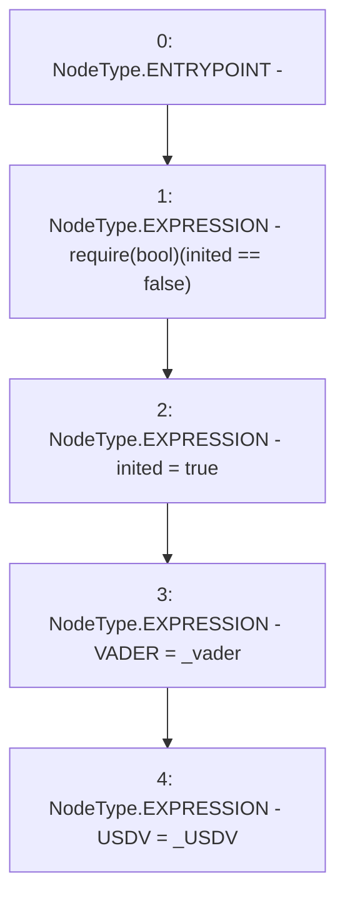

# Context: Attack.init

**Contract:** `Attack` (Inherits: None)
**Signature:** `init(address,address)`
**Method Selector ID:** `0xf09a4016`
**Visibility:** `public`
**Environment-Free:** `Yes`
**Modifiers:** None

### State Variables Interaction
- **Reads:** inited
- **Writes:** USDV, VADER, inited

### Assertion Checks & Business Requirements
- require/assert: `require(bool)(inited == false)`

### Environment & Verification Flags
- **Uses Foundry Cheatcodes:** No
- **Has Echidna Properties:** No

### Internal Calls Tree
- None

### External Calls / Value Transfers
- None

### Control Flow Graph (CFG)


### Source Mapping
Declared in: `contracts/Attack.sol` on lines **20** to **25**

```solidity
    function init(address _vader, address _USDV) public {
        require(inited == false);
inited = true;
        VADER = _vader;
        USDV = _USDV;
    }

```
