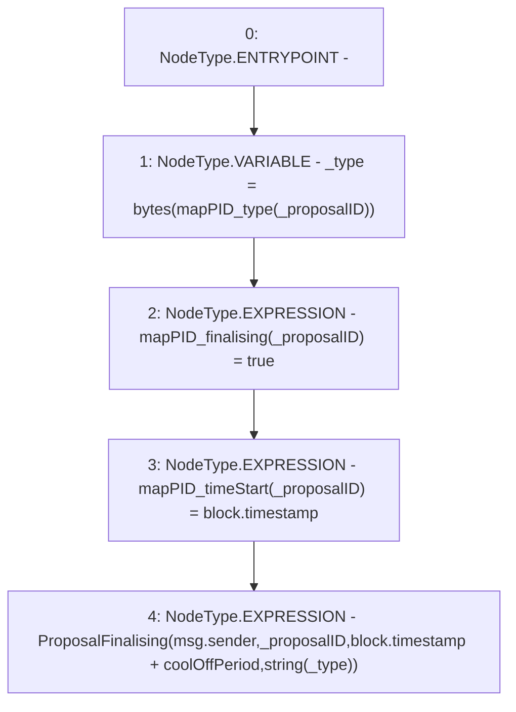

# Context: DAO._finalise

**Contract:** `DAO` (Inherits: None)
**Signature:** `_finalise(uint256)`
**Method Selector ID:** `Internal (No Method ID)`
**Visibility:** `internal`
**Environment-Free:** `No (reads EVM state context)`
**Modifiers:** None

### State Variables Interaction
- **Reads:** coolOffPeriod, mapPID_type
- **Writes:** mapPID_finalising, mapPID_timeStart

### Environment & Verification Flags
- **Uses Foundry Cheatcodes:** No
- **Has Echidna Properties:** No

### Internal Calls Tree
- None

### External Calls / Value Transfers
- None

### Control Flow Graph (CFG)


### Source Mapping
Declared in: `contracts/DAO.sol` on lines **94** to **99**

```solidity
    function _finalise(uint _proposalID) internal {
        bytes memory _type = bytes(mapPID_type[_proposalID]);
        mapPID_finalising[_proposalID] = true;
        mapPID_timeStart[_proposalID] = block.timestamp;
        emit ProposalFinalising(msg.sender, _proposalID, block.timestamp+coolOffPeriod, string(_type));
    }

```
