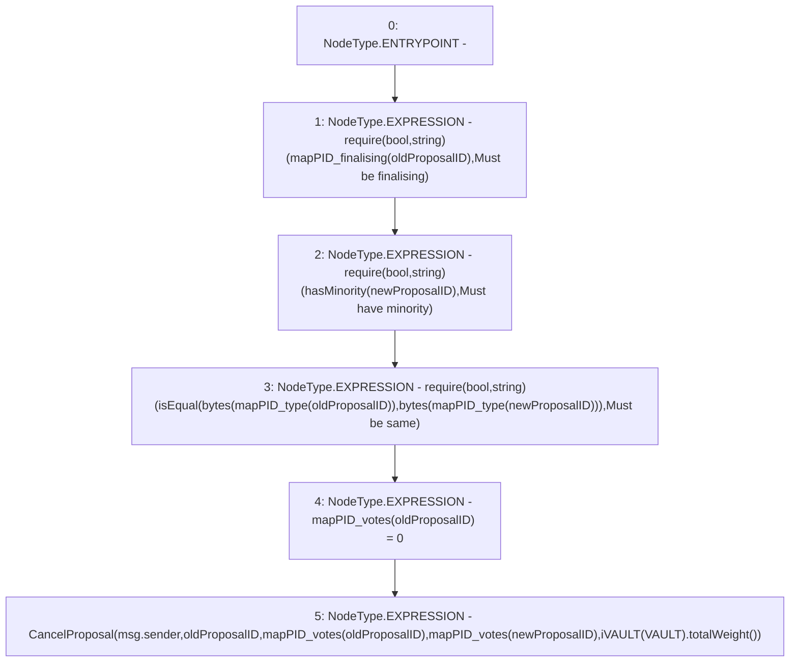

# Context: DAO.cancelProposal

**Contract:** `DAO` (Inherits: None)
**Signature:** `cancelProposal(uint256,uint256)`
**Method Selector ID:** `0x5ded8b06`
**Visibility:** `public`
**Environment-Free:** `No (reads EVM state context)`
**Modifiers:** None

### State Variables Interaction
- **Reads:** VAULT, mapPID_finalising, mapPID_type, mapPID_votes
- **Writes:** mapPID_votes

### Assertion Checks & Business Requirements
- require/assert: `require(bool,string)(mapPID_finalising[oldProposalID],Must be finalising)`
- require/assert: `require(bool,string)(hasMinority(newProposalID),Must have minority)`
- require/assert: `require(bool,string)(isEqual(bytes(mapPID_type[oldProposalID]),bytes(mapPID_type[newProposalID])),Must be same)`

### Environment & Verification Flags
- **Uses Foundry Cheatcodes:** No
- **Has Echidna Properties:** No

### Internal Calls Tree
- None

### External Calls / Value Transfers
- `iVAULT.TMP_44(uint256) = HIGH_LEVEL_CALL, dest:TMP_43(iVAULT), function:totalWeight, arguments:[]  `

### Control Flow Graph (CFG)


### Source Mapping
Declared in: `contracts/DAO.sol` on lines **102** to **108**

```solidity
    function cancelProposal(uint oldProposalID, uint newProposalID) public {
        require(mapPID_finalising[oldProposalID], "Must be finalising");
        require(hasMinority(newProposalID), "Must have minority");
        require(isEqual(bytes(mapPID_type[oldProposalID]), bytes(mapPID_type[newProposalID])), "Must be same");
        mapPID_votes[oldProposalID] = 0;
        emit CancelProposal(msg.sender, oldProposalID, mapPID_votes[oldProposalID], mapPID_votes[newProposalID], iVAULT(VAULT).totalWeight());
    }

```
