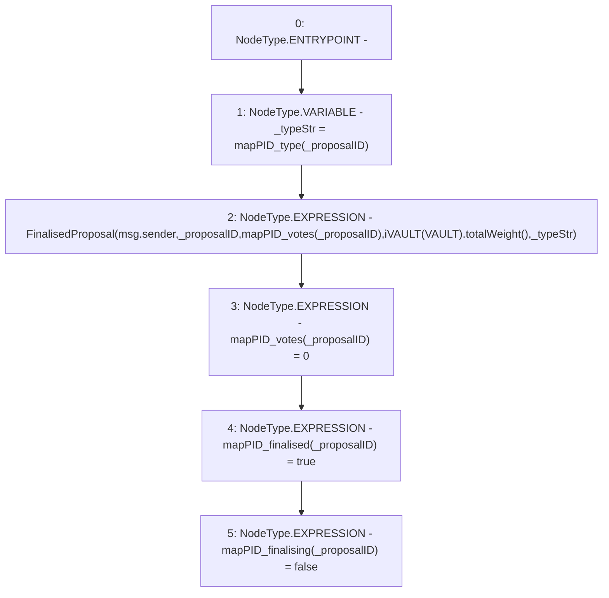

# Context: DAO.completeProposal

**Contract:** `DAO` (Inherits: None)
**Signature:** `completeProposal(uint256)`
**Method Selector ID:** `Internal (No Method ID)`
**Visibility:** `internal`
**Environment-Free:** `No (reads EVM state context)`
**Modifiers:** None

### State Variables Interaction
- **Reads:** VAULT, mapPID_type, mapPID_votes
- **Writes:** mapPID_finalised, mapPID_finalising, mapPID_votes

### Environment & Verification Flags
- **Uses Foundry Cheatcodes:** No
- **Has Echidna Properties:** No

### Internal Calls Tree
- None

### External Calls / Value Transfers
- `iVAULT.TMP_62(uint256) = HIGH_LEVEL_CALL, dest:TMP_61(iVAULT), function:totalWeight, arguments:[]  `

### Control Flow Graph (CFG)


### Source Mapping
Declared in: `contracts/DAO.sol` on lines **127** to **133**

```solidity
    function completeProposal(uint _proposalID) internal {
        string memory _typeStr = mapPID_type[_proposalID];
        emit FinalisedProposal(msg.sender, _proposalID, mapPID_votes[_proposalID], iVAULT(VAULT).totalWeight(), _typeStr);
        mapPID_votes[_proposalID] = 0;
        mapPID_finalised[_proposalID] = true;
        mapPID_finalising[_proposalID] = false;
    }

```
