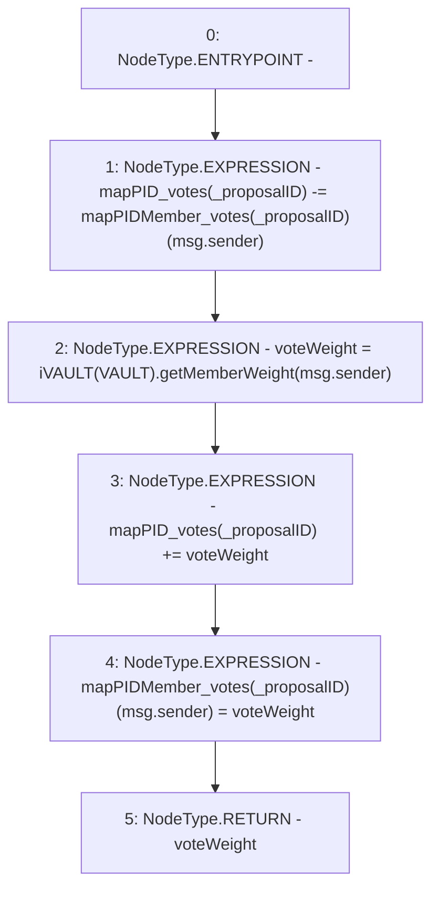

# Context: DAO.countMemberVotes

**Contract:** `DAO` (Inherits: None)
**Signature:** `countMemberVotes(uint256) returns (uint256)`
**Method Selector ID:** `Internal (No Method ID)`
**Visibility:** `internal`
**Environment-Free:** `No (reads EVM state context)`
**Modifiers:** None

### State Variables Interaction
- **Reads:** VAULT, mapPIDMember_votes, mapPID_votes
- **Writes:** mapPIDMember_votes, mapPID_votes

### Environment & Verification Flags
- **Uses Foundry Cheatcodes:** No
- **Has Echidna Properties:** No

### Internal Calls Tree
- None

### External Calls / Value Transfers
- `iVAULT.TMP_85(uint256) = HIGH_LEVEL_CALL, dest:TMP_84(iVAULT), function:getMemberWeight, arguments:['msg.sender']  `

### Control Flow Graph (CFG)


### Source Mapping
Declared in: `contracts/DAO.sol` on lines **158** to **163**

```solidity
    function countMemberVotes(uint _proposalID) internal returns (uint voteWeight){
        mapPID_votes[_proposalID] -= mapPIDMember_votes[_proposalID][msg.sender];
        voteWeight = iVAULT(VAULT).getMemberWeight(msg.sender);
        mapPID_votes[_proposalID] += voteWeight;
        mapPIDMember_votes[_proposalID][msg.sender] = voteWeight;
    }

```
