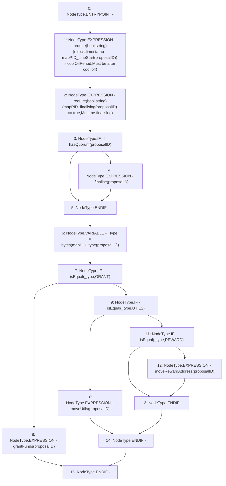

# Context: DAO.finaliseProposal

**Contract:** `DAO` (Inherits: None)
**Signature:** `finaliseProposal(uint256)`
**Method Selector ID:** `0x4b193e23`
**Visibility:** `public`
**Environment-Free:** `No (reads EVM state context)`
**Modifiers:** None

### State Variables Interaction
- **Reads:** coolOffPeriod, mapPID_finalising, mapPID_timeStart, mapPID_type
- **Writes:** None

### Assertion Checks & Business Requirements
- require/assert: `require(bool,string)((block.timestamp - mapPID_timeStart[proposalID]) > coolOffPeriod,Must be after cool off)`
- require/assert: `require(bool,string)(mapPID_finalising[proposalID] == true,Must be finalising)`

### Environment & Verification Flags
- **Uses Foundry Cheatcodes:** No
- **Has Echidna Properties:** No

### Internal Calls Tree
- None

### External Calls / Value Transfers
- None

### Control Flow Graph (CFG)


### Source Mapping
Declared in: `contracts/DAO.sol` on lines **111** to **125**

```solidity
    function finaliseProposal(uint proposalID) public  {
        require((block.timestamp - mapPID_timeStart[proposalID]) > coolOffPeriod, "Must be after cool off");
        require(mapPID_finalising[proposalID] == true, "Must be finalising");
        if(!hasQuorum(proposalID)){
            _finalise(proposalID);
        }
        bytes memory _type = bytes(mapPID_type[proposalID]);
        if (isEqual(_type, 'GRANT')){
            grantFunds(proposalID);
        } else if (isEqual(_type, 'UTILS')){
            moveUtils(proposalID);
        } else if (isEqual(_type, 'REWARD')){
            moveRewardAddress(proposalID);
        }
    }

```
