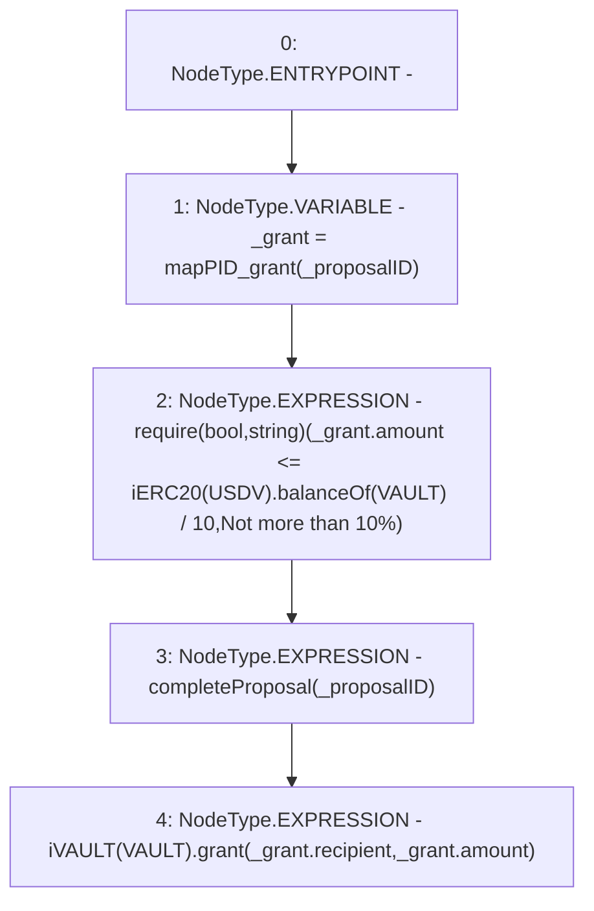

# Context: DAO.grantFunds

**Contract:** `DAO` (Inherits: None)
**Signature:** `grantFunds(uint256)`
**Method Selector ID:** `Internal (No Method ID)`
**Visibility:** `internal`
**Environment-Free:** `No (reads EVM state context)`
**Modifiers:** None

### State Variables Interaction
- **Reads:** USDV, VAULT, mapPID_grant
- **Writes:** None

### Assertion Checks & Business Requirements
- require/assert: `require(bool,string)(_grant.amount <= iERC20(USDV).balanceOf(VAULT) / 10,Not more than 10%)`

### Environment & Verification Flags
- **Uses Foundry Cheatcodes:** No
- **Has Echidna Properties:** No

### Internal Calls Tree
- None

### External Calls / Value Transfers
- `iVAULT.HIGH_LEVEL_CALL, dest:TMP_70(iVAULT), function:grant, arguments:['REF_37', 'REF_38']  `
- `iERC20.TMP_65(uint256) = HIGH_LEVEL_CALL, dest:TMP_64(iERC20), function:balanceOf, arguments:['VAULT']  `

### Control Flow Graph (CFG)


### Source Mapping
Declared in: `contracts/DAO.sol` on lines **137** to **142**

```solidity
    function grantFunds(uint _proposalID) internal {
        GrantDetails memory _grant = mapPID_grant[_proposalID];
        require(_grant.amount <= iERC20(USDV).balanceOf(VAULT) / 10, "Not more than 10%");
        completeProposal(_proposalID);
        iVAULT(VAULT).grant(_grant.recipient, _grant.amount);
    }

```
