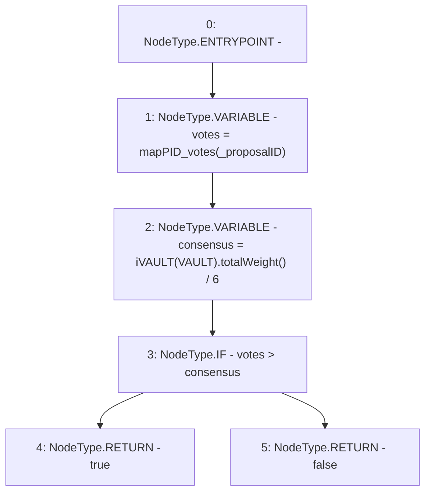

# Context: DAO.hasMinority

**Contract:** `DAO` (Inherits: None)
**Signature:** `hasMinority(uint256) returns (bool)`
**Method Selector ID:** `0xd0ad1709`
**Visibility:** `public`
**Environment-Free:** `Yes`
**Modifiers:** None

### State Variables Interaction
- **Reads:** VAULT, mapPID_votes
- **Writes:** None

### Environment & Verification Flags
- **Uses Foundry Cheatcodes:** No
- **Has Echidna Properties:** No

### Internal Calls Tree
- None

### External Calls / Value Transfers
- `iVAULT.TMP_95(uint256) = HIGH_LEVEL_CALL, dest:TMP_94(iVAULT), function:totalWeight, arguments:[]  `

### Control Flow Graph (CFG)


### Source Mapping
Declared in: `contracts/DAO.sol` on lines **183** to **191**

```solidity
    function hasMinority(uint _proposalID) public view returns(bool){
        uint votes = mapPID_votes[_proposalID];
        uint consensus = iVAULT(VAULT).totalWeight() / 6; // >16%
        if(votes > consensus){
            return true;
        } else {
            return false;
        }
    }

```
