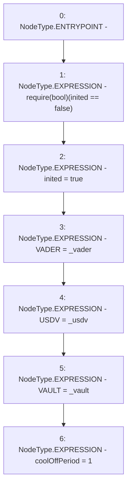

# Context: DAO.init

**Contract:** `DAO` (Inherits: None)
**Signature:** `init(address,address,address)`
**Method Selector ID:** `0x184b9559`
**Visibility:** `public`
**Environment-Free:** `Yes`
**Modifiers:** None

### State Variables Interaction
- **Reads:** inited
- **Writes:** USDV, VADER, VAULT, coolOffPeriod, inited

### Assertion Checks & Business Requirements
- require/assert: `require(bool)(inited == false)`

### Environment & Verification Flags
- **Uses Foundry Cheatcodes:** No
- **Has Echidna Properties:** No

### Internal Calls Tree
- None

### External Calls / Value Transfers
- None

### Control Flow Graph (CFG)


### Source Mapping
Declared in: `contracts/DAO.sol` on lines **46** to **53**

```solidity
    function init(address _vader, address _usdv, address _vault) public {
        require(inited == false);
        inited = true;
        VADER = _vader;
        USDV = _usdv;
        VAULT = _vault;
        coolOffPeriod = 1;
    }

```
