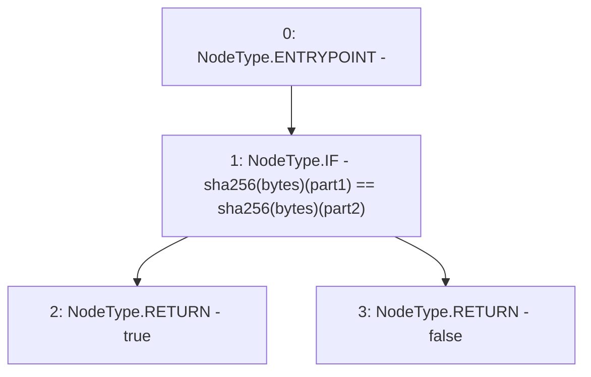

# Context: DAO.isEqual

**Contract:** `DAO` (Inherits: None)
**Signature:** `isEqual(bytes,bytes) returns (bool)`
**Method Selector ID:** `0x34359808`
**Visibility:** `public`
**Environment-Free:** `Yes`
**Modifiers:** None

### State Variables Interaction
- **Reads:** None
- **Writes:** None

### Environment & Verification Flags
- **Uses Foundry Cheatcodes:** No
- **Has Echidna Properties:** No

### Internal Calls Tree
- None

### External Calls / Value Transfers
- None

### Control Flow Graph (CFG)


### Source Mapping
Declared in: `contracts/DAO.sol` on lines **192** to **198**

```solidity
    function isEqual(bytes memory part1, bytes memory part2) public pure returns(bool){
        if(sha256(part1) == sha256(part2)){
            return true;
        } else {
            return false;
        }
    }

```
