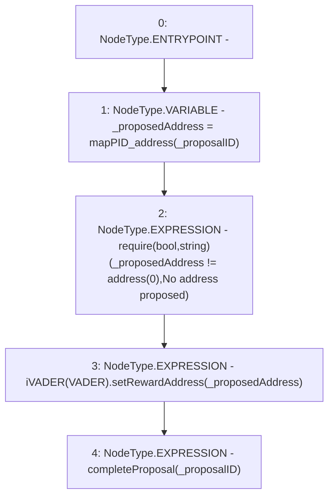

# Context: DAO.moveRewardAddress

**Contract:** `DAO` (Inherits: None)
**Signature:** `moveRewardAddress(uint256)`
**Method Selector ID:** `Internal (No Method ID)`
**Visibility:** `internal`
**Environment-Free:** `No (reads EVM state context)`
**Modifiers:** None

### State Variables Interaction
- **Reads:** VADER, mapPID_address
- **Writes:** None

### Assertion Checks & Business Requirements
- require/assert: `require(bool,string)(_proposedAddress != address(0),No address proposed)`

### Environment & Verification Flags
- **Uses Foundry Cheatcodes:** No
- **Has Echidna Properties:** No

### Internal Calls Tree
- None

### External Calls / Value Transfers
- `iVADER.HIGH_LEVEL_CALL, dest:TMP_81(iVADER), function:setRewardAddress, arguments:['_proposedAddress']  `

### Control Flow Graph (CFG)


### Source Mapping
Declared in: `contracts/DAO.sol` on lines **150** to **155**

```solidity
    function moveRewardAddress(uint _proposalID) internal {
        address _proposedAddress = mapPID_address[_proposalID];
        require(_proposedAddress != address(0), "No address proposed");
        iVADER(VADER).setRewardAddress(_proposedAddress);
        completeProposal(_proposalID);
    }

```
