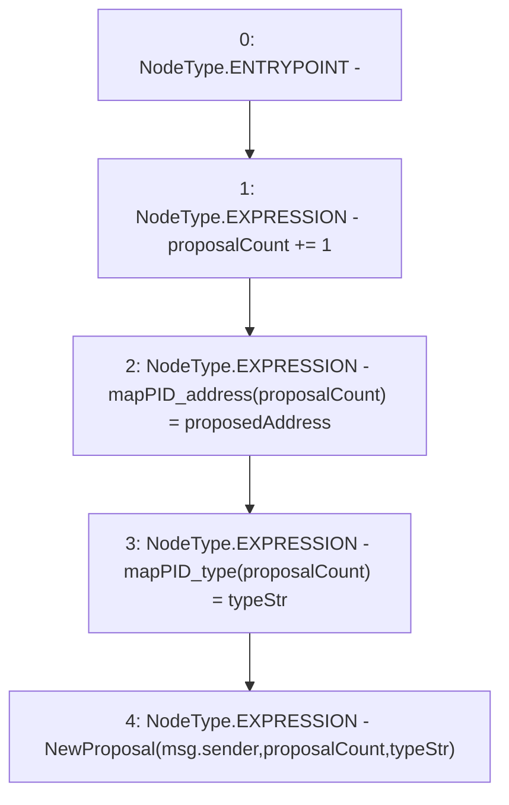

# Context: DAO.newAddressProposal

**Contract:** `DAO` (Inherits: None)
**Signature:** `newAddressProposal(address,string)`
**Method Selector ID:** `0x293cee7d`
**Visibility:** `public`
**Environment-Free:** `No (reads EVM state context)`
**Modifiers:** None

### State Variables Interaction
- **Reads:** proposalCount
- **Writes:** mapPID_address, mapPID_type, proposalCount

### Environment & Verification Flags
- **Uses Foundry Cheatcodes:** No
- **Has Echidna Properties:** No

### Internal Calls Tree
- None

### External Calls / Value Transfers
- None

### Control Flow Graph (CFG)


### Source Mapping
Declared in: `contracts/DAO.sol` on lines **69** to **74**

```solidity
    function newAddressProposal(address proposedAddress, string memory typeStr) public {
        proposalCount += 1;
        mapPID_address[proposalCount] = proposedAddress;
        mapPID_type[proposalCount] = typeStr;
        emit NewProposal(msg.sender, proposalCount, typeStr);
    }

```
