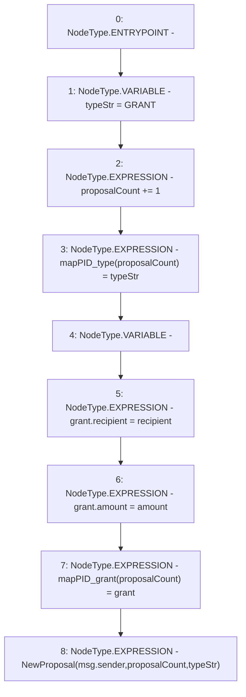

# Context: DAO.newGrantProposal

**Contract:** `DAO` (Inherits: None)
**Signature:** `newGrantProposal(address,uint256)`
**Method Selector ID:** `0xa6c83fed`
**Visibility:** `public`
**Environment-Free:** `No (reads EVM state context)`
**Modifiers:** None

### State Variables Interaction
- **Reads:** proposalCount
- **Writes:** mapPID_grant, mapPID_type, proposalCount

### Environment & Verification Flags
- **Uses Foundry Cheatcodes:** No
- **Has Echidna Properties:** No

### Internal Calls Tree
- None

### External Calls / Value Transfers
- None

### Control Flow Graph (CFG)


### Source Mapping
Declared in: `contracts/DAO.sol` on lines **57** to **66**

```solidity
    function newGrantProposal(address recipient, uint amount) public {
        string memory typeStr = "GRANT";
        proposalCount += 1;
        mapPID_type[proposalCount] = typeStr;
        GrantDetails memory grant;
        grant.recipient = recipient;
        grant.amount = amount;
        mapPID_grant[proposalCount] = grant;
        emit NewProposal(msg.sender, proposalCount, typeStr);
    }

```
