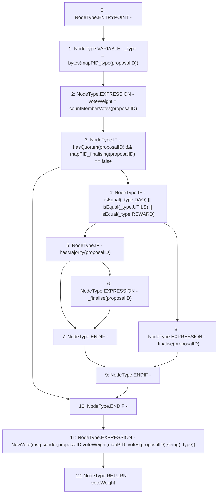

# Context: DAO.voteProposal

**Contract:** `DAO` (Inherits: None)
**Signature:** `voteProposal(uint256) returns (uint256)`
**Method Selector ID:** `0x807896d5`
**Visibility:** `public`
**Environment-Free:** `No (reads EVM state context)`
**Modifiers:** None

### State Variables Interaction
- **Reads:** mapPID_finalising, mapPID_type, mapPID_votes
- **Writes:** None

### Environment & Verification Flags
- **Uses Foundry Cheatcodes:** No
- **Has Echidna Properties:** No

### Internal Calls Tree
- None

### External Calls / Value Transfers
- None

### Control Flow Graph (CFG)


### Source Mapping
Declared in: `contracts/DAO.sol` on lines **79** to **92**

```solidity
    function voteProposal(uint proposalID) public returns (uint voteWeight) {
        bytes memory _type = bytes(mapPID_type[proposalID]);
        voteWeight = countMemberVotes(proposalID);
        if(hasQuorum(proposalID) && mapPID_finalising[proposalID] == false){
            if(isEqual(_type, 'DAO') || isEqual(_type, 'UTILS') || isEqual(_type, 'REWARD')){
                if(hasMajority(proposalID)){
                    _finalise(proposalID);
                }
            } else {
                _finalise(proposalID);
            }
        }
        emit NewVote(msg.sender, proposalID, voteWeight, mapPID_votes[proposalID], string(_type));
    }

```
