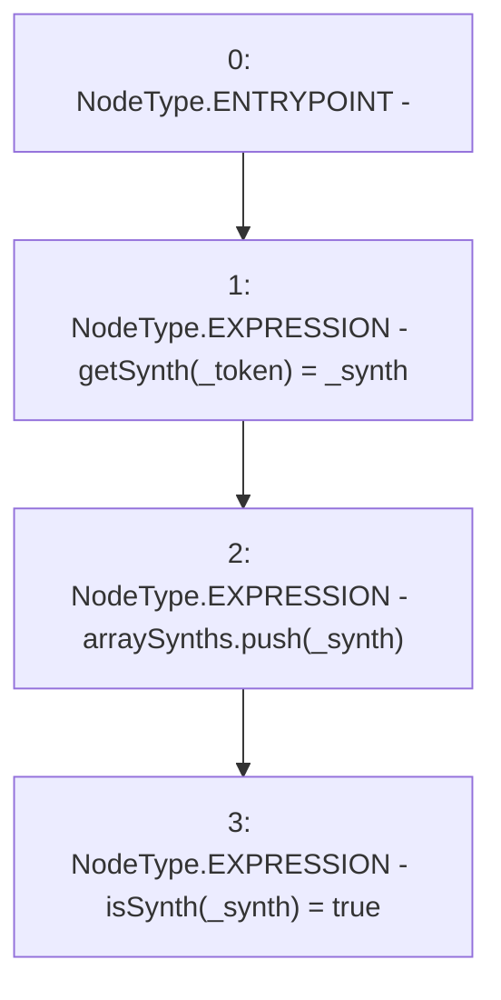

# Context: Factory._addSynth

**Contract:** `Factory` (Inherits: None)
**Signature:** `_addSynth(address,address)`
**Method Selector ID:** `Internal (No Method ID)`
**Visibility:** `internal`
**Environment-Free:** `Yes`
**Modifiers:** None

### State Variables Interaction
- **Reads:** arraySynths
- **Writes:** arraySynths, getSynth, isSynth

### Environment & Verification Flags
- **Uses Foundry Cheatcodes:** No
- **Has Echidna Properties:** No

### Internal Calls Tree
- None

### External Calls / Value Transfers
- None

### Control Flow Graph (CFG)


### Source Mapping
Declared in: `contracts/Factory.sol` on lines **57** to **61**

```solidity
    function _addSynth(address _token, address _synth) internal {
        getSynth[_token] = _synth;
        arraySynths.push(_synth); 
        isSynth[_synth] = true;
    }

```
