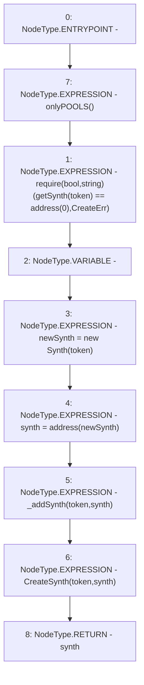

# Context: Factory.deploySynth

**Contract:** `Factory` (Inherits: None)
**Signature:** `deploySynth(address) returns (address)`
**Method Selector ID:** `0x8e80bddf`
**Visibility:** `external`
**Environment-Free:** `No (reads EVM state context)`
**Modifiers:**
- `onlyPOOLS`
  ```solidity
  modifier onlyPOOLS() {
          require(msg.sender == POOLS, "!POOLS");
          _;
      }
  ```

### State Variables Interaction
- **Reads:** getSynth
- **Writes:** None

### Assertion Checks & Business Requirements
- require/assert: `require(bool,string)(getSynth[token] == address(0),CreateErr)`

### Environment & Verification Flags
- **Uses Foundry Cheatcodes:** No
- **Has Echidna Properties:** No

### Internal Calls Tree
- None

### External Calls / Value Transfers
- None

### Control Flow Graph (CFG)


### Source Mapping
Declared in: `contracts/Factory.sol` on lines **34** to **41**

```solidity
    function deploySynth(address token) external onlyPOOLS returns(address synth) {
        require(getSynth[token] == address(0), "CreateErr");
        Synth newSynth;
        newSynth = new Synth(token);  
        synth = address(newSynth);
        _addSynth(token, synth);
        emit CreateSynth(token, synth);
    }

```
